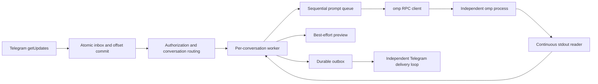

# Architecture and development

English | [中文](architecture.zh.md) | [User guide](../README.md)

This document describes the current implementation and its recovery semantics.

## Scope and ownership

The bridge owns Telegram polling, authorization, conversation routing, subprocess startup/shutdown, and reliable message delivery. omp owns model execution, tools, configuration, credentials, and native session history.

The deployment model is one bot per database and one worker per conversation: an ordinary private chat, private-chat topic, or group topic. Non-topic group messages are unsupported. There is no terminal emulation, second model transcript, multi-bot dispatcher, generic backend abstraction, or automatic replay of uncertain tasks. Different sessions do not isolate filesystems or credentials.

## Modules

| Location | Responsibility |
| --- | --- |
| [`cmd/omp-telegram`](../cmd/omp-telegram/main.go) | CLI, version output, data-directory lock, signal handling |
| [`internal/config`](../internal/config/config.go) | TOML, environment references, path defaults, startup-argument validation |
| [`internal/bridge`](../internal/bridge/bridge.go) | Worker actors, commands, prompt queues, previews, final replies, host tools |
| [`internal/bridge/recovery.go`](../internal/bridge/recovery.go) | Startup restoration and persisted close state |
| [`internal/bridge/resume_picker.go`](../internal/bridge/resume_picker.go) | Native session listing, export jobs, and authorized, expiring selection menus |
| [`internal/omp`](../internal/omp/client.go) | RPC framing, request correlation, events, native session metadata, ACP listing, and native export delegation |
| [`internal/telegram`](../internal/telegram/client.go) | Bot API, attachment transport, sanitized errors and delivery certainty |
| [`internal/media`](../internal/media/media.go) | Workspace-confined file handling, image preparation and outgoing snapshots |
| [`internal/store`](../internal/store/store.go) | SQLite schema, bindings, durable input/output and completion transactions |
| [`config.go`](../config.go) | Embeds the canonical [`config.toml`](../config.toml) |

## Runtime flow



Startup proceeds through configuration loading, the data-directory lock, database initialization/reconciliation, `getMe`, database bot-ownership checking, command registration, restoration, then polling and delivery. `--version` returns before configuration loading. `--check` validates local configuration and creates the configured directories; it does not open the database or authenticate with Telegram.

Incoming updates are persisted before routing authorization. Unauthorized inputs are marked ignored and cannot start a process, download a file, or execute a command. Users and chats must both be allowed, including both the user ID and matching private chat ID for ordinary private chats. After authorization, messages with a nonzero thread ID or private chat type are accepted; non-topic group messages receive guidance rather than an inferred destination.

### Concurrency

- Each conversation has an actor-like worker. Ordinary text, attachments, and `/review` enter the bridge's deferred queue as independent prompts and run sequentially. The bridge submits the next prompt only after the current task finishes.
- Commands and callbacks use the worker's control path rather than waiting behind queued prompts. This does not promise that every operation is nonblocking: startup and some control RPC round trips still take time.
- `/queue` reads only the current worker's in-memory `queue`, `active`, and `busy` state. It is a per-conversation viewer; its Cancel buttons target pending bridge inbox IDs and never abort the active task or manage OMP's native queue. The queue is runtime-only: worker shutdown cancels remaining pending inboxes, and no queue entry is restored.
- Attachment preparation and uploads are asynchronous and bounded. Pending preparation retains its queue position.
- The RPC stdout reader never performs Telegram HTTP delivery. Its event buffers are bounded; protocol violations or overload fail the client rather than allowing unbounded growth.
- `worker.max_workers` bounds connected OMP processes, not logical sessions. A positive `worker.idle_timeout` may release a quiescent worker's process and return its slot while retaining its validated binding and session claim.

The client waits for `ready`, negotiates protocol v2, serializes stdin writes, and correlates responses by request ID. A successful `Call("prompt")` means acceptance, not task completion. Only `agent_end` events whose `isTerminal` is not `false`, or a local-command completion signal, finish the task; nonterminal events must not dispatch the next queued prompt. On a terminal assistant message, `stopReason=error` or a nonempty `errorMessage` commits the input as `uncertain`; `stopReason=aborted` commits it as `cancelled`; otherwise confirmed text commits it as `done`. Partial text remains deliverable for `uncertain` and `cancelled` terminal results. An uncertain failure reply may include a bounded `errorMessage` summary after redacting credentials, request IDs, URLs, and absolute paths; unsafe details and provider classifications are not forwarded. Framing and reassembly have explicit bounds, with no PTY/ANSI parsing.

### Prompt and interrupt semantics

The bridge uses public RPC v2 without protocol extensions. Before calling `prompt`, it marks the input as the active terminal-result owner. A successful acknowledgement needs no routing classification; `agentInvoked=false` completes a local command through the normal completion path, while other accepted prompts await terminal events. A failed or unconfirmed prompt request settles the input as uncertain, closes that OMP client, and cancels the bridge queue without retrying. The client must not be reused as idle: unconfirmed work could otherwise take ownership of a later input's result. `/stop` clears bridge-deferred prompts, then sends a plain `abort` request without queue-clearing options. Worker-submitted task and control RPCs share a FIFO lane, so local queue cancellation is immediate but `abort` cannot overtake an in-flight prompt acknowledgement. Pending tasks, including `/review`, are never replayed automatically after a restart or uncertain execution.

An errored `handoff` or `compact` request retires the client unless omp explicitly rejects it; timeouts, cancellations, and unconfirmed results force lazy resume on the next request. If writing a `host_tool_result` fails, the bridge settles the active task as `uncertain` and retires that client.

Progress Stop aborts only the active task. `/queue` cancellation removes only the selected pending bridge task, while `/stop` aborts the active task and clears all pending bridge tasks.

RPC v2 may compact large terminal frames and omit messages already emitted by `message_end`. The worker caches the latest assistant message's `stopReason` and `errorMessage`, plus finalized text from every assistant `message_end`; terminal `agent_end` messages take precedence, and the cache is used only when they contain no assistant message. The cache resets at `agent_start`, terminal completion, and shutdown. Cached error metadata classifies the result; only a bounded sanitized `errorMessage` summary may be included in an uncertain reply, never the raw metadata.

### Missing terminal completion and watchdog

Missing terminal completion has a separate conservative recovery path, never a success path. An active busy root task must have no activity for 30 seconds and no compaction/handoff, retry, running tool, host request, or native UI wait. A background `get_state` call has a five-second timeout and never blocks actor control handling. Both `isStreaming` and `isCompacting` must explicitly be `false`; absent/null/malformed fields and errors discard confirmation. Two confirmations must be separated by at least 30 seconds. Every event, including unknown or malformed events, and ordinary RPC activity invalidates probes. Results are fenced by client identity, generation, turn, active input, and activity revision; queued events take precedence over probe results. Confirmed missing completion uses the existing atomic uncertain-result transaction and progress cleanup, then retires the old client before queue dispatch, preserving the logical session claim and queued inputs for lazy resume without replay. Pending typing requests are canceled on terminal completion, turn changes, runtime release, and shutdown; their timeout remains four seconds.

`awaitingContinuation` records explicit `agent_end isTerminal=false` and blocks watchdog probes and recovery. Native async work may legitimately remain non-streaming for minutes. `agent_start`, task settlement, new root dispatch, and runtime teardown clear this state; unrelated events and status calls do not. Without a native pending-async-work signal, a missing continuation remains intentionally unrecovered rather than killing legitimate background work.

Actor lifecycle logs identify the client, active input, busy flag, turn, and generation for `agent_start`, `agent_end`, `prompt_result`, auto-compaction boundaries, and failed requests. Terminal flags distinguish absent/true/false. They record metadata only, never raw events, prompts, output, provider diagnostics, or credentials.

RPC client logs use the same client identity to distinguish receipt, event queueing, failed-response routing, and rejection. `event_queued` confirms a buffered send, not actor consumption; compare it with the actor's `phase=received` entry. Only locally numeric request IDs are logged, never arbitrary peer IDs or response bodies.

### Structured logging

The daemon creates one `slog` registry after configuration succeeds. It has exactly six component loggers: `daemon`, `bridge`, `rpc`, `telegram`, `store`, and `media`. Text and JSON handlers share one synchronized writer, so concurrent records are complete and independently parseable. `logging.level` sets the default threshold (`debug`, `info`, `warn`, or `error`), and `logging.format` selects text or JSON output; `[logging.component_levels]` may override the level for named components. Component names, levels, formats, event names, and RPC phases are fixed allowlists rather than user-defined labels.

Text output uses compact `YYYY-MM-DD HH:MM:SS LEVEL [component] message key=value` lines, for example `2026-09-19 13:20:01 WARN [telegram] telegram polling failed event=poll_failed reason=timeout`. The component header comes from the registry. Original message content and all remaining structured attributes are preserved, without `time=`, `level=`, `msg=`, or `component=` header labels. Strings and control characters are escaped as needed to keep records single-line. JSON output remains standard `slog.JSONHandler` output, including the `component` field. These are the only two formats; unspecified components inherit `logging.level`.

Events use short stable `snake_case` names. `debug` is for RPC/probe detail and bridge handled-path detail; `info` records successful lifecycle milestones; `warn` records recoverable delivery, media, or watchdog failures; `error` records durable persistence failures, protocol violations, and buffer overflow. Ordinary user cancellations are not warning or error events. A failure is recorded at the layer that owns its policy, with callers avoiding duplicate copies of the same error.

RPC lifecycle detail is emitted as `event=rpc_lifecycle` with an allowlisted `rpc_event` (`agent_start`, `agent_end`, `prompt_result`, `auto_compaction_start`, `auto_compaction_end`, or `response`) and a phase of `received`, `event_queued`, `response_queued`, `response_ignored`, `rejected`, or `handled`. `terminal` is one of `absent`, `true`, `false`, or `invalid`. `request_id` is included only when the local decimal value parses safely as an unsigned integer. Bridge lifecycle records retain their component and stable event fields; handled bridge paths remain at debug level.

Log metadata is a reviewed whitelist: component/event identity, bounded numeric state such as chat/thread IDs, turn/generation, retry counts, error classification, and internal session UUIDs may be recorded when needed for correlation. Logs never contain prompts, output, reasoning, tokens, headers, URLs, raw errors or frames, tool arguments/results, callback tokens, filenames, workspace/session paths, configuration, or `omp.args`. Asynchronous callbacks capture the identity of the operation when scheduled; they never read dynamic identity from a reused worker. Configuration and CLI failures happen before this registry exists and stay plain text rather than being formatted as JSON.

Both formats write to stderr. File storage and rotation belong to supervisor/journald; there is no asynchronous log queue, sampling, network exporter, or runtime level reload. The shared writer serializes this registry's records only, not output from other processes. Logging write errors never enter task state transitions.

| Component | Main events |
| --- | --- |
| `daemon` | `daemon_start`, `daemon_stop`, `daemon_fatal`, `lock_failed` |
| `bridge` | `worker_start`, `worker_stop`, `task_submit`, `task_complete`, `queue_rejected`, `session_new`, `session_resume`, `session_replace`, `session_close`, `runtime_connected`, `runtime_resume`, `runtime_release`, `runtime_exit`, `restore_claim`, `restore_runtime_failed`, `restore_runtime_skipped`, `topic_rename_failed`, `watchdog_probe`, `watchdog_probe_reset`, `watchdog_async_wait`, `watchdog_recover` |
| `rpc` | `rpc_lifecycle`, `rpc_protocol_error`, `rpc_queue_overflow`, `rpc_process_exit` |
| `telegram` | `command_menu_registered`, `poll_failed`, `delivery_rate_limited`, `delivery_retry_scheduled`, `delivery_retry_exhausted`, `delivery_failed`, `delivery_uncertain`, `reply_fallback`, `progress_cleanup_failed`, `progress_cleanup_abandoned` |
| `store` | `cleanup_completed`, `cleanup_failed`, `snapshot_cleanup_failed`, `outbox_read_failed`, `outbox_write_failed`, `outbox_state_write_failed`, `inbox_state_write_failed`, `final_commit_failed`, `progress_message_write_failed`, `progress_cleanup_state_failed` |
| `media` | `prepare_failed`, `snapshot_failed`, `attachment_persist_failed`, `cleanup_failed` |

Root task correlation uses `chat_id`, `thread_id`, `generation`, `turn`, `inbox_id`, and `client_id` where applicable. `thread_id=0` is meaningful for private chats. Native `session_id` is recorded in full only after validation; file paths are never session log identities. `client_id` is process-local and monotonic, not persisted. `task_complete` reports `result=done|cancelled|uncertain` after the durable transaction succeeds, with `duration_ms` when the root start time is available. Delivery metadata uses `outbox_id`, `kind`, `api_code`, `retry_after_s`, `uncertain`, and `replay`; descriptions and response bodies are never logged. To trace receipt through actor handling, set `logging.component_levels.rpc = "debug"` and `logging.component_levels.bridge = "debug"`.

Bot IDs remain part of internal session identity and database checks, but are omitted from logs because each daemon serves one bot. Chat and thread IDs are not credentials, but are linkable identifiers; restrict log access and replace them with consistent placeholders before sharing logs publicly.

Live progress is an in-memory, best-effort view using the existing one-message preview transport. `telegram.progress_mode=off` suppresses Telegram Send/Edit and typing but continues text-delta processing for final-result fallback. `summary` shows assistant output, active tool names keyed by tool call ID, and state; `verbose` adds the bounded recent tool list. Retry, compaction, and concurrent tools are explicit events. `tool_execution_end` is the sole completion source, including host tools; host callbacks only correct a matching active tool name. Reasoning, raw frames, tool arguments/results, command text, stdout, and stderr are never rendered. Each active root progress message has a Stop button fenced by owner, worker generation, active inbox ID, and turn. A valid click consumes and removes the button, sends native `abort` only for that active root task, and unlike `/stop` preserves bridge-deferred prompts for ordered dispatch after cancellation; stale buttons are removed without aborting. Programmatic task settlement, worker replacement, and shutdown invalidate the button through the bounded cleanup queue. An initial Send failure suppresses progress for that turn to avoid duplicate messages; an Edit failure remains retryable. Progress replies to the root input when possible, but reply rejection falls back to a plain message without changing task state.

Progress creation is evaluated on the regular 1.5-second worker tick after a three-second initial delay for a new task. Existing-message updates, typing, and durable final replies retain their independent behavior. Each progress preview is associated with its root inbox. For every terminal inbox state (`done`, `cancelled`, `ignored`, `failed`, or `uncertain`), the bridge deletes that progress message only after every associated outbox part is marked `done` following confirmed Telegram delivery. A failed or uncertain outbox part keeps the association for later cleanup. The association is a local cleanup aid, not a permanent retention pin: when terminal data reaches the retention cutoff with no associated `pending` or `sending` outbox work, cleanup clears only the local association and leaves the Telegram message in place. A confirmed non-retryable Telegram rejection also clears the local association.

## Identity and stale work

| Identity | Representation |
| --- | --- |
| Bot | Numeric ID returned by `getMe`, not its token or username |
| Conversation | `(bot, chat, thread)`; ordinary private chats use `thread=0` |
| Live worker incarnation | Conversation plus `generation` and its current client |
| Saved conversation | Native omp session-file path |
| Inbound update | Telegram update ID, unique within this bot-owned database |

Ordinary private chats use the existing `(chat, 0)` target and worker/session lifecycle; topic targets retain their thread IDs. No new worker type or schema migration is required. Stored bindings do not contain Telegram chat type, so recovery accepts zero-thread targets only for positive private chat IDs, still enforcing the chat allowlist; topic targets keep their existing recovery behavior.

`CheckBot` rejects another bot using the same database. `daemon.lock` prevents two bridge processes from opening the same data directory concurrently. Operators must still avoid running the same bot with another data directory or polling client.

A successful new/resumed instance increments the persisted generation. Background results are checked against the appropriate generation, turn, request token, or client identity. Session claims prevent two workers in this daemon from opening the same native conversation concurrently. Claims do not lock a workspace against other programs.

Closed-binding deletion and startup-intent preparation use a transaction fence: a start reserves only the exact persisted binding generation, or an actually unbound conversation, while deletion succeeds only when no startup intent exists. A bridge-wide binding mutation epoch invalidates picker and list callbacks after deletion, and a worker also drops old confirmations before recreating a binding after observing a missing row.

**The acceptance boundary matters:** stale runtime work must not affect a replacement instance, but already committed outbox results remain deliverable after `/new` or `/close`. A later generation is not permission to discard accepted results.

## SQLite

The database is `omp-telegram.db` under `storage.data_dir`. It uses WAL, a busy timeout, and one open connection. It stores bridge state and Telegram message content, not an independent copy of omp's model context.

| Table | Key / fields | Role |
| --- | --- | --- |
| `meta` | `key`, integer `value` | Owning bot ID and polling offset |
| `bindings` | PK `(bot,chat,thread)`; `workspace,session,session_id,generation,last_used_at,running,interrupted` | Last validated session binding, restoration eligibility, last-use metadata, and active-task interruption marker |
| `startup_intents` | PK `(bot,chat,thread)`; `kind,workspace,session,generation` | Durable uncommitted `/new` or `/resume` transition |
| `history` | `bot,chat,thread,workspace,session,generation` | Previous binding snapshots created on replacement; deleting a closed binding removes this conversation's snapshots. It is not a session browser. |
| `session_favorites` | PK `(bot,chat,thread,workspace,session_id)` | Pinned native session identities for the `/resume` picker; no session content |
| `inbox` | PK `id`; `raw,state,reply_to,progress_message_id,created_at,updated_at` | Update deduplication, processing state, and optional live-progress identity |
| `outbox` | Autoincrement `id`; `inbox_id,chat,thread,text,state,reply_to,kind,path,name,next_attempt_at,attempt_count,server_retry_count,created_at,updated_at` | Ordered Telegram delivery; definite rate limits are uncapped, while the separate server-rejection count bounds retryable 5xx failures |

### Database Message Retention

`storage.database_retention_days` defaults to 90. `0` disables automatic cleanup; positive values retain terminal Telegram bridge message records for that many days, measured from `updated_at`, the latest state transition. The Bridge runs this best-effort janitor once at startup and every 24 hours thereafter. Failures are logged and retry on the next interval; they do not stop Telegram or omp processing.

Only explicitly enumerated terminal states are eligible: inbox `done`, `cancelled`, `ignored`, `failed`, `uncertain`; outbox `done`, legacy `sent`, `failed`, `uncertain`, `cancelled`. Inbox `pending`/`submitted` and outbox `pending`/`sending` remain durable. Deletion uses committed batches of 1000 rows; the service never automatically runs `VACUUM`.

Terminal inbox rows with a nonzero `progress_message_id`, and their associated outbox rows, remain outside retention cleanup until the Telegram progress deletion succeeds, a confirmed non-retryable rejection clears the association, or the retention cutoff is reached with no associated `pending` or `sending` outbox work. The last case clears only the local association and does not call Telegram Delete.
Retention never deletes bindings, history, startup intents, session favorites, workspaces, omp session files, or other omp data. Terminal outbox attachment snapshots become unowned after their corresponding delete commits and are removed best-effort only when confined to `storage.data_dir/attachments/outbox/`. Each janitor run also removes unreferenced `attachment-*` snapshots in that private spool once their file modification time exceeds the retention cutoff.

### Schema version

`PRAGMA user_version` is the schema version, currently 11. An empty database creates all tables, indexes, and the version in one transaction. Reopening reconciles runtime states. Populated unversioned databases and unsupported future versions are rejected before schema or record changes. Versions 1 through 10 migrate transactionally through `startup_intents`, the binding interruption marker, message timestamps, reply targets, native session IDs, inbox/outbox progress associations, `bindings.last_used_at`, per-conversation `/resume` favorites, durable outbox retry metadata, and separate server-rejection retry counts before advancing `user_version`. The v8 migration leaves existing `last_used_at` values at zero; the v10-to-v11 migration initializes `server_retry_count` to zero because legacy `attempt_count` mixed rate limits and server rejections. Application versions and database versions evolve independently.

### Input and completion transactions

```text
Telegram update
  -> transaction: insert inbox pending + advance offset
  -> authorize and route
  -> persist submitted
  -> write prompt to omp stdin
  -> receive terminal completion
  -> transaction: persist final text parts + set inbox done, uncertain, or cancelled
```

`Accept` performs one atomic transaction per update. Offset advancement never precedes durable input, and duplicates do not overwrite the original stored update.

For ordinary root tasks, submission durably records the originating Telegram message ID before OMP accepts the prompt. Completion requires that submitted input and commits all final text parts, their persisted reply target, and the terminal inbox state in one transaction. Normal terminal output is `done`; a provider/model error is `uncertain`; an explicit OMP abort is `cancelled`. Any failure rolls back both. `say()` remains a notification helper, not the completion API. Control-command completion is handled separately. Tool attachments can be queued during execution and are not retroactively included in the final-text transaction.

When an inbound message replies to another Telegram message, the bridge composes a separate input-only context before `prompt`: a non-empty Telegram `quote.text` wins, otherwise it uses one level of replied text, photo/document metadata and caption, caption-only content, or an unsupported marker. The complete quoted block is capped at 3000 UTF-16 code units and receives `...[truncated]` when necessary. It labels the sender only as `From: bot` or `From: user`. The current message follows under `[Current user message]` and is never truncated. The bridge never follows `ReplyToMessage` recursively, downloads or re-imports replied attachments, or changes the existing output `reply_to` target. Queue previews use the current user text rather than this synthetic wrapper.

Reply context is derived only from the current Update's decoded `ReplyToMessage` and `Quote`; the durable source remains `inbox.raw`. No Telegram history lookup, extra history API request, or reply-context database column is used.

A database completion failure stops the worker rather than pretending the task completed. On restart, submitted inputs become `uncertain`; previously pending ordinary messages, attachments, and `/review` commands are canceled rather than replayed. Other pending controls still pass normal authorization, and old in-memory callback tokens expire when their state is lost.

### Output delivery and progress cleanup

```text
pending -> sending -> done
                   -> pending (429 uncapped / definite 5xx before the 12th server rejection)
                   -> failed (12th definite 5xx rejection, or other failure)
                   -> uncertain

restart: sending -> uncertain
```

The Telegram client classifies failures at the transport boundary:

- Local pre-send failures and trustworthy, complete API rejections are definite failures.
- Transport interruption, incomplete responses, or otherwise unconfirmed delivery remain uncertain.
- HTTP status alone is insufficient. Prior uncertainty must not be erased by a later local failure.

Complete, definite 500, 502, 503, and 504 rejections use exponential retry delay starting at one second and capped at five minutes. A durable `server_retry_count` records only these definite rejections; the 12th marks the output `failed` rather than scheduling another retry, allowing later outputs in that conversation to proceed. `attempt_count` tracks total claims and does not consume this server-rejection budget. Definite 429 responses return to the durable pending queue at Telegram's `retry_after` deadline, or after one second when it is absent; 429 retries are uncapped. Uncertain outcomes and other failures are not automatically retried. A database transaction cannot atomically commit a Telegram network side effect, so exactly-once delivery is not promised.

For progress deletion, a confirmed non-retryable Telegram 4xx other than 429 clears only the local progress association. A 429, 5xx, transport failure, or uncertain response retains that association for a later cleanup attempt. Cleanup state never changes the task or outbox result.

Outbox replay preserves the stored reply target for every final text part. If Telegram rejects that target because the original message is unavailable, the client sends the same text once without reply binding; this UX fallback does not change inbox/outbox ownership or task settlement.

Each progress preview is associated with its root inbox, and every final outbox part carries that inbox ID. For any terminal inbox (`done`, `cancelled`, `ignored`, `failed`, or `uncertain`), progress is deleted only after all associated outbox parts are marked `done` following confirmed Telegram delivery. Startup retries completed associations left by a previous run. A confirmed non-retryable Telegram deletion rejection clears the best-effort progress association; once terminal data reaches the retention cutoff without pending or sending outbox work, retention clears the local association without deleting the Telegram message. Transport failures, 429, 5xx, and uncertain responses retain it for retry without changing task delivery state.

### Attachment lifecycle

Incoming Telegram attachments are downloaded only after authorization and remain under the selected workspace's `.telegram/incoming/` directory. They are workspace files and are not removed by bridge message retention. Outgoing `telegram_send` files must be regular files inside the active workspace. The bridge copies each file into a private `storage.data_dir/attachments/outbox/` snapshot before enqueueing it, so delivery is independent of later changes to the source file. A confirmed delivery removes the snapshot; failed or uncertain delivery leaves it owned by the outbox until terminal retention cleanup. Retention removes snapshots only after the corresponding outbox row is deleted, and the janitor removes old unreferenced `attachment-*` files only inside the private spool.
Snapshot removal after confirmed delivery is best-effort; retention and the spool janitor handle snapshots that cannot be removed immediately.

`/export` uses only the committed binding workspace and native session identity. It never calls `ensureRuntime`, changes binding state, claims a session, touches `last_used_at`, or consumes the normal runtime slot. If the selected ID is the committed binding's `session_id`, export uses the committed `session` path directly, including after idle release or `/close`; other IDs are resolved by OMP's native `omp <omp.args...> render <session-id> -q -t` command with the configured working directory, then validated against the returned first `session  <absolute-path>` diagnostic line and the persisted session header. Inactive-session export is rejected when `omp.args` or `PI_CODING_AGENT_SESSION_DIR` selects a custom session directory, because native render does not receive that launch-global store override. The bridge does not discover or emulate OMP session storage rules. Raw export opens the absolute source read-only with no-follow semantics, checks it against `Fstat`, copies it with a bounded `MaxDocumentBytes` limit into the private attachment outbox spool, fsyncs it, sets mode `0400`, and preserves a sanitized OMP basename as the Telegram filename. HTML export first makes the same no-follow stable snapshot of only the selected main JSONL, then passes that bridge-owned snapshot to OMP's native exporter; companion and subagent transcript files are not copied. HTML output is monitored during generation and is removed when it exceeds `MaxDocumentBytes`. Only the main session JSONL is exported; the bridge does not create zips or subagent bundles.

Photo and document messages with a non-empty `media_group_id` are collected in the owning worker by `(media_group_id,sender_id)`. The first member immediately reserves one bridge queue slot and owns the logical task and inbox; later members are marked `done` as consumed continuations and never enter the queue. A 500 ms quiet-period timer, capped at 2 seconds from the first member, seals the ordered group with a version fence. An album accepts at most 10 members. The sealed members are sorted by Telegram message ID, downloaded into one incoming directory with indexed filenames, and submitted as one prompt with the first non-empty caption and all available inline images. A reply context from the first member that has one is applied once, and the final reply targets the first album message. Preparation is all-or-nothing; a member failure removes the directory and owner queue entry, marks the owner `failed`, and emits one album-specific notice. Attachments without a media group keep the existing single-message path. Album collection is worker-local transient state; cancellation, rejection, sealing, and teardown suppress late members for a short window, and daemon restart cancels unfinished owners without replaying album state.

## Session lifecycle

`/new` resolves a working directory and, when replacing a live instance, requires confirmation. `/new <name or path>`, `/resume`, and the other existing commands work in ordinary private chats and topics alike. `/resume` obtains the current directory's session list from a short-lived native `omp acp` process using `session/list`. The bridge does not scan session files or synthesize this list from `history`. Selection menus use random tokens with owner, conversation, generation, expiry, and cancellation checks. Explicit `/resume ID` delegates native lookup to omp and may restore its original directory. Resume pins store only `(bot,chat,thread,workspace,session_id)` identity metadata; pinned entries sort first, while stale pins simply remain hidden until native listing returns the same identity. Pin and Unpin are picker controls and do not alter native sessions or binding lifecycle. Explicit deletion of a closed binding also removes its pinned metadata without touching native session history.
On the first `/new` in an unbound forum topic, the bridge schedules a best-effort Telegram topic-title update to the resolved workspace basename outside the worker's command path. Rename failure does not undo a successful session start. Later session replacements do not rename the topic; `/name` changes only the native OMP session title.

`/export` opens the generation- and binding-identity-fenced picker with native session JSONL as the default format; `/export html` opens the same picker for native HTML rendering. `/export <session ID>` and `/export html <session ID>` list no sessions and export the requested session directly after native identity and workspace validation. The picker may open while the current worker is busy because listing is read-only. Selecting the current session is rejected until its active task, compaction/finalization, and queued prompts finish; another inactive, unclaimed session may export concurrently. Each in-flight export reserves its selected session identity, so another conversation cannot claim or export that session until the operation finishes. Export delivery is queued to the current conversation as a document; successful export only means that a durable outbox item was created, while Telegram delivery is confirmed separately.`

Session export is a bridge control-plane operation, not an OMP task-queue item. The native JSONL path is:

```text
/export
  |
  v
read committed binding
  |
  v
validate workspace
  |
  v
omp.ListSessions(workspace)
  |
  v
Telegram session picker
  |
  v
omp <omp.args...> render <session-id> -q -t -> native session path
  |
  v
snapshot JSONL
  |
  v
durable attachment outbox
  |
  v
Telegram document
```

HTML follows the same control-plane path until session resolution, then delegates rendering to the native exporter:

```text
/export html
  |
  v
read committed binding -> validate workspace -> omp.ListSessions(workspace)
  |
  v
select session -> omp <omp.args...> render <session-id> -q -t -> bridge-owned main JSONL snapshot -> omp --export
  |
  v
private HTML spool file -> durable attachment outbox -> Telegram document
```

Export does not:

- submit a prompt;
- mutate the session;
- change binding generation;
- update `last_used_at`;
- wake an idle runtime;
- consume a normal runtime slot;
- create a `startup_intents` row;
- mutate session claims.

The outbox never points at the original native session file. Confirmed delivery removes only the private snapshot; failed or uncertain delivery follows the existing attachment outbox semantics.

The native JSONL returned by `/export` can be used on another computer by preparing the corresponding source directory, downloading the file, and running `omp --resume /path/to/exported-session.jsonl` in the target project directory. If the recorded old working directory is unavailable, OMP may require re-rooting the session to the current directory. The export is not a project archive and does not include source files, Git state, uncommitted files, OMP configuration, API credentials, or the shell environment; synchronize those separately. JSONL and HTML exports may contain sensitive conversation and tool data, including prompts, responses, tool calls and results, local paths, command output, source snippets, and accidentally captured secrets. Send them only to trusted Telegram conversations; entering `/export` is the explicit confirmation.

Without arguments, `/new` reuses the saved conversation workspace. With no saved workspace, it resolves and uses `storage.workspace_root` itself; it does not create a per-conversation subdirectory. Database read failures still fail instead of falling back. Conversations selecting the same directory share files, not native session identities.

### Binding viewer

`/bindings` reads only committed bindings and unfinished `startup_intents` for the current bot and Telegram chat. The bridge merges rows by `(bot,chat,thread)` into one display entry; a pending intent takes precedence over the committed binding's `running` value. The display states are `Pending new`, `Pending resume`, `Open`, and `Closed`. A pending entry uses the intent workspace and resume session target, while its `Last used` value comes from the old committed binding; a first `/new` shows `Session: pending` and `Last used: unknown`.

Native session names are resolved best-effort from short-lived `omp acp` `session/list` queries for each saved workspace. The names are transient viewer metadata and are never copied into SQLite; unavailable or unnamed sessions display `unknown`, while pending new sessions display `pending`.

The message body contains only the viewer header. All binding details are rendered as disabled inline-keyboard buttons: each entry occupies four rows, with a disabled numbered title button beside its `Del` action, followed by disabled status/last-used and workspace rows, then one disabled `Name`/short-session row. Only the `Del` action can carry callback data.

The viewer has six entries per page. Pending, open, and current-conversation entries use Telegram disabled delete buttons without callback data. Only a closed binding from another conversation can open the danger-styled delete confirmation. Every list and delete callback is fenced by its authorized user, current conversation generation, expiry, source message ID, action token, target binding generation, and the bridge-wide in-memory binding mutation epoch. A successful `DeleteClosedBinding` advances that epoch for every worker, invalidating older `/bindings` menus and delete confirmations even if a deleted generation is later reused. Refreshing `/bindings` also invalidates older viewer tokens; stale callbacks cannot paginate or clear a newer page.

`/queue` shows the current worker's running state, pending count, attachment preparation state, and up to six pending tasks per page. Task previews are bounded text or `Preparing attachment...`; callback data carries a random menu token plus `cancel:<inbox_id>`. The worker re-scans its live queue when handling the callback. If the task was dispatched meanwhile, it answers `Task is no longer queued.` and never converts the request into an active abort.

`last_used_at` is Unix time and starts at zero for migrated rows. It is touched after explicit `/new` or `/resume`, accepted root/review/attachment prompts, and successful native session-changing commands including name, model, thinking, fast mode, compact, handoff, and abort. Startup restore, lazy restore itself, `/status`, `/bindings`, `/help`, and viewer pagination do not touch it. A touch failure is logged as metadata failure and never changes an already accepted task's outcome. Startup restore copies the previous value into the new generation instead of refreshing it.

`DeleteClosedBinding` and `PrepareStart` use generation-fenced transactions over the same binding and intent rows. Deletion succeeds only when the target is closed and has no startup intent; a closed-binding start must first confirm its expected row, and inserts the intent in that transaction. Therefore an intent committed first rejects deletion, while a deletion committed first rejects the stale start. Successful deletion also removes bridge history snapshots and advances the non-persisted bridge-wide binding mutation epoch, so menus held by other workers become stale. It never deletes the workspace, native session file, or omp native history. The current worker clears its in-memory binding identity if a deletion ever targets itself; the UI normally disables that action.

After a valid terminal choice or cancellation, the confirmation token is consumed before best-effort `editMessageReplyMarkup` removes the inline keyboard without changing the message text. Cleanup failure does not block the requested operation. Pagination edits the existing menu directly. Known expired menus are also cleared; unauthorized users and unknown stale tokens cannot clear menus, so an old page callback cannot erase a newer page's buttons. Menu message IDs are held only in memory, not persisted across restarts.

Timer-driven expiry invalidates tokens in the worker and queues keyboard removal without waiting for Telegram. Each worker has one cleanup consumer and at most 32 pending message IDs; a full queue drops the best-effort removal, not the token invalidation. Each request has a five-second timeout and worker cancellation stops the consumer, so stalled UI cleanup cannot hold up control commands or terminal events. Explicit user selections retain their existing clear-before-action sequence.

Programmatic invalidation uses the same bounded cleanup queue: canceling a resume list, native UI cancellation, closing or replacing an instance, and terminal task completion remove their applicable tokens and enqueue their known menu IDs. Terminal completion leaves an independent `/queue` viewer token valid for the current generation, so a callback racing with dispatch can re-scan the live queue and report `Task is no longer queued.` rather than aborting the active task. Runtime-bound confirmations for model, thinking, fast, compact, new, and native UI choices keep the connected runtime active and are not invalidated by normal idle release; their existing expiry still removes the token and cancels current-generation native UI when needed. An independent `/resume` picker may outlive a released runtime and remains actionable. Explicit runtime teardown still invalidates old runtime menus, while `/close` and worker teardown clear all confirmations. Cleanup remains best-effort and is not guaranteed after worker-context cancellation or queue overflow.

`/model` reads `cycleOrder` and `modelRoles` through read-only `omp config get ... --json` processes in the worker workspace. Runtime `--config` files are appended to the query child's inherited `PI_CONFIG_FILES` in argument order, letting OMP perform its own overlay merge. Both flag forms, workspace-relative paths, and `~/` expansion are supported. Paths containing the environment list separator are passed through inherited read-only file descriptors so they are not split into different files. No configuration files or parent environment are modified. The bridge does not enumerate roles by switching models or duplicate selector resolution. Selecting a role sends the native local `/model @role` command and verifies its success identity against `get_state`; raw command output is never forwarded. Selection requires native and bridge idle state with an empty bridge queue. Unsupported `--profile`, `--smol`, `--slow`, and `--plan` overrides still disable the role picker; manual selection remains available. Uncertain native role-command completion invalidates the client.

`/thinking` uses the same owner/generation/expiry and idle guards as model selection. It sends `set_thinking_level` only after a valid button is consumed, then reads `get_state.thinkingLevel` to report native adjustment rather than echoing the request. This command changes session state through OMP's existing RPC; it does not edit OMP configuration files or start an agent turn.

`/fast` opens an owner-bound on/off menu; `/fast on` and `/fast off` call native `set_fast_mode` only while idle with an empty queue. Replies use its returned `enabled` and `active` values separately, rather than assuming the requested setting is active. Unsupported models and failed requests do not produce success notices. `/fast status` reads the native settings without changing them and is available during a task. Provider support and service-tier behavior remain OMP-owned.

`/status` decodes only a safe whitelist from `get_state` while connected. Workspace paths below the current user's home are abbreviated with `~`; session titles retain a short native ID. Thinking reports the effective level, not whether auto mode is configured. Fast reports actual activity and shows the setting separately when they differ. Context displays OMP's native `contextUsage.percent` as its reported percentage, using token usage/window only when that value is absent; speed uses native `tokensPerSecond`. Absent metrics are `n/a`, distinct from zero. `Queued` counts only bridge-deferred prompts. A released runtime reports only retained workspace/session data, `OMP: released`, unavailable model/context, and queue state; it never claims live native metrics. Raw model configuration, headers, system prompts, and native queue counts are never rendered.

`/doctor` is an asynchronous bridge control-plane check. It does not call `ensureRuntime`, start or replace an OMP process, join the prompt queue, or mutate the binding. It checks configuration, Telegram `getMe`, SQLite `quick_check`, data-directory write/delete access, `omp --version`, the committed workspace and session file, runtime state, uncertain inbox/outbox counts, and free disk space. Reports use fixed safe summaries and never include tokens, headers, prompts, raw RPC state, or full local paths. A binding and runtime snapshot fence discards results if the conversation changes during the checks; a second request while one is active is rejected.
 A connected or starting binding whose native history file has not been persisted yet is reported as `WARN`; a released running binding with a missing file is `FAIL`, while a closed binding with a missing file is `WARN`.

`/name <title>` uses native `set_session_name` on the running instance. It is a control command, so naming does not wait behind prompts or interrupt active work. It neither changes the session identity/workspace nor renames the Telegram topic. OMP remains responsible for title persistence, including its handling of fresh sessions whose history has not yet been written; the bridge keeps no shadow title in SQLite. `/status` reads the title back from native state.

`/handoff [instructions]` directly calls native `handoff` with optional `customInstructions`; summary generation and context maintenance remain OMP-owned. It requires an idle instance and empty bridge queue, uses the existing asynchronous maintenance-result channel, and fences results by generation. The bridge does not create a replacement session or synthesize a handoff document, and does not replay failed or uncertain operations. Local `/help` and `/close` remain processable while awaiting the result. Other RPC commands follow OMP's own serialization; immediate `/stop` interruption of a handoff is not promised.

### Startup recovery and crash semantics

An uncommitted startup intent records an unfinished transition, not permission to start another omp process. Recovery preserves the saved binding for explicit operator recovery and requires `/close` followed by `/new` or `/resume` before a new transition is attempted.

Every user-requested start first commits a `startup_intents` record with the frozen operation, target, and next generation. In the same transaction, any prior running binding becomes ineligible for automatic restoration. Only after native identity validation and host-tool registration does a second transaction publish the binding and delete the intent. This is a bridge-level two-phase commit: durable intent first, live binding publication second; it does not make process startup exactly once. `/close` deletes a pending intent before closing the current binding.

`running` is restoration eligibility, not a live PID indicator:

| Event | Persisted behavior |
| --- | --- |
| Successful start/resume | Publish native identity, delete intent, and set `running=1` |
| Normal daemon shutdown | Preserve committed restoration eligibility; mark an active task as interrupted |
| `/stop` | Keep the instance and eligibility; clear waiting prompts |
| `/close` | Delete a pending intent, persist `running=0`, then close the instance |
| Runtime failure closed by the worker | Clear eligibility; active task becomes uncertain |
| Missing native session file or working directory during automatic restoration | Persist `running=0`, log an informational skip, and tell the user to use `/new`; never create a replacement |
| Other automatic restoration failure | Preserve saved identity and eligibility for manual recovery or a later service restart |

### Idle runtime release

`worker.idle_timeout` defaults to `30m`; set it to `0` or `disabled` to turn it off. With a positive duration, the worker releases only a connected process that has been inactive for the full interval and has no active task, queue entry (including attachment preparation), compaction or handoff operation, finishing preview, host request, session-list request, startup intent, or runtime-bound confirmation. Runtime-bound confirmations for model, thinking, fast, compact, new, and native UI choices prevent idle release until they are consumed or expire. The independent `/resume` picker does not block release and may remain actionable after the runtime is released. Once eligible, the worker closes the client and returns its global process slot. It does not alter the binding, generation, validated session-file identity, session claim, workspace, or native history.
Before an idle release, the current binding's session path must be absolute, exist, and refer to a regular file. A fresh native session may have an ID and committed binding before OMP writes its history file; it remains connected in that state so the bridge cannot destroy the only recoverable copy. This is an in-memory release guard and adds no database durability flag.

The next ordinary prompt, attachment, `/review`, or native control that requires OMP state lazily restores the persisted session with the normal native identity and workspace checks before queue admission or the RPC call. A failed lazy restore does not submit or replay a root task. `/status`, `/help`, `/stop`, and `/close` do not wake a released runtime; `/stop` only clears bridge-deferred prompts and `/close` clears restoration eligibility directly. Explicit `/resume ID` replaces the logical binding and starts the requested native session. The actor removes the client and marks the runtime released before closing it, so stale close events cannot enter failure handling; actual OMP exits while still connected retain the existing uncertain/failure path. Events, confirmation display, and successful native calls refresh the inactivity clock.

Successful RPC calls refresh the idle clock and invalidate watchdog evidence. Failed RPC calls invalidate watchdog evidence, including in-flight probes, but do not refresh the idle clock.

After restart, a committed running binding restores the exact saved session file and directory. Before any OMP process is restored, the daemon rebuilds every eligible binding's logical session claim from its persisted native session ID; bindings blocked by `worker.max_workers` retain that claim until explicitly closed, so another conversation cannot resume the same session. A binding marked interrupted appends a warning to its `omp is ready` message, then clears the marker in the new generation; idle restorations stay silent. An uncommitted new/resume intent does not launch another omp process: the prior start may already have created process state whose identity was never committed. The bridge creates an inactive worker, reports the uncertainty, and requires explicit `/close` followed by `/new` or `/resume`. This preserves the requested transition without replaying an uncertain operation. If the saved session file or working directory is unavailable before launch, the bridge persists `running=0`, logs `restore_runtime_skipped`, and tells the user to use `/new`; it never creates a replacement conversation. Other startup failures preserve the saved identity and eligibility for manual recovery or a later service restart. A fresh omp session may report an identity before its history file exists.

The persisted logical session claim is the restore claim: it is rebuilt from the saved native session identity before process launch and retained while worker capacity delays reconnection.

## Process and file safety

- Launch argv directly, without a shell. Explicit `omp.args` cannot replace bridge-owned RPC, cwd, or session lifecycle options.
- Linux RPC and ACP launches use parent-death SIGTERM. Because Linux ties this signal to the creating OS thread, that thread stays locked until `Wait` completes, costing one locked thread per live native child.
- Parent-death signaling is not process-tree containment. Ignored signals, surviving descendants, escaped groups, or cleared parent-death settings require a deployment-level containment boundary. No systemd/supervisor configuration is imposed by the project.
- Incoming attachments are confined to the selected workspace and retained under `.telegram/incoming/`. Outgoing files are copied to private snapshots under `storage.data_dir/attachments/outbox/` before enqueueing. Confirmed deliveries remove snapshots; failures retain them.
- Host tool calls are scoped to the active conversation/request and cannot select another Telegram destination. Raw RPC state, provider headers, credentials, and system prompts must not be logged or sent as status output.

## Configuration and path contracts

Bridge defaults are relative to the real executable directory after symlink resolution, not the caller's cwd. Explicit relative `--config` paths are caller-relative; relative `storage.data_dir` and `storage.workspace_root` remain executable-relative even when the config file is elsewhere.

The root `config.toml` is embedded once. Only an absent implicit default file selects the embedded configuration; explicit missing files and unreadable/invalid files fail.

The bridge configuration uses grouped TOML tables: `[telegram]`, `[omp]`, `[storage]`, `[worker]`, `[logging]`, and optional `[logging.component_levels]`. Flat root fields, the former `[log_component_levels]` table, fields in the wrong table, and mixed flat/grouped layouts are rejected. This intentional breaking cutover requires existing private configuration files to be migrated manually before upgrade; the service does not rewrite them automatically.

Environment expansion happens after TOML parsing and exactly once for every string value, including `logging.level`, `logging.format`, and values in `[logging.component_levels]`. Component names are validated against the six supported names before override values are expanded. The optional `OMP_TELEGRAM_ARGS`, `OMP_TELEGRAM_PROGRESS_MODE`, and `OMP_TELEGRAM_WORKSPACE_ROOT` references may be unset. The bundled `telegram.progress_mode` reads `OMP_TELEGRAM_PROGRESS_MODE`; empty, missing, or invalid values fall back to `summary`. No dedicated logging environment variables are read. `logging.level` defaults to `info`, `logging.format` to `text`, and component overrides accept only the six fixed component names. `omp.args` uses quoting-aware tokenization, not shell execution. omp's own defaults remain untouched unless explicitly configured or changed through a user-requested RPC command.

## Development and release

```sh
just build
just check
just install
just deploy
```

`just test` runs unit tests without starting or restarting a service. `just check` runs unit tests, race checks, and vet. `just install` copies only the binary. `just deploy` installs the binary, then restarts the existing supervised daemon.

Keep regression tests for observable behavior: atomic rollback, restart identity, authorization, cancellation, delivery uncertainty, and process ownership. Use isolated workspaces/databases for real omp smoke tests. Do not describe injected Telegram input or simulated callbacks as phone-originated end-to-end validation.

Current evidence includes transactional failure injection, index query plans, real omp restart recovery, and real Telegram file transfers with injected input. A parent-SIGKILL probe observed a cooperating native omp/tool tree exit, while isolated fixtures demonstrated that non-cooperating descendants can survive. Actual user-client input/clicks, the full live fault matrix, and successful long-session compaction still need acceptance.

Application version comes from `Version` in [`cmd/omp-telegram/main.go`](../cmd/omp-telegram/main.go). `--version`/`-v` includes Git revision/dirty metadata when available; `-ldflags "-X main.Version=..."` can override the base version.

The [release workflow](../.github/workflows/release.yaml) runs on `main` pushes, pull requests, and manual dispatch. All non-`main` branch changes must enter through a pull request. It builds/tests Linux amd64 and arm64 natively, with race checks on amd64. Every workflow from the repository publishes: a new source version on `main` creates a formal release without rewriting an existing version tag, while all other internal workflows update the `dev-latest` GitHub prerelease. Internal PRs publish the true head commit. External PRs only build and do not publish. The workflow can only update the `dev-latest` prerelease tag and a new source version tag; it never changes unrelated tags.

Release archives contain the binary and LICENSE, with `SHA256SUMS` alongside them. Publishing uses `GITHUB_TOKEN` with write permission only in the release job. To release a new application version, update `Version` to `vMAJOR.MINOR.PATCH` and merge/push to `main`. This does not automatically change the database schema version.
