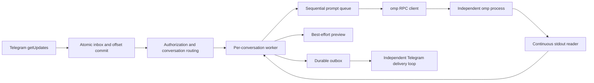

# Architecture and development

[中文版](architecture.zh.md) | [User guide](../README.md)

This document describes the current implementation and its recovery semantics.

## Scope and ownership

The bridge owns Telegram polling, authorization, conversation routing, subprocess startup/shutdown, and reliable message delivery. omp owns model execution, tools, configuration, credentials, and native session history.

The deployment model is one bot per database and one worker per conversation: an ordinary private chat, private-chat topic, or group topic. Non-topic group messages are unsupported. There is no terminal emulation, second model transcript, multi-bot dispatcher, generic backend abstraction, or automatic replay of uncertain tasks. Different sessions do not isolate filesystems or credentials.

## Modules

| Location | Responsibility |
| --- | --- |
| [`cmd/omp-telegram`](../cmd/omp-telegram/main.go) | CLI, version output, data-directory lock, signal handling |
| [`internal/config`](../internal/config/config.go) | TOML, environment references, path defaults, startup-argument validation |
| [`internal/bridge`](../internal/bridge/bridge.go) | Worker actors, commands, prompt queues, previews, final replies, host tools |
| [`internal/bridge/recovery.go`](../internal/bridge/recovery.go) | Startup restoration and persisted close state |
| [`internal/bridge/resume_picker.go`](../internal/bridge/resume_picker.go) | Native session listing and authorized, expiring selection menus |
| [`internal/omp`](../internal/omp/client.go) | RPC framing, request correlation, events, native session metadata and ACP listing |
| [`internal/telegram`](../internal/telegram/client.go) | Bot API, attachment transport, sanitized errors and delivery certainty |
| [`internal/media`](../internal/media/media.go) | Workspace-confined file handling, image preparation and outgoing snapshots |
| [`internal/store`](../internal/store/store.go) | SQLite schema, bindings, durable input/output and completion transactions |
| [`config.go`](../config.go) | Embeds the canonical [`config.toml`](../config.toml) |

## Runtime flow



Startup proceeds through configuration loading, the data-directory lock, database initialization/reconciliation, `getMe`, database bot-ownership checking, command registration, restoration, then polling and delivery. `--version` returns before configuration loading. `--check` validates local configuration and creates the configured directories; it does not open the database or authenticate with Telegram.

Incoming updates are persisted before routing authorization. Unauthorized inputs are marked ignored and cannot start a process, download a file, or execute a command. Users and chats must both be allowed, including both the user ID and matching private chat ID for ordinary private chats. After authorization, messages with a nonzero thread ID or private chat type are accepted; non-topic group messages receive guidance rather than an inferred destination.

### Concurrency

- Each conversation has an actor-like worker. Ordinary text, attachments, and `/review` enter the bridge's deferred queue as independent prompts and run sequentially. The bridge submits the next prompt only after the current task finishes. `/followup` remains unsupported.
- Commands and callbacks use the worker's control path rather than waiting behind queued prompts. This does not promise that every operation is nonblocking: startup and some control RPC round trips still take time.
- Attachment preparation and uploads are asynchronous and bounded. Pending preparation retains its queue position.
- The RPC stdout reader never performs Telegram HTTP delivery. Its event buffers are bounded; protocol violations or overload fail the client rather than allowing unbounded growth.
- A global slot limit bounds active conversation instances. Native session-list queries have a separate concurrency limit.

The client waits for `ready`, negotiates protocol v2, serializes stdin writes, and correlates responses by request ID. A successful `Call("prompt")` means acceptance, not task completion. Only `agent_end` events whose `isTerminal` is not `false`, or a local-command completion signal, finish the task; nonterminal events must not dispatch the next queued prompt. On a terminal assistant message, `stopReason=error` or a nonempty `errorMessage` commits the input as `uncertain`; `stopReason=aborted` commits it as `cancelled`; otherwise confirmed text commits it as `done`. Partial text remains deliverable for `uncertain` and `cancelled` terminal results, while provider diagnostics are never forwarded. Framing and reassembly have explicit bounds, with no PTY/ANSI parsing fallback.

### Prompt and interrupt semantics

The bridge uses public RPC v2 without protocol extensions. Before calling `prompt`, it marks the input as the active terminal-result owner. A successful acknowledgement needs no routing classification; `agentInvoked=false` completes a local command through the normal completion path, while other accepted prompts await terminal events. A failed or unconfirmed prompt request settles the input as uncertain, closes that OMP client, and cancels the bridge queue without retrying. The client must not be reused as idle: unconfirmed work could otherwise take ownership of a later input's result. `/stop` clears bridge-deferred prompts, then sends a plain `abort` request without queue-clearing options. Pending tasks, including `/review`, are never replayed automatically after restart or uncertain execution.

RPC v2 may compact large terminal frames and omit messages already emitted by `message_end`. The worker caches the latest assistant message's `stopReason` and `errorMessage`, plus finalized text from every assistant `message_end`; terminal `agent_end` messages take precedence, and the cache is used only when they contain no assistant message. The cache resets at `agent_start`, terminal completion, and shutdown. Cached diagnostics classify the result but never appear in Telegram output.

Live progress is an in-memory, best-effort view using the existing one-message preview transport. `progress_mode=off` suppresses Telegram Send/Edit and typing but continues text-delta processing for final-result fallback. `summary` shows assistant output, active tool names keyed by tool call ID, and state; `verbose` adds the bounded recent tool list. Retry, compaction, and concurrent tools are explicit events. `tool_execution_end` is the sole completion source, including host tools; host callbacks only correct a matching active tool name. Reasoning, raw frames, tool arguments/results, command text, stdout, and stderr are never rendered. An initial Send failure suppresses progress for that turn to avoid duplicate messages; an Edit failure remains retryable. Progress has generation and turn fences, does not write SQLite, and cannot affect terminal classification or durable outbox completion.

## Identity and stale work

| Identity | Representation |
| --- | --- |
| Bot | Numeric ID returned by `getMe`, not its token or username |
| Conversation | `(bot, chat, thread)`; ordinary private chats use `thread=0` |
| Live worker incarnation | Conversation plus `generation` and its current client |
| Saved conversation | Native omp session-file path |
| Inbound update | Telegram update ID, unique within this bot-owned database |

Ordinary private chats use the existing `(chat, 0)` target and worker/session lifecycle; topic targets retain their thread IDs. No new worker type or schema migration is required. Stored bindings do not contain Telegram chat type, so recovery accepts zero-thread targets only for positive private chat IDs, still enforcing the chat allowlist; topic targets keep their existing recovery behavior.

`CheckBot` rejects another bot using the same database. `daemon.lock` prevents two bridge processes from opening the same data directory concurrently. Operators must still avoid running the same bot with another data directory or polling client.

A successful new/resumed instance increments the persisted generation. Background results are checked against the appropriate generation, turn, request token, or client identity. Session claims prevent two workers in this daemon from opening the same native conversation concurrently. Claims do not lock a workspace against other programs.

**The acceptance boundary matters:** stale runtime work must not affect a replacement instance, but already committed outbox results remain deliverable after `/new` or `/close`. A later generation is not permission to discard accepted results.

## SQLite

The database is `omp-telegram.db` under `data_dir`. It uses WAL, a busy timeout, and one open connection. It stores bridge state and Telegram message content, not an independent copy of omp's model context.

| Table | Key / fields | Role |
| --- | --- | --- |
| `meta` | `key`, integer `value` | Owning bot ID and polling offset |
| `bindings` | PK `(bot,chat,thread)`; `workspace,session,generation,running,interrupted` | Last validated session binding, restoration eligibility, and active-task interruption marker |
| `startup_intents` | PK `(bot,chat,thread)`; `kind,workspace,session,generation` | Durable uncommitted `/new` or `/resume` transition |
| `history` | `bot,chat,thread,workspace,session,generation` | Previous binding snapshots, not a session browser |
| `inbox` | PK `id`; `raw,state,created_at,updated_at` | Update deduplication and processing state |
| `outbox` | Autoincrement `id`; `chat,thread,text,state,kind,path,name,created_at,updated_at` | Ordered text/attachment delivery |

### Database Message Retention

`database_retention_days` defaults to 90. `0` disables automatic cleanup; positive values retain terminal Telegram bridge message records for that many days, measured from `updated_at`, the latest state transition. The Bridge runs this best-effort janitor once at startup and every 24 hours thereafter. Failures are logged and retry on the next interval; they do not stop Telegram or omp processing.

Only explicitly enumerated terminal states are eligible: inbox `done`, `cancelled`, `ignored`, `failed`, `uncertain`; outbox `done`, legacy `sent`, `failed`, `uncertain`, `cancelled`. Inbox `pending`/`submitted` and outbox `pending`/`sending` remain durable. Deletion uses committed batches of 1000 rows; the service never automatically runs `VACUUM`.

Retention never deletes bindings, history, startup intents, workspaces, omp session files, or other omp data. Terminal outbox attachment snapshots become unowned after their corresponding delete commits and are removed best-effort only when confined to `data_dir/attachments/outbox/`. Each janitor run also removes unreferenced `attachment-*` snapshots in that private spool once their file modification time exceeds the retention cutoff.

### Schema version

`PRAGMA user_version` is the schema version, currently 4. An empty database creates all tables, indexes, and the version in one transaction. Reopening reconciles runtime states. Populated unversioned databases and unsupported future versions are rejected before schema or record changes. Versions 1 through 3 migrate transactionally through `startup_intents`, the binding interruption marker, and message timestamps before advancing `user_version`. Existing v3 messages receive migration-time timestamps, giving them a full retention period rather than guessing historical age. An older binary rejects the newer schema. Application versions and database versions evolve independently.

### Input and completion transactions

```text
Telegram update
  -> transaction: insert inbox pending + advance offset
  -> authorize and route
  -> persist submitted
  -> write prompt to omp stdin
  -> receive terminal completion
  -> transaction: persist final text parts + set inbox done, uncertain, or cancelled
```

`Accept` performs one atomic transaction per update. Offset advancement never precedes durable input, and duplicates do not overwrite the original stored update.

For ordinary tasks, completion requires a submitted input and commits all final text parts with the terminal inbox state in one transaction. Normal terminal output is `done`; a provider/model error is `uncertain`; an explicit OMP abort is `cancelled`. Any failure rolls back both. `say()` remains a notification helper, not the completion API. Control-command completion is handled separately. Tool attachments can be queued during execution and are not retroactively included in the final-text transaction.

A database completion failure stops the worker rather than pretending the task completed. On restart, submitted inputs become `uncertain`; previously pending ordinary messages, attachments, and `/review` commands are canceled rather than replayed. Other pending controls still pass normal authorization, and old in-memory callback tokens expire when their state is lost.

### Output delivery

```text
pending -> sending -> done
                   -> failed
                   -> uncertain

restart: sending -> uncertain
```

The Telegram client classifies failures at the transport boundary:

- Local pre-send failures and trustworthy, complete API rejections are definite failures.
- Transport interruption, incomplete responses, or otherwise unconfirmed delivery remain uncertain.
- HTTP status alone is insufficient. Prior uncertainty must not be erased by a later local failure.

There is no new automatic resend for either terminal error state. Explicit Telegram rate limits retain bounded retries. A database transaction cannot atomically commit a Telegram network side effect, so exactly-once delivery is not promised.

## Session lifecycle

`/new` resolves a working directory and, when replacing a live instance, requires confirmation. `/new <name or path>`, `/resume`, and the other existing commands work in ordinary private chats and topics alike. `/resume` obtains the current directory's session list from a short-lived native `omp acp` process using `session/list`. The bridge does not scan session files or synthesize this list from `history`. Selection menus use random tokens with owner, conversation, generation, expiry, and cancellation checks. Explicit `/resume ID` delegates native lookup to omp and may restore its original directory.

Every user-requested start first commits a `startup_intents` record with the frozen operation, target, and next generation. In the same transaction, any prior running binding becomes ineligible for automatic restoration. Only after native identity validation and host-tool registration does a second transaction publish the binding and delete the intent. `/close` deletes a pending intent before closing the current binding.

`running` is restoration eligibility, not a live PID indicator:

| Event | Persisted behavior |
| --- | --- |
| Successful start/resume | Publish native identity, delete intent, and set `running=1` |
| Normal daemon shutdown | Preserve committed restoration eligibility; mark an active task as interrupted |
| `/stop` | Keep the instance and eligibility; clear waiting prompts |
| `/close` | Delete a pending intent, persist `running=0`, then close the instance |
| Runtime failure closed by the worker | Clear eligibility; active task becomes uncertain |
| Automatic restoration failure | Preserve saved identity and eligibility for manual recovery or a later service restart |

After restart, a committed running binding restores the exact saved session file and directory. A binding marked interrupted appends a warning to its `omp is ready` message, then clears the marker in the new generation; idle restorations stay silent. An uncommitted new/resume intent does not launch another omp process: the prior start may already have created process state whose identity was never committed. The bridge creates an inactive worker, reports the uncertainty, and requires explicit `/close` followed by `/new` or `/resume`. This preserves the requested transition without replaying an uncertain operation. Missing files/directories do not trigger a replacement conversation. A fresh omp session may report an identity before its history file exists.

## Process and file safety

- Launch argv directly, without a shell. Explicit `omp_args` cannot replace bridge-owned RPC, cwd, or session lifecycle options.
- Normal shutdown closes stdin, drains output, then escalates through process-group termination when necessary. Each process has one owner of `Wait`.
- Linux RPC and ACP launches use parent-death SIGTERM. Because Linux ties this signal to the creating OS thread, that thread stays locked until `Wait` completes, costing one locked thread per live native child.
- Parent-death signaling is not process-tree containment. Ignored signals, surviving descendants, escaped groups, or cleared parent-death settings require a deployment-level containment boundary. No systemd/supervisor configuration is imposed by the project.
- Incoming attachments are confined to the selected workspace and retained under `.telegram/incoming/`. Outgoing files are copied to private snapshots under `data_dir/attachments/outbox/` before enqueueing. Confirmed deliveries remove snapshots; failures retain them.
- Host tool calls are scoped to the active conversation/request and cannot select another Telegram destination. Raw RPC state, provider headers, credentials, and system prompts must not be logged or sent as status output.

## Configuration and path contracts

Bridge defaults are relative to the real executable directory after symlink resolution, not the caller's cwd. Explicit relative `--config` paths are caller-relative; relative `data_dir` and `workspace_root` remain executable-relative even when the config file is elsewhere.

The root `config.toml` is embedded once. Only an absent implicit default file selects the embedded configuration; explicit missing files and unreadable/invalid files fail. Environment expansion happens after TOML parsing and only once. `omp_args` uses quoting-aware tokenization, not shell execution. omp's own defaults remain untouched unless explicitly configured or changed by a requested RPC command.

## Development and release

```sh
just build
just check
just install
just service
```

`just test` runs unit tests without starting or restarting a service. `just check` runs unit tests, race checks, and vet. `just install` copies only the binary. `just service` installs the binary, then restarts the existing supervised daemon.

Keep regression tests for observable behavior: atomic rollback, restart identity, authorization, cancellation, delivery uncertainty, and process ownership. Use isolated workspaces/databases for real omp smoke tests. Do not describe injected Telegram input or simulated callbacks as phone-originated end-to-end validation.

Current evidence includes transactional failure injection, index query plans, real omp restart recovery, and real Telegram file transfers with injected input. A parent-SIGKILL probe observed a cooperating native omp/tool tree exit, while isolated fixtures demonstrated that non-cooperating descendants can survive. Actual user-client input/clicks, the full live fault matrix, and successful long-session compaction still need acceptance.

Application version comes from `Version` in [`cmd/omp-telegram/main.go`](../cmd/omp-telegram/main.go). `--version`/`-v` includes Git revision/dirty metadata when available; `-ldflags "-X main.Version=..."` can override the base version.

The [release workflow](../.github/workflows/release.yaml) runs on `main` pushes, pull requests, and manual dispatch. All non-`main` branch changes must enter through a pull request. It builds/tests Linux amd64 and arm64 natively, with race checks on amd64. Every workflow from the repository publishes: a new source version on `main` creates a formal release without rewriting an existing version tag, while all other internal workflows publish a unique `v<version>-dev.g<commit>` GitHub prerelease. Internal PR prereleases are tagged at the real head commit. Pull requests from another repository use the same validation path but never publish. Manual runs outside `main` publish prereleases.

Release archives contain the binary and LICENSE, with `SHA256SUMS` alongside them. Publishing uses `GITHUB_TOKEN` with write permission only in the release job. To release a new application version, update `Version` to `vMAJOR.MINOR.PATCH` and merge/push to `main`. This does not automatically change the database schema version.
