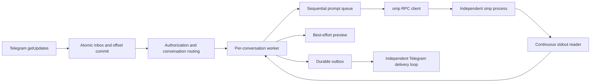

# Architecture and development

English | [中文](architecture.zh.md) | [User guide](../README.md)

This document describes the current implementation and its recovery semantics.

Installation, configuration, command usage, and user-visible limits belong in the [user guide](../README.md). Keep protocol, state-machine, persistence, and recovery details in this document instead of duplicating them in the README.

## Scope and ownership

The bridge owns Telegram polling, authorization, conversation routing, subprocess startup/shutdown, and reliable message delivery. omp owns model execution, tools, configuration, credentials, and native session history.

The deployment model is one bot per database and one worker per conversation: an ordinary private chat, private-chat topic, or group topic. Non-topic group messages are unsupported. There is no terminal emulation, second model transcript, multi-bot dispatcher, generic backend abstraction, or automatic replay of uncertain tasks. Different sessions do not isolate filesystems or credentials.

## Modules

| Location | Responsibility |
| --- | --- |
| [`cmd/omp-telegram`](../cmd/omp-telegram/main.go) | CLI, version output, data-directory lock, signal handling |
| [`internal/config`](../internal/config/config.go) | TOML, environment references, path defaults, startup-argument validation |
| [`internal/bridge`](../internal/bridge/bridge.go) | Worker actors, commands, prompt queues, previews, final replies, host tools |
| [`internal/bridge/recovery.go`](../internal/bridge/recovery.go) | Startup restoration and persisted close state |
| [`internal/bridge/resume_picker.go`](../internal/bridge/resume_picker.go) | Native session listing, export jobs, and authorized, expiring selection menus |
| [`internal/bridge/session_delete.go`](../internal/bridge/session_delete.go) | Delete confirmation, session reservations, native deletion orchestration |
| [`internal/omp`](../internal/omp/client.go) | RPC framing, request correlation, events, native session metadata, ACP listing, and native export delegation |
| [`internal/omp/delete.go`](../internal/omp/delete.go) | Native RPC session deletion and file-absence verification |
| [`internal/telegram`](../internal/telegram/client.go) | Bot API, attachment transport, sanitized errors and delivery certainty |
| [`internal/media`](../internal/media/media.go) | Confined file handling, incoming attachment storage, image preparation and outgoing snapshots |
| [`internal/store`](../internal/store/store.go) | SQLite schema, bindings, durable input/output and completion transactions |
| [`config.go`](../config.go) | Embeds the canonical [`config.toml`](../config.toml) |

## Runtime flow


```mermaid
flowchart LR
    TG[Telegram getUpdates] --> IN[Atomic inbox and offset commit]
    IN --> AUTH[Authorization and conversation routing]
    AUTH --> W[Per-conversation worker]
    W --> Q[Sequential prompt queue]
    Q --> RPC[omp RPC client]
    RPC --> OMP[Independent omp process]
    OMP --> READER[Continuous stdout reader]
    READER --> W
    W --> PREVIEW[Best-effort preview]
    W --> OUT[Durable outbox]
    OUT --> DELIVERY[Independent Telegram delivery loop]
```

Startup proceeds through configuration loading, the data-directory lock, database initialization/reconciliation, `getMe`, database bot-ownership checking, command registration, restoration, then polling and delivery. `--version` returns before configuration loading. `--check` validates local configuration and creates the configured directories; it does not open the database or authenticate with Telegram.

Incoming updates are authorized before persistence. Authorized inputs retain the typed update in the inbox for routing; unauthorized inputs retain only update ID, ignored state, and receive timestamps while the offset advances atomically. Unauthorized inputs cannot start a process, download a file, or execute a command. Users and chats must both be allowed, including both the user ID and matching private chat ID for ordinary private chats. After authorization, messages with a nonzero thread ID or private chat type are accepted; non-topic group messages receive guidance rather than an inferred destination. A group topic has one shared OMP session for all authorized users, and Telegram members who can view the topic can also see bot replies and `/export` attachments even without bot command access.

### Concurrency

- Each conversation has an actor-like worker. Idle ordinary text begins an independent root prompt; ordinary text arriving during a root is a tracked OMP steer, not a new root. `/followup <message>`, attachments, `/review`, and other recognized native OMP commands use the deferred bridge queue as independent submissions. The active root owns the final reply; different conversations run concurrently.
- Bridge controls and callbacks use the worker's control path rather than waiting behind queued prompts. This does not promise that every operation is nonblocking: startup and some control RPC round trips still take time.
- Command recognition gives the registered bridge commands plus the hidden `/start` alias precedence, then checks the current OMP command catalog. An `@bot` suffix is recognized only for a single-segment Telegram command name (ASCII letters, digits, underscores; 1-32 characters) and a username-shaped target (5-32 such characters). Paths such as `/opt/user@host/file` remain ordinary prompts. Foreign-bot commands are ignored, including pending ones after restart; startup cancels pending slash-prefixed prompts just like ordinary queued text, never replaying them automatically.
- `/queue` reads only the current worker's in-memory `queue`, `active`, and `busy` state. It is a per-conversation viewer; its Cancel buttons target pending bridge inbox IDs and never abort the active task or manage OMP's native queue. The queue is runtime-only: worker shutdown cancels remaining pending inboxes, and no queue entry is restored.
- Attachment preparation and uploads are asynchronous and bounded. Pending preparation retains its queue position.
- The RPC stdout reader never performs Telegram HTTP delivery. A shared 64 MiB credit budget includes reserved frame reassembly capacity and queued asynchronous event bytes; credits return when the worker receives an event. Protocol violations or overload fail the client rather than allowing unbounded growth. The worker separately limits accumulated pre-terminal assistant text to 4 MiB. Either overflow before a terminal event fails the runtime and leaves the task uncertain without replay. After a confirmed terminal event, only display overflow is truncated: up to 32 Telegram messages and 1 MiB of reply text, with an explicit notice, while the task remains done.
  The 64 MiB logical-frame protocol ceiling and 64 MiB buffered-resource policy are independent: a valid near-limit frame may exceed the resource budget while its physical chunk or queued events are retained. A completed assistant message replaces its in-progress streamed bytes in the 4 MiB logical output budget; the retained stream buffer has a separate 4 MiB cap.
- `worker.max_workers` bounds connected OMP processes, not logical sessions. A positive `worker.idle_timeout` may release a quiescent worker's process and return its slot while retaining its validated binding and session claim.

The client waits for `ready`, negotiates protocol v2, serializes stdin writes, and correlates responses by request ID. A successful `Call("prompt")` means acceptance, not task completion. Only `agent_end` events whose `isTerminal` is not `false`, or a local-command completion signal, finish the task; nonterminal events must not dispatch the next queued prompt. On a terminal assistant message, `stopReason=error` or a nonempty `errorMessage` commits the input as `uncertain`; `stopReason=aborted` commits it as `cancelled`; otherwise confirmed text commits it as `done`. Partial text remains deliverable for `uncertain` and `cancelled` terminal results. An uncertain failure reply may include a bounded `errorMessage` summary after redacting credentials, request IDs, URLs, and absolute paths; unsafe details and provider classifications are not forwarded. Framing and reassembly have explicit bounds, with no PTY/ANSI parsing.

Managed autoresearch is the explicit exception to ordinary-root completion above: a terminal-looking round does not settle its research owner. See [Managed autoresearch](#managed-autoresearch).

### Native command recognition and submission

Phase 1 uses a per-client, immutable command-catalog snapshot with distinct `CatalogUnknown`, `CatalogReady` (including an empty catalog), and `CatalogUnsupported` states. Advertised aliases participate in lookup. Discovery runs asynchronously with at most one query in flight, and availability is refreshed after lazy session restore. Explicit unsupported discovery is not a transport failure: slash input not explicitly owned by the bridge is cancelled because its command source cannot be verified; non-slash text and bridge controls retain their existing routing. Transport failures remain errors, and malformed catalogs are protocol errors, never unsupported or ready-empty fallbacks. Unknown discovery does not block an ordinary root when current-branch metadata confirms research mode is disabled. Enabled research waits for discovery before taking ownership. Catalog names, descriptions, and raw frames are not logged or persisted; no schema or queue-persistence change is introduced.

The catalog retains compact unknown/builtin/extension/other source classification, plus a canonical-autoresearch extension variant, in one private map. The general executable whitelist is `builtin`, `skill`, `custom`, `mcp_prompt`, and `file`; only `builtin` enables builtin invocation syntax. The sole extension exception is the canonical name `autoresearch` with source `extension`. Its aliases retain ordinary extension refusal, and another extension's alias named `autoresearch` cannot gain permission. Missing, null, non-string, empty, and unrecognized source values remain unknown: their names and aliases stay recognizable but are not executable. Source anomalies alone do not reject the catalog or close the runtime. Other aliases inherit their command's source classification; other metadata is discarded.

Names and aliases are retained as opaque strings without normalization, including Unicode format, whitespace, and control characters. Validation still rejects empty names, a leading `/`, and invalid name/alias field types. Catalog validity is separate from invocation matching: a file command named `code review` must not close the runtime even though the current literal-space parser cannot match that whole name. Existing bridge/native precedence and separators still determine routing; retaining an entry does not make its full name callable.

The stdout reader applies `available_commands_update` snapshots before waking any later response waiter. Worker events are notifications only and read the authoritative client snapshot; an older already-queued event cannot reapply an obsolete catalog. A discovery query records the reader's update revision and session scope before it is issued. The reader decides whether to apply the query snapshot before waking its response waiter, and applies it only if both revision and scope are unchanged. A newer reader update therefore wins over an older query result. Session transitions invalidate the catalog and fence in-flight queries without changing the client ID; stale bridge continuations must also be rejected against the current runtime/session scope.

Supported recognized native text is normalized from `/cmd@thisbot` to `/cmd` while preserving its arguments, and is submitted through the existing bridge queue without a reply-context wrapper or `streamingBehavior: "steer"`. With a ready catalog, unrecognized slash input, including absolute paths, retains its original text and ordinary prompt/steer routing. Native queue entries retain their native classification and revalidate availability at dispatch. If the current catalog no longer advertises a queued command (including after a transition to unsupported discovery), that entry is cancelled, never downgraded to model text. Refresh failures cannot be used as a healthy unsupported fallback.

The Unsupported fail-closed check is shared by direct slash routing, pending slash classification, raw slash-headed queued prompt dispatch (including followups and prepared attachments), and the active-task steer path. Rejection cancels the inbox, removes queued input and its prepared attachment resources, and emits a generic capability notice without closing the runtime or changing its binding. Explicit bridge `/review` queue entries carry bridge-owned provenance; raw `/followup /review ...` or attachment text cannot gain that exemption by matching a command name. Unknown discovery remains a separate waiting state, never an Unsupported rejection or a ready-empty fallback.

Bridge routing, lifecycle refusal, and restart classification use the slash invocation parser. It splits at the earliest OMP-compatible whitespace or `:`, including JavaScript BOM whitespace but excluding NEL. Advertised-native recognition first matches the complete name before the first literal space, preserving extension/custom/file names such as `plugin:command` and `foo:bar` and normalizing valid bot suffixes. Only advertised builtin names and aliases enable colon/other-whitespace invocation syntax. Advertised non-executable sources are also recognized under these separators solely to refuse them; a complete literal-space name still takes precedence over a refused prefix. Unadvertised names and executable extension/custom/file non-literal-space invocations remain ordinary input with reply context and prompt/steer routing intact. Dispatch revalidation uses the same full-name-first recognition and requires the saved native name to match. Removal, source changes that invalidate the syntax, or adding a longer matching name cancel the queued submission even if its original name remains advertised. Bot targeting is parsed only in the command token. Bridge argument handling removes one separator and trims surrounding whitespace; native normalization retains the original separator and argument bytes. Unknown commands are never normalized. Thus colon syntax cannot bypass bridge command precedence, confirmation, idle checks, or session-operation ownership. Unsupported `/compact` arguments are rejected locally.

Native queue entries also retain the native session ID. A changed session cancels them even if the new session advertises the same command; a new client restoring the same session does not. Same-session catalog revisions alone do not cancel still-advertised commands. A rejection from an old-session discovery request cannot close a newer session. Native ownership survives acknowledgment when `agentInvoked` is absent: ordinary text remains queued until `agentInvoked:true` or `agent_start` proves agent execution. Those signals switch the active input to ordinary root-task behavior, permitting subsequent text steering under the original final-reply owner.

`RefreshCommandCatalog` returns the epoch of the query it actually creates or joins under the client mutex. The worker uses that returned epoch to distinguish an old-session result from a current-session failure; a worker snapshot taken before launching discovery is not a query scope token.

Discovery waiter deadlines, cancellation, and request rejection do not prove runtime failure, regardless of query epoch. A reader-published usable catalog remains authoritative and can resolve waiting inputs. If discovery remains unknown, slash inputs stay pending and the worker pauses discovery for that client/epoch instead of repeatedly joining the unanswered query. A scope change can refresh discovery; a reader-published update restores classification. The user-facing failure notice points to `/queue` and Cancel on the waiting slash item; removing that item releases following work without reordering FIFO. Actual transport, protocol, process, and other discovery failures retain runtime-failure handling. Interrupted discovery never becomes an unsupported-catalog fallback or a reason to retire an unrelated healthy root.

Pending classification rereads the current catalog for every entry, including after a research-mode query while the stdout reader may publish an update. An unknown catalog leaves remaining inputs pending. Dispatch rereads the queue head after classification and refuses a still-preparing attachment, even when rejecting an earlier command has exposed it. After asynchronous research-mode admission completes for the original queue head, a final queue-head validation rereads the current catalog's source, name, and session before removing or submitting the input. This final validation does not classify pending inputs or issue another blocking query. It also covers raw slash-headed queued prompts; a catalog revision alone does not cancel a command that remains executable and available under the same name and session.

Lifecycle-mutating builtins `/move`, `/wt`, `/worktree`, and `/session delete` are reserved as unsupported at input routing and checked again before queued prompt dispatch. OMP's whitespace/colon invocation syntax, bot suffixes, and the worktree alias are covered. The session refusal matches the case-insensitive `delete` verb with no remaining arguments; `/session info` and `/session pin` retain normal native routing. Refusal cancels the inbox and notifies the user without submitting a prompt, moving or deleting the session file, creating a worktree, or changing the saved binding. This policy applies even when discovery is unknown or unsupported, because falling back to raw model text would still let OMP dispatch the builtin. Session deletion remains owned by the `/resume` picker with its confirmation and in-use checks. No per-command session reconciliation or binding migration is implemented.

Except for canonical autoresearch, advertised extension and unknown-source commands and aliases are refused at ready input routing, pending discovery classification, and queued dispatch. Extension handlers can call native session lifecycle APIs such as `newSession`, `branch`, `navigateTree`, `switchSession`, and `reload`; generic extension lifecycle changes are not reconciled with the saved binding and session claim, and unknown sources must not inherit permission to execute. Refusal cancels the inbox and emits a generic source-specific notice without echoing catalog names, arguments, or raw source data; it never falls back to an ordinary prompt or steer and does not close the current runtime. Dispatch also checks raw slash-headed queued prompts from followups or attachments and source changes from executable sources to extension or unknown. Slash-headed prompts wait while discovery is unknown; research admission also checks the catalog before other roots. Bridge control precedence and foreign-bot ignoring remain unchanged. This refusal does not disable extensions in OMP or add session identity migration.

Dispatch revalidation closes the bridge's queue-time stale-catalog window, but is not an atomic upstream check-and-execute operation: OMP can change availability after the last snapshot check and before accepting the prompt. Likewise, an untagged old-session `available_commands_update` on the same client cannot be reliably identified as stale; query fencing does not supply the missing session identity. These are RPC protocol limits, not guarantees supplied by bridge generations.

A successful native local response with `agentInvoked:false`, or a request-correlated `prompt_result` with `agentInvoked:false` and `status:"completed"`, marks the bridge submission `done` even without assistant text. Retaining native ownership after an acknowledgment without `agentInvoked` lets a delayed local completion settle correctly. This is submission completion, not proof that a background operation has finished. Phase 1 leaves uncorrelated native `command_output` handling unchanged and does not deliver it to Telegram; local commands may emit output but yield no visible reply. It adds no rich ask UI. `/plan` and `/plan-review` still require upstream RPC implementation; catalog recognition alone does not implement them.

Recorded research mode does not change ACK-only completion for other native commands, such as `/session info`. Only the canonical research command bypasses that shortcut and requires correlated local completion.

For a local `prompt_result`, `status:"error"` retains root-task failure semantics (`uncertain`), `status:"aborted"` becomes `cancelled`, and absent or unknown status becomes `uncertain`. These outcomes atomically persist a generic notice with the terminal inbox state, without exposing raw RPC errors. They do not close the runtime or replay the command; following bridge tasks can continue normally.

### Managed autoresearch

[`internal/bridge/autoresearch.go`](../internal/bridge/autoresearch.go) owns only research operation metadata. The native extension owns experiments, Git operations, artifacts, and autonomous continuation. Startup adds no confirmation or approval override. Direct goal and empty-toggle commands use the native handler; off and clear use correlated local completion, not an acceptance response or a notification. A confirmed local startup refusal completes the command without leaving a fake research root.

Before dispatch, including lazy restore, `Client.AutoresearchMode` obtains the native session ID/file from `get_state`, reads only ancestry/control metadata from that JSONL history, and requests `get_entries` with `since` set to the last entry in its valid prefix. RPC supplies the canonical suffix and the authoritative current `leafId`; the file's append order never selects the current branch. The session ID/file is rechecked after the query. This avoids transferring the entire native transcript, which can exceed the 64 MiB RPC reassembly limit even when the active model context is compacted. New sessions without a persisted file use the initial entries query. No metadata cache, model/tool payload copy, or second history is persisted.

[`internal/bridge/research_admission.go`](../internal/bridge/research_admission.go) runs dispatch mode lookup in the existing asynchronous RPC lane. Its evidence is scoped to client, generation, turn, queue-head inbox, catalog epoch/revision, and native session. Canceled or replaced heads cannot consume an old result; catalog revisions require fresh mode evidence without replaying a command. Queue cancellation, runtime retirement, and explicit off discard the lookup or its ready result. Evidence is consumed by one submission, never reused for a following root. Stop and close remain actionable while native metadata is withheld.

OMP can recover malformed JSONL records without immediately rewriting its history. On a JSON syntax error, the disk reader stops at the preceding complete entry and obtains the canonical remaining entries through RPC. It neither skips ahead to a later disk cursor nor assumes the mode is off, and never repairs the file itself. Valid JSON with invalid control metadata still fails closed.

Legacy session headers with `version < 2`, including an omitted version, cannot supply disk entry IDs or ancestry: OMP migrates them in memory without necessarily rewriting the file. The reader uses the initial native `get_entries` snapshot instead of a disk cursor, then applies the same identity, control, and ancestry validation. Modern histories still require valid entry IDs. The bridge never writes the migrated history itself.

The reader follows `leafId` through parent IDs to the nearest `autoresearch-control` entry (`on`, `off`, or `clear`). Opposite-mode entries on other branches are ignored. Missing metadata, invalid modes, broken ancestry, cycles, unreadable history or missing/mismatched session headers, stale cursors, session changes, and query failures are not interpreted as disabled mode: attempted input is cancelled and waiting work pauses. This is the recorded control flag, not a second experiment state or a guarantee about branch-dependent tool activation. Pending slash inputs must be classified by the actor before research admission, even if the reader has already published a ready catalog.

Known upstream limitation: this is control intent, not authoritative effective state. OMP 18.8.2 can restore a recorded `on` entry while disabling research for the current Git branch. Its [`get_state` implementation](https://github.com/can1357/oh-my-pi/blob/v18.8.2/packages/coding-agent/src/modes/rpc/rpc-mode.ts) does not expose effective autoresearch mode. The bridge must not duplicate OMP's branch/storage reconstruction rules or infer mode from notifications/tools. Consequently recorded-on/effective-off can still create a managed root that does not naturally settle; this P2 requires an upstream authoritative query tied to the current session and extension lifecycle. A missing field is not evidence of off. Workspace leases do not resolve this protocol limitation.

Discovery classification converts queued research goals and enabling toggles in place, preserving their original FIFO position. Immediate off/disable-toggle controls and clear remove their own pending entry before applying control checks; clear still requires all other queued work to be absent. Taking over a research root or its persisted lease also cancels queued empty-toggle controls, including inputs awaiting catalog classification, without removing ordinary work or nonempty research goals.

If a control replaces the runtime during classification, that pass stops immediately. Remaining entries wait for the new client's catalog instead of being cancelled or classified through the retired client.

A research owner alone does not enable steering. Ordinary text arriving while a native command awaits agent admission or local completion stays queued. Once that command enters the ordinary-prompt state, text can steer the same root, including between research rounds.

While a native-command root is pending and no research control is already loading, a newly accepted research goal or toggle stays queued without starting another routing-mode query. This keeps the root's correlated local-completion control exclusive; dispatch reads fresh mode evidence for the queued input after that root settles. If the research root instead enters agent execution, deferred empty toggles return to the immediate control path with fresh catalog/session validation and mode lookup. They must not wait behind the autonomous root. Off for a research root or lease owner cancels both a pending toggle lookup and every queued empty-toggle control before retirement, even before agent execution is observed. Canceled toggles become `cancelled` and cannot later be reinterpreted as enabling commands after off completes; ordinary prompts, attachments, and nonempty queued goals retain their order.

An enabled mode makes the next ordinary submission a research root. Its original inbox, request owner, turn, and progress association survive autonomous `agent_start`/`agent_end` pairs, terminal-looking `prompt_result`, and transient settled/idle states. The bridge does not replay the goal or synthesize continuation prompts. Each round appends bounded replies atomically to outbox while leaving the owner `submitted`, then clears round text buffers. Duplicate end events without a new start do not append another round. Ordinary text steers the same root; native commands, attachments, and followups remain deferred. Generic completion, idle release, and watchdog paths cannot conclude that explicit research has finished. `/status` distinguishes managed research, recorded enabled mode without a root, and an unconfirmed disable.

Natural shutdown has a separate completion path. `session_settled` only invalidates older evidence and schedules an asynchronous query through the existing RPC lane. After the round closes and every steer resolves, recorded mode must be off and `get_state` must explicitly report `isStreaming=false`, `isCompacting=false`, `isSettled=true`, `hasPendingAsyncWork=false`, and `queuedMessageCount=0`. Only then does the root transition to `done`, without copying already committed round replies. The confirmed-off lease is released before queue dispatch. Query errors or incomplete state retire the root as uncertain and pause the queue; mode-on or pending work retains ownership. Results are fenced by client, generation, root/request, turn, catalog epoch/revision/session, settlement revision, and steer admission; buffered events take precedence. Stop and close remain actionable during the query.

Connected `/status` reads research metadata and runtime state in the asynchronous RPC lane, not synchronously in the worker actor. Slow `get_entries` therefore does not hold up active-research Stop or `/close` handling. Mode-cache updates require the original generation, turn, client, catalog epoch, and session identity; stale results cannot restore enabled mode in a replacement runtime.

[`internal/bridge/research_control.go`](../internal/bridge/research_control.go) advances routing, mode lookup, off identity verification, final idle checks, prompt acceptance, correlated local completion, and post-control mode lookup as actor-owned phases. RPC work uses the existing cancellable operation lane and returns immutable results; it does not mutate worker state or drain `Client.Events`. `worker.event` remains the single dispatcher for control results, catalog/session updates, host tools, notifications, and other events. Results require the original client, generation, turn, catalog epoch/revision, and native session. Local research completion requires both acceptance and a correlated `status:"completed"`, `agentInvoked:false`, `sessionSettled:true` result before its post-mode query. Stop/close can cancel these waits and retire the original runtime; an interrupted off/clear retains the lease and pause, never implicitly replaying the control. Process startup retains its existing lifecycle.

Research notifications are display-only, bounded, sanitized through the existing terminal-detail filter, and delivered through durable outbox with a budget of eight per round/local control. They do not prove mode or completion. Error/abort events, process exit, and resource overflow retire the runtime and settle interrupted owners conservatively, never replaying research.

Explicit `/autoresearch off` checks research-root and persisted lease ownership before retirement. With no research lease or root, a scoped recorded-off proof completes the control without sending native off or abort, preserving the ordinary task, runtime, binding, and deferred queue. A stale proof requires an asynchronous read-only mode query. Failure of that read-only query marks the control uncertain and pauses future queued work, but does not interrupt the ordinary task or discard its final reply. An empty-argument toggle still requires mode lookup; without research ownership, a control waiting for discovery removes only its own queue entry.

Catalog scope invalidation follows the same rule: failing a read-only off or route mode query does not consume ordinary-task events already queued before the reader's catalog update when the original runtime is preserved. The actor still handles their output and completion normally. A failed route cancels the unsubmitted research command and pauses queued work; stale mode results cannot clear the queue pause.

Retrying a failed read-only off lookup remains read-only while the ordinary root has no research ownership. A repeated off, or an off arriving during a route query before its research command is submitted, cancels and replaces only the read-only query, not the ordinary runtime, even if the root finishes during the lookup. The canceled off control remains uncertain; an unsubmitted routed command is cancelled. Stale results cannot affect the replacement. Confirmation of recorded-off mode clears the disable-pending queue pause without changing the root's runtime, identity, or pending work. Repeated query failures retain both the ordinary task and the pause.

For active research or an owned research lease, Stop/off first invalidate and immediately terminate the active research process group, then durably mark its root and unresolved steers `uncertain`. A resumed runtime must be idle, settled, and without pending work before sending native `/autoresearch off`; acceptance plus a correlated completed local result (`agentInvoked:false`, `sessionSettled:true`) and a subsequent disabled-mode query permit preserved work to dispatch and release the lease. Failure closes the runtime and leaves a disable-pending pause. Progress Stop/off preserve ordinary queued work; `/stop` clears the queue. Old client/generation/turn results cannot mutate the resumed worker. Termination does not undo tool effects or guarantee the session remains resumable.

An idle connected owner can confirm local off before its first native session file has been persisted. Saved-file availability is required only for cold resume. The connected path still validates the native session ID, exact file path or existing-file identity, workspace, session claim, correlated local completion, and subsequent disabled-mode evidence before releasing the lease.

When Stop interrupts an unfinished admission lookup and canonical autoresearch is available, it clears the queue and retires the blocked runtime before restoring the original session and confirming local off. It does not start another mode lookup behind the withheld response. If the native session has not yet been persisted, or restoration/disable cannot be confirmed, the bridge keeps the disable-pending pause and any original lease, reports the failure, and never invents a replacement session or replays canceled input.

When process exit is deferred behind an outstanding RPC, handling that result clears the old client's exit fence before research retirement. The active RPC lane still waits for its result, but the exit fence must not prevent later calls on a replacement runtime.

If shutdown cancels a deferred input's Git admission probe before submission, its error handler leaves that inbox pending for the common shutdown/restart cancellation pass instead of marking it done. This applies to queued text/review/followup, native/raw slash inputs, individual attachments, and new albums. A real OMP 18.8.2 smoke confirmed this boundary for followup, native slash, photo, and album inputs: all four were cancelled without provider calls, using an isolated profile and simulated Telegram.

Once the worker context is cancelled, a concurrently ready client-exit notification is not an unexpected-exit close. Normal worker teardown retains the saved running binding, marks an active root uncertain and interrupted, and cancels queued work. A real OMP 18.8.2 smoke observed both cancellation and actual native process exit, then confirmed preserved session identity/history, uncertain active work, and a cancelled followup without replay, using a local provider and simulated Telegram.

Clear requires an idle instance, no queued work or unresolved steers, and a confirmation fenced by owner, chat, topic, message, generation, and catalog epoch. Original native clear arguments are retained. Raw followup/attachment forms cannot bypass these controls. Native clear may reset/clean the worktree and removes research artifacts even with `--keep-tree`; the bridge never implements its own filesystem cleanup. Shutdown/restart settles in-flight work as uncertain and cancels waiting work through existing recovery; it does not resume the loop automatically. The next explicit prompt rechecks native recorded mode.

Immediately after the final idle `get_state`, off and confirmed clear recheck the original client, native session, catalog epoch, and executable canonical autoresearch source before sending their control prompt. Session changes or revoked sources during the query prevent submission; failure retains the original lease and follows the unconfirmed-control pause policy. This is still a snapshot check, not an atomic upstream check-and-execute transaction.

Workspace fencing is persistent and distinct from native session claims. `workspace_users` records normal logical users; `workspace_leases` reserves a physical root for one `(bot,chat,thread,native session ID)`. Before enabling research or executing confirmed clear, a transaction rejects other topics already using that root. `/new`, known-CWD resume, lazy runtime startup, and actual startup metadata all check admission before any user work. Unknown-ID resume may inspect native session metadata but cannot submit work before the actual CWD and identity pass admission. Startup intent and normal admission commit together; successful binding commit replaces old normal registrations atomically. Research claims and deletion reservations also exclude one another.

Every admission boundary re-resolves physical identity under `sessionMu`, including all durable running bindings, known-workspace pending intents, and otherwise unmatched normal registrations. Durable owner workspace paths replace stale normal roots; a path-only worker cache is not sufficient when ordinary work creates or removes a Git repository. One store transaction replaces normal registrations and extends existing leases to their current canonical roots, preserving historical lease roots. Lease refresh also follows the exact owner's workspace from a closed binding, so a newly nested repository cannot evade its reservation. The owner binding cannot be forgotten while any research lease for its conversation remains, preserving that original workspace source. A topology change that merges lease owners preserves every exact owner instead of failing the global refresh; ordinary admission to that root checks all leases and fails closed. An unavailable source retains conservative registrations and historical leases without blocking unrelated roots. Persistence failures roll back both tables. Confirmed off/clear releases every lease alias for the exact `(bot,chat,thread,native session ID)`, never a session prefix, without requiring another Git probe. Resolution is a snapshot, not a filesystem lock.

Git is invoked with explicit read-only argv to resolve the physical worktree root, without process-global `GIT_*` overrides. This probe alone pins both `LC_ALL=C` and `LANGUAGE=C` so localized non-repository diagnostics remain recognizable; OMP's environment policy is unchanged. Symlinks and subdirectories share a root; linked worktrees are independent; non-Git directories use their canonical directory. Root-resolution failures fail closed. At restart, every running binding and known-workspace pending intent is registered before any worker starts, even without a runtime slot. Idle release, worker eviction, and restart retain normal occupancy and exclusive leases. Explicit close or a skipped unavailable binding removes only normal occupancy. Exclusive leases have no TTL and survive close, uncertain termination, and unconfirmed disable; only the same native owner can release one after confirmed off or clear. A different session cannot replace that owner, and native history deletion is refused while its lease exists. External deletion of owner history requires restoring that history to recover normally; the bridge never silently drops its lease. This is bridge-local admission control, not filesystem isolation against external processes or arbitrary tool paths.

Restoring a saved session claim establishes identity, not workspace admission. Conflicts do not abort unrelated workers' startup; every normal execution path still checks admission, including new text steering an active root. An unavailable ordinary binding follows the skipped-restore/closed path. An unavailable exact lease owner retains its binding and lease so the user can repair the original directory/session file and retry disable.

Only explicit `/autoresearch off` or Stop for the exact persisted lease owner may restore a disable-only runtime without ordinary workspace admission. It must confirm the native session ID, session file, and workspace, then idle/settled state and correlated local off completion before releasing that owner's leases. A connected owner's unknown command catalog uses the existing asynchronous discovery queue; off removes only its own pending entry when classified. The disable-only path cannot admit ordinary prompts, enable, toggle, or clear. One owner's confirmed off never releases another owner's lease on a merged root.

Real OMP 18.8.2 smoke used an isolated profile/environment and a local deterministic OpenAI-compatible endpoint: native `init_experiment` armed two autonomous rounds; Progress Stop confirmed native off on a new process before a preserved followup completed. This exercised actual RPC and extension hooks, not live Telegram or a production model provider. Destructive Git/reset behavior was not exercised by this smoke.

A recovery smoke with existing native history also exercised process exit before handling a pending status result, confirmed off and subsequent local/ordinary RPC completion, and a deferred off followed by a queued research goal and preserved followup across runtime replacement. It used real OMP with simulated Telegram and a local deterministic model endpoint.

A natural-stop smoke ran real OMP 18.8.2 with `init_experiment(max_iterations=1)`, a harmless `run_experiment` harness, and `log_experiment(status="keep")` in an isolated non-Git directory. Native off completed the original root exactly once and released its queued followup. A second topic was denied during the lease and admitted after natural off. The provider was local and deterministic, Telegram was simulated, and no Git reset/commit or live Telegram delivery was exercised.

A second real-OMP smoke used a disposable Git repository. With two normal topics bound there, enable and confirmed clear were refused before native mutation: the branch stayed `main`, an untracked sentinel survived, and no model request started. After closing the other topic and committing the smoke's harmless baseline, native OMP entered `autoresearch/*`; the same finite experiment then completed and released the lease. Only disposable Git data changed; native reset/clean was not invoked.

A dynamic-identity smoke started two real OMP 18.8.2 runtimes in non-Git parent/subdirectory workspaces under a French locale, then initialized one disposable parent worktree. Both research goals and confirmed clear were refused without model calls or native Git mutation. Closing the other topic permitted local enable and confirmed off, with no remaining leases. A separate recovery smoke first saved native history, then armed a fault for old-runtime `get_entries` during active research: explicit off skipped that query, retired the original root as uncertain, resumed and confirmed native off, and executed the preserved followup exactly once. Both used an isolated profile, a local deterministic provider, and simulated Telegram; no native reset/clean or live Telegram delivery was exercised.

A real OMP 18.8.6 smoke restored a synthetic 78,750,537-byte native history in an isolated agent directory/workspace. Incremental mode lookup confirmed off within its five-second query deadline, canonical `autoresearch` qualified as an executable extension through the Go client, native `/autoresearch off` completed through its correlated local result, and a subsequent `/session info` completed locally. No provider prompt, production history mutation, Git operation, or live Telegram delivery was exercised. Permanent regressions cover large-history branch selection, updates after the file snapshot, mismatched history, and session changes during lookup.

A crash-tail recovery smoke with real OMP 18.8.6 restored synthetic recorded-off and recorded-on histories ending in an incomplete message record. Both mode queries succeeded without changing the damaged files; native off then completed through a correlated local result, followed by a successful local `/session info`. No provider prompt or live Telegram operation was submitted. Regressions also require RPC-supplied on metadata to survive a partial disk control record and retain fail-closed behavior for invalid control metadata, rejected cursors, and broken ancestry.

A real-OMP recovery smoke covered v1 and unversioned histories with both recorded modes: lookup preserved the original file, correlated native off completed, and `/session info` completed afterward. Workspace smokes merged two persisted lease owners with a disposable parent `git init`: unrelated local work succeeded, both owners' ordinary admission was refused, and each exact owner confirmed off while preserving the other owner's lease until its own disable. The final smoke covered both a connected owner with an invalidated catalog and a cold owner. These used isolated profiles and simulated Telegram, without provider prompts or native reset/clean.

### Telegram command menus

The default menu retains the bridge commands. A separate chat-scoped menu combines those commands with executable advertised names and aliases from that chat's workers. `builtin`, `skill`, `custom`, `mcp_prompt`, and `file` sources qualify, plus the exact canonical `autoresearch` extension. Other extensions and extension aliases, unknown-source commands, hidden `/start`, and refused lifecycle commands are excluded. Bridge commands keep their descriptions and precedence. Native entries use a fixed generic description, never upstream catalog descriptions.

Telegram has no topic-specific command scope. Topics in one chat therefore share a union, while different chats remain separate. A menu entry is not execution permission: routing and dispatch still validate the current session. Native names must match `[a-z0-9_]{1,32}` without normalization or invented aliases. Names are deduplicated and sorted after the bridge entries, and the combined list is capped at 100. Omitted executable commands remain manually callable.

Catalog results and reader update notifications publish the authoritative snapshot in memory. Session invalidation clears the old contribution; runtime startup registers the current worker, including reopening after `/close`. Closing, replacing, failing, or shutting down a logical worker removes its contribution without removing other topics' entries. Idle process release alone retains the discovered contribution until the next session/catalog update. Pointer ownership and removal fencing reject late updates or removals from retired workers.

A single background publisher coalesces dirty chats, performs bounded `setMyCommands` requests outside worker actors and the RPC reader, and updates both the default language and `zh` for each chat scope. Startup synchronizes allowed chat scopes, using bridge-only lists where discovery has not completed and preserving catalogs that arrived early. Successful lists are cached per chat/language; failures are not cached, and later contribution updates can retry. An in-flight older publication is followed by the latest queued union. Menu failure does not fail tasks or block worker control handling.

An uncertain publication invalidates the last successful cache entry for that chat/language: Telegram may have applied the new list before its response was lost. Returning to the previously acknowledged list must publish it again. A definite rejection retains the successful cache; this adds no publisher retry or backoff policy.

Menu state is not persisted by the bridge. Published command names are visible to Telegram chat members, including those not authorized to operate the bot. Logs contain only bounded chat/language/error metadata (`telegram_chat_commands_failed`), never native names, descriptions, arguments, or raw RPC data.

### Prompt and interrupt semantics

The bridge uses public RPC v2. Root prompts persist their inbox before sending; acceptance and `agentInvoked=false` retain the existing terminal handling. A failed or unconfirmed root submission closes its client and cancels the bridge queue without replay. For running text, the worker validates the frame, reserves an RPC request ID, persists the steer inbox as `submitted`, registers the request under the current root/client/generation/turn, then sends `prompt` with `streamingBehavior: "steer"`. OMP >= 18.3.2 is required for correlated `prompt_result` and settlement evidence. A steer does not own a final reply, create progress, or enter the bridge queue. `/followup` instead creates a separate bridge-queued root; attachments and `/review` remain queued. The combined number of queued roots and unresolved steers is bounded by `worker.queue_capacity`.

OMP 18.3.2 is the oldest version verified for text steering with request-ID-correlated RPC v2 `prompt_result` statuses (`completed`, `aborted`, `error`) and settlement evidence. This feature requirement is newer than the bridge's underlying RPC v2 requirement.

Root finalization is fenced until a terminal `agent_end`, every steer request's terminal result (`completed`, `aborted`, `error`; local-only `agentInvoked=false`), and current-session settlement have all been observed. A result's `sessionSettled=false` invalidates earlier true evidence; unkeyed `session_settled` only requests a `get_state.isSettled` probe, never releases the fence itself. Probe results are checked against client, generation, root, turn, and revision after already queued events. `agent_start` clears a deferred old terminal, while local-only steer responses preserve it. A missing result after repeated confirmed idle probes retires the old runtime and settles unresolved steer inputs and the root as `uncertain` without replay. Worker shutdown and unexpected client exit settle unresolved submitted steer inboxes likewise.

Settlement evidence follows receipt order: any correlated steer's `sessionSettled=false` invalidates prior true evidence, even when that request was admitted earlier. Only the latest admission's true result can establish settlement; otherwise current quiescence must be confirmed with `get_state`.

An errored `handoff` or `compact` request retires the client unless omp explicitly rejects it; timeouts, cancellations, and unconfirmed results force lazy resume on the next request. An explicitly rejected `abort` keeps the client reusable; an unconfirmed abort retires it and settles any active task as `uncertain` without replay, then continues queued work on a fresh runtime. `set_model`, `set_thinking_level`, and `set_fast_mode` retain the client only on explicit RPC rejection; uncertain errors or unconfirmed results retire it before queued prompts run. Native cycle-role selection retains `SetModelRole`'s fail-closed behavior. If the client exits during a worker RPC, the worker waits for that RPC's result before applying exit policy; model-role failures therefore retire only the runtime and preserve the logical binding for lazy resume. If writing a `host_tool_result` fails, the bridge settles the active task as `uncertain` and retires that client.

Without a steer fence, Progress Stop sends plain `abort` for the active task and preserves bridge-queued tasks; `/stop` also clears the bridge queue. With a steer fence, plain `abort` cannot guarantee OMP's native steer queue is cleared. Both controls first invalidate and immediately terminate the old process group (without graceful stdin draining), then mark the root and unresolved steers `uncertain`; Progress Stop preserves bridge follow-ups, `/stop` clears them. A preserved follow-up can only start on a newly resumed runtime after durable settlement. Forced termination cannot undo tool effects and may leave OMP's session unrestorable. `/queue` cancels only its selected pending bridge task, never native steers.

Workspace admission gates new work, not interruption of an existing runtime. Ordinary abort uses the current connected client without workspace admission or lazy restoration, so a Git topology or path change that blocks new work cannot block Stop. It preserves other topics' research leases; any bridge tasks retained by Progress Stop still require normal admission before dispatch. This does not change the separate exact-owner research disable recovery path.

Steered-root retirement clears the old runtime's compaction/session-operation state without waiting for an end event from the terminated process. Attachment preparation belongs to the preserved logical-session queue: results still apply while the client is released when generation and pending inbox ID match. Cancelled tasks and old-generation results remain discarded, including their temporary files.

OMP RPC currently cannot atomically abort the active run and clear accepted native steer/follow-up prompts while returning correlated terminal results for every removed prompt. The bridge does not depend on this capability for correctness: the fail-closed retirement above is the current safe path. A future atomic abort-and-clear RPC must prevent queued execution, abort the active run, return request-ID-correlated `prompt_result(status="aborted")` events for removed prompts, and confirm an empty queue and session settlement. This optional improvement could replace runtime retirement with normal cancellation, keep the process reusable, and avoid lazy-resume overhead and force-termination recovery risks; queue clearing alone is insufficient.

RPC v2 may compact large terminal frames and omit messages already emitted by `message_end`. The worker caches the latest assistant message's `stopReason` and `errorMessage`, plus finalized text from every assistant `message_end`; terminal `agent_end` messages take precedence, and the cache is used only when they contain no assistant message. The cache resets at `agent_start`, terminal completion, and shutdown. Cached error metadata classifies the result; only a bounded sanitized `errorMessage` summary may be included in an uncertain reply, never the raw metadata.

An `agent_start` changes task busy state only while a bridge input owns the active lane. A late or unsolicited start after task settlement cannot restart typing or block queued prompts. `/status` reports OMP's native streaming state, while bridge queue dispatch uses its own active-task state.

### Missing terminal completion and watchdog

Missing terminal completion has a separate conservative recovery path, never a success path. An active busy root task must have no activity for 30 seconds and no compaction/handoff, retry, running tool, host request, or native UI wait. A background `get_state` call has a five-second timeout and never blocks actor control handling. Both `isStreaming` and `isCompacting` must explicitly be `false`; absent/null/malformed fields and errors discard confirmation. Two confirmations must be separated by at least 30 seconds. Every event, including unknown or malformed events, and ordinary RPC activity invalidates probes. Results are fenced by client identity, generation, turn, active input, and activity revision; queued events take precedence over probe results. Confirmed missing completion uses the existing atomic uncertain-result transaction and progress cleanup, then retires the old client before queue dispatch, preserving the logical session claim and queued inputs for lazy resume without replay. Pending typing requests are canceled on terminal completion, turn changes, runtime release, and shutdown; their timeout remains four seconds.

`awaitingContinuation` records explicit `agent_end isTerminal=false` and blocks ordinary-root watchdog probes. Native async work may legitimately remain non-streaming for minutes. `agent_start`, task settlement, new root dispatch, and runtime teardown clear this state; unrelated events and status calls do not. Ordinary roots intentionally retain this suppression rather than assuming a missing continuation has failed.

The steer fence is the exception to normal `awaitingContinuation` watchdog suppression. Streaming, compaction, tools, native UI, and active retry prevent idle recovery. Explicitly idle probes with `hasPendingAsyncWork=true` or a positive `queuedMessageCount` instead get a five-minute grace period from the first such confirmation. Repeated idle-pending probes do not reset it. Activity, an ineligible/non-idle observation, or pending work disappearing clears the continuous-pending timer. At or after the deadline, another current idle-pending confirmation force-terminates the old process and marks the root and unresolved steers `uncertain`, preserving bridge follow-ups without replay. This bounds a stuck native queue but may interrupt legitimate async work that remains entirely silent and pending for five minutes.

Actor lifecycle logs identify the client, active input, busy flag, turn, and generation for `agent_start`, `agent_end`, `prompt_result`, auto-compaction boundaries, and failed requests. Terminal flags distinguish absent/true/false. They record metadata only, never raw events, prompts, output, provider diagnostics, or credentials.

RPC client logs use the same client identity to distinguish receipt, event queueing, failed-response routing, and rejection. `event_queued` confirms a buffered send, not actor consumption; compare it with the actor's `phase=received` entry. Only locally numeric request IDs are logged, never arbitrary peer IDs or response bodies.

### Structured logging

The daemon creates one `slog` registry after configuration succeeds. It has exactly six component loggers: `daemon`, `bridge`, `rpc`, `telegram`, `store`, and `media`. Text and JSON handlers share one synchronized writer, so concurrent records are complete and independently parseable. `logging.level` sets the default threshold (`debug`, `info`, `warn`, or `error`), and `logging.format` selects text or JSON output; `[logging.component_levels]` may override the level for named components. Component names, levels, formats, event names, and RPC phases are fixed allowlists rather than user-defined labels.

Text output uses compact `YYYY-MM-DD HH:MM:SS LEVEL [component] message key=value` lines, for example `2026-09-19 13:20:01 WARN [telegram] telegram polling failed event=poll_failed reason=timeout`. The component header comes from the registry. Original message content and all remaining structured attributes are preserved, without `time=`, `level=`, `msg=`, or `component=` header labels. Strings and control characters are escaped as needed to keep records single-line. JSON output remains standard `slog.JSONHandler` output, including the `component` field. These are the only two formats; unspecified components inherit `logging.level`.

Events use short stable `snake_case` names. `debug` is for RPC/probe detail and bridge handled-path detail; `info` records successful lifecycle milestones; `warn` records recoverable delivery, media, or watchdog failures; `error` records durable persistence failures, protocol violations, and buffer overflow. Ordinary user cancellations are not warning or error events. A failure is recorded at the layer that owns its policy, with callers avoiding duplicate copies of the same error.

RPC lifecycle detail is emitted as `event=rpc_lifecycle` with an allowlisted `rpc_event` (`agent_start`, `agent_end`, `prompt_result`, `auto_compaction_start`, `auto_compaction_end`, or `response`) and a phase of `received`, `event_queued`, `response_queued`, `response_ignored`, `rejected`, or `handled`. `terminal` is one of `absent`, `true`, `false`, or `invalid`. `request_id` is included only when the local decimal value parses safely as an unsigned integer. Bridge lifecycle records retain their component and stable event fields; handled bridge paths remain at debug level.

Log metadata is a reviewed whitelist: component/event identity, bounded numeric state such as chat/thread IDs, turn/generation, retry counts, error classification, and internal session UUIDs may be recorded when needed for correlation. At startup, `daemon_start` includes only the effective progress mode, worker/queue limits, idle timeout, database retention days, and log level/format; this info-level event follows the daemon component threshold. Logs never contain prompts, output, reasoning, tokens, headers, URLs, raw errors or frames, tool arguments/results, callback tokens, filenames, workspace/session paths, authorization lists, unreviewed configuration values, or `omp.args`. Asynchronous callbacks capture the identity of the operation when scheduled; they never read dynamic identity from a reused worker. Configuration and CLI failures happen before this registry exists and stay plain text rather than being formatted as JSON.

Both formats write to stderr. File storage and rotation belong to supervisor/journald; there is no asynchronous log queue, sampling, network exporter, or runtime level reload. The shared writer serializes this registry's records only, not output from other processes. Logging write errors never enter task state transitions.

| Component | Main events |
| --- | --- |
| `daemon` | `daemon_start`, `daemon_stop`, `daemon_fatal`, `lock_failed` |
| `bridge` | `worker_start`, `worker_stop`, `task_submit`, `task_complete`, `queue_rejected`, `session_new`, `session_resume`, `session_replace`, `session_close`, `runtime_connected`, `runtime_resume`, `runtime_release`, `runtime_exit`, `restore_claim`, `restore_runtime_failed`, `restore_runtime_skipped`, `topic_rename_failed`, `watchdog_probe`, `watchdog_probe_reset`, `watchdog_async_wait`, `watchdog_recover` |
| `rpc` | `rpc_lifecycle`, `rpc_protocol_error`, `rpc_queue_overflow`, `rpc_process_exit` |
| `telegram` | `command_menu_registered`, `poll_failed`, `delivery_rate_limited`, `delivery_retry_scheduled`, `delivery_retry_exhausted`, `delivery_failed`, `delivery_uncertain`, `reply_fallback`, `progress_cleanup_failed`, `progress_cleanup_abandoned` |
| `store` | `cleanup_completed`, `cleanup_failed`, `snapshot_cleanup_failed`, `outbox_read_failed`, `outbox_write_failed`, `outbox_state_write_failed`, `inbox_state_write_failed`, `final_commit_failed`, `progress_message_write_failed`, `progress_cleanup_state_failed` |
| `media` | `prepare_failed`, `snapshot_failed`, `attachment_persist_failed`, `cleanup_failed` |

Root task correlation uses `chat_id`, `thread_id`, `generation`, `turn`, `inbox_id`, and `client_id` where applicable. `thread_id=0` is meaningful for private chats. Native `session_id` is recorded in full only after validation; file paths are never session log identities. `client_id` is process-local and monotonic, not persisted. `task_complete` reports `result=done|cancelled|uncertain` after the durable transaction succeeds, with `duration_ms` when the root start time is available. Delivery metadata uses `outbox_id`, `kind`, `api_code`, `retry_after_s`, `uncertain`, and `replay`; descriptions and response bodies are never logged. To trace receipt through actor handling, set `logging.component_levels.rpc = "debug"` and `logging.component_levels.bridge = "debug"`.

Bot IDs remain part of internal session identity and database checks, but are omitted from logs because each daemon serves one bot. Chat and thread IDs are not credentials, but are linkable identifiers; restrict log access and replace them with consistent placeholders before sharing logs publicly.

Live progress is an in-memory, best-effort view using the existing one-message preview transport. `telegram.progress_mode=off` suppresses Telegram Send/Edit and typing but continues text-delta processing for final-result fallback. `summary` shows editable assistant output, active tool names keyed by tool call ID, and state; `verbose` adds bounded raw tool arguments, partial updates, final results, and recent completed tool outcomes in that same message without sending a separate Activity message. Retry, compaction, and concurrent tools are explicit events. `tool_execution_end` is the sole completion source, including host tools; host callbacks correct a matching active tool name and may supply arguments. Reasoning and whole RPC frames are never rendered; tool payloads are rendered only in `verbose` and are not logged by the bridge. Each active root progress message has a Stop button fenced by owner, worker generation, active inbox ID, and turn. A valid click consumes and removes the button, sends native `abort` only for that active root task, and unlike `/stop` preserves bridge-deferred prompts for ordered dispatch after cancellation; stale buttons are removed without aborting. Programmatic task settlement, worker replacement, and shutdown invalidate the button through the bounded cleanup queue. An initial Send failure suppresses progress for that turn to avoid duplicate messages; an Edit failure remains retryable. Progress replies to the root input when possible, but reply rejection falls back to a plain message without changing task state.

Assistant text deltas update the editable preview's `Output`; completed assistant text remains available for the durable final reply. Only in `verbose`, active tools retain at most 100 UTF-16 units each of raw JSON arguments and the latest partial update or final result. Completed tools retain these bounded fields, outcomes (`completed` or `failed`), and rounded elapsed times for the 5 most recent calls, with an earlier-call count. Tool detail text has a 1600-unit aggregate budget; active tools remain visible independently so a running tool can still be identified. Only a matching `tool_execution_end` records a completed outcome; partial updates change only the active tool's preview. This history uses the existing one-message preview and its Stop keyboard, never a second Activity message. The preview and durable final reply retain their independent delivery and cleanup rules. Tool payloads are not redacted and may reveal credentials or private files to anyone who can read the progress message.

The JSON decoder still scans the full tool event, but each payload field copies only its bounded prefix instead of duplicating the entire value. The 100-unit limit includes `…`; when a rune would fill the limit exactly and more data follows, that rune is omitted to make room for the marker.

Development schema 12 stored historical Activity message IDs. Migrating to schema 13 discards those IDs along with their table; any old Activity messages still present in Telegram cannot be cleaned up automatically. Previously accepted sends with an unknown ID likewise cannot be cleaned up automatically.

Progress creation is evaluated on the regular 1.5-second worker tick after a three-second initial delay for a new task. Existing-message updates, typing, and durable final replies retain their independent behavior. Each progress preview is associated with its root inbox. For every terminal inbox state (`done`, `cancelled`, `ignored`, `failed`, or `uncertain`), the bridge attempts to delete that progress message once every associated outbox part reaches a terminal delivery state (`done`, `failed`, `uncertain`, `cancelled`, or legacy `sent`); `pending` and `sending` parts defer cleanup. Terminal delivery failure therefore does not retain the progress association. The association is a local cleanup aid, not a permanent retention pin: when terminal data reaches the retention cutoff with no associated `pending` or `sending` outbox work, cleanup clears only the local association and leaves the Telegram message in place. A confirmed non-retryable Telegram rejection also clears the local association.

## Identity and stale work

| Identity | Representation |
| --- | --- |
| Bot | Numeric ID returned by `getMe`, not its token or username |
| Conversation | `(bot, chat, thread)`; ordinary private chats use `thread=0` |
| Live worker incarnation | Conversation plus `generation` and its current client |
| Saved conversation | Native omp session-file path |
| Inbound update | Telegram update ID, unique within this bot-owned database |

Ordinary private chats use the existing `(chat, 0)` target and worker/session lifecycle; topic targets retain their thread IDs. No new worker type or schema migration is required. Stored bindings do not contain Telegram chat type, so recovery accepts zero-thread targets only for positive private chat IDs, still enforcing the chat allowlist; topic targets keep their existing recovery behavior.

`CheckBot` rejects another bot using the same database. `daemon.lock` prevents two bridge processes from opening the same data directory concurrently. Operators must still avoid running the same bot with another data directory or polling client.

A successful new/resumed instance increments the persisted generation. Background results are checked against the appropriate generation, turn, request token, or client identity. Session claims prevent two workers in this daemon from opening the same native conversation concurrently. Claims do not lock a workspace against other programs.

Closed-binding deletion and startup-intent preparation use a transaction fence: a start reserves only the exact persisted binding generation, or an actually unbound conversation, while deletion succeeds only when no startup intent or research lease for that conversation exists. A bridge-wide menu mutation epoch invalidates picker and list callbacks after binding or native session deletion, and a worker also drops old confirmations before recreating a binding after observing a missing row.

**The acceptance boundary matters:** stale runtime work must not affect a replacement instance, but already committed outbox results remain deliverable after `/new` or `/close`. A later generation is not permission to discard accepted results.

## SQLite

The database is `omp-telegram.db` under `storage.data_dir`. It uses WAL, a busy timeout, and one open connection. It stores bridge state and Telegram message content, not an independent copy of omp's model context.

| Table | Key / fields | Role |
| --- | --- | --- |
| `meta` | `key`, integer `value` | Owning bot ID and polling offset |
| `bindings` | PK `(bot,chat,thread)`; `workspace,session,session_id,generation,last_used_at,running,interrupted` | Last validated session binding, restoration eligibility, last-use metadata, and active-task interruption marker |
| `startup_intents` | PK `(bot,chat,thread)`; `kind,workspace,session,generation,created_at` | Durable uncommitted `/new` or `/resume` transition and its retention age |
| `workspace_users` | PK `(root,bot,chat,thread,session)` | Durable normal logical occupancy, including disconnected runtimes |
| `workspace_leases` | PK `(root,bot,chat,thread,session)` | Research reservations, retaining all exact owners after root merges until each confirms native off/clear |
| `history` | `bot,chat,thread,workspace,session,generation` | Previous binding snapshots created on replacement; deleting a closed binding removes this conversation's snapshots. It is not a session browser. |
| `session_favorites` | PK `(bot,chat,thread,workspace,session_id)` | Pinned native session identities for the `/resume` picker; no session content |
| `inbox` | PK `id`; `raw,state,reply_to,progress_message_id,created_at,updated_at` | Update deduplication, processing state, and optional live-progress identity |
| `outbox` | Autoincrement `id`; `inbox_id,chat,thread,text,state,reply_to,kind,path,name,next_attempt_at,attempt_count,server_retry_count,created_at,updated_at` | Ordered Telegram delivery; definite rate limits are uncapped, while the separate server-rejection count bounds retryable 5xx failures |

### Database retention

`storage.database_retention_days` defaults to 90. `0` disables automatic cleanup; positive values retain terminal Telegram bridge message records for that many days, measured from `updated_at`, the latest state transition. The Bridge runs the best-effort message and attachment janitor once at startup and every 24 hours thereafter. Its failures are logged and retry on the next interval; they do not stop Telegram or omp processing.

Only explicitly enumerated terminal states are eligible: inbox `done`, `cancelled`, `ignored`, `failed`, `uncertain`; outbox `done`, legacy `sent`, `failed`, `uncertain`, `cancelled`. Inbox `pending`/`submitted` and outbox `pending`/`sending` remain durable. Deletion uses committed batches of 1000 rows; the service never automatically runs `VACUUM`.

Terminal inbox rows with a nonzero `progress_message_id`, and their associated outbox rows, remain outside retention cleanup until the Telegram progress deletion succeeds, a confirmed non-retryable rejection clears the association, or the retention cutoff is reached with no associated `pending` or `sending` outbox work. The last case clears only the local association and does not call Telegram Delete.
Transient progress deletion failures retain the association and are retried every minute during normal operation as well as at startup. Confirmed permanent Telegram rejections clear the association without retry.
Retention never deletes bindings, history, session favorites, workspace users or leases, workspaces, omp session files, or other omp data. A terminal outbox row owns its attachment snapshot until the row is deleted. The bridge removes snapshots best-effort after persisting any terminal outbox state; retention removes a remaining snapshot only after its outbox row is deleted and only when confined to `storage.data_dir/attachments/outbox/`. Each janitor run also removes unreferenced `attachment-*` snapshots in that private spool once their file modification time exceeds the retention cutoff.

Uncommitted `startup_intents` use their own `created_at` and the same retention cutoff. At startup, expired intents are removed before restoring workers or accepting updates; cleanup failure aborts startup rather than misrepresenting intent state. While running, a worker with a pending intent checks once per day and removes it only after its runtime has stopped, using `(bot,chat,thread,generation)` and the cutoff as a deletion fence. It invalidates stale binding menus after removal. A currently executing OMP start is not deleted by the periodic janitor. This removes only the bridge's unresolved intent, never its previous committed binding, workspace, or any OMP session it may have created; the native startup outcome remains unknown. With retention disabled (`0`), intents remain until explicitly closed or committed.
Cancelling or expiring an intent atomically removes its obsolete normal workspace registrations along with the intent, while preserving any running binding's native-session registration and every exclusive research lease. A stale generation or unexpired intent cannot release occupancy.

Incoming Telegram files live in private `storage.data_dir/attachments/inbox/incoming-*` directories, not in SQLite. If a selected workspace contains this path, the attachments are inside that workspace too. Preparation failures and tasks canceled before submission remove their directories. While the daemon runs, submitted queued or active task paths are excluded from cleanup; settlement refreshes the directory modification time. The startup/daily janitor considers only directories older than the retention cutoff and not in use: completed attachments additionally require a valid owner and a successful `session/list` showing that the session is absent or was last updated before the cutoff. Unverifiable owner/session state retains them. Interrupted preparations with the bridge's `.preparing` marker but no valid owner are removed after the cutoff; unmarked directories without valid owner metadata are preserved. `database_retention_days = 0` disables this cleanup. Directories under the legacy workspace `.telegram/incoming/` path are neither migrated nor deleted. Retained OMP session history may still contain a path after the corresponding file is removed by retention.

### Schema version

`PRAGMA user_version` is the schema version, currently 16. An empty database creates all tables, indexes, and the version in one transaction, without an Activity table. Reopening reconciles runtime states. Populated unversioned databases and unsupported future versions are rejected before schema or record changes. Versions 1 through 10 migrate transactionally through `startup_intents`, the binding interruption marker, message timestamps, reply targets, native session IDs, inbox/outbox progress associations, `bindings.last_used_at`, per-conversation `/resume` favorites, durable outbox retry metadata, and separate server-rejection retry counts before advancing `user_version`. The v8 migration leaves existing `last_used_at` values at zero; the v10-to-v11 migration initializes `server_retry_count` to zero because legacy `attempt_count` mixed rate limits and server rejections. Application versions and database versions evolve independently.

The historical version 11-to-12 migration creates `activity_messages`; version 12-to-13 drops that table in the same startup transaction, regardless of whether it contains rows. Version 13-to-14 adds `startup_intents.created_at` and stamps existing pending rows with the migration time: their original age is unknown, so they are not immediately expired. Workspace tables were introduced in version 15; older schemas now create their current version directly. Version 15-to-16 transactionally replaces the root-only lease key with `(root,bot,chat,thread,session)`, preserving every existing owner and historical root. Daemon startup reconstructs normal occupancy from running bindings and known-workspace pending intents before admitting workers. Existing records and native session data remain intact. Versions above 16 remain unsupported; older binaries cannot open a v16 database.

### Input and completion transactions

```text
Telegram update
  -> transaction: insert inbox pending + advance offset
  -> authorize and route
  -> persist submitted
  -> write prompt to omp stdin
  -> receive terminal completion
  -> transaction: persist final text parts + set inbox done, uncertain, or cancelled
```

`Accept` performs one atomic transaction per update. Offset advancement never precedes durable input, and duplicates do not overwrite the original stored update.

For ordinary root tasks, submission durably records the originating Telegram message ID before OMP accepts the prompt. Completion requires that submitted input and commits all final text parts, their persisted reply target, and the terminal inbox state in one transaction. Normal terminal output is `done`; a provider/model error is `uncertain`; an explicit OMP abort is `cancelled`. Any failure rolls back both. `say()` remains a notification helper, not the completion API. Control-command completion is handled separately. Tool attachments can be queued during execution and are not retroactively included in the final-text transaction.

Steer inputs transition from `pending` to `submitted` before their first RPC byte; `FinishSubmitted` accepts only one `submitted` row into `done`, `cancelled`, `failed`, or `uncertain`. They do not create final-reply outbox rows. Crash recovery converts any unresolved submitted steer to `uncertain` and never replays it; OMP session history remains OMP-owned.

When an inbound message replies to another Telegram message, the bridge composes a separate input-only context before `prompt`: a non-empty Telegram `quote.text` wins, otherwise it uses one level of replied text, photo/document metadata and caption, caption-only content, or an unsupported marker. The complete quoted block is capped at 3000 UTF-16 code units and receives `...[truncated]` when necessary. It labels the sender only as `From: bot` or `From: user`. The current message follows under `[Current user message]` and is never truncated. The bridge never follows `ReplyToMessage` recursively, downloads or re-imports replied attachments, or changes the existing output `reply_to` target. Queue previews use the current user text rather than this synthetic wrapper.

Reply context is derived only from the current Update's decoded `ReplyToMessage` and `Quote`; the durable source remains `inbox.raw`. No Telegram history lookup, extra history API request, or reply-context database column is used.

A database completion failure stops the worker rather than pretending the task completed. On restart, submitted inputs become `uncertain`; previously pending ordinary messages, attachments, and `/review` commands are canceled rather than replayed. Other pending controls still pass normal authorization, and old in-memory callback tokens expire when their state is lost.

### Output delivery and progress cleanup

```text
pending -> sending -> done
                   -> pending (429 uncapped / definite 5xx before the 12th server rejection)
                   -> failed (12th definite 5xx rejection, or other failure)
                   -> uncertain

restart: sending -> uncertain
```

The Telegram client classifies failures at the transport boundary:

- Local pre-send failures and trustworthy, complete API rejections are definite failures.
- Transport interruption, incomplete responses, or otherwise unconfirmed delivery remain uncertain.
- HTTP status alone is insufficient. Prior uncertainty must not be erased by a later local failure.

Complete, definite 500, 502, 503, and 504 rejections use exponential retry delay starting at one second and capped at five minutes. A durable `server_retry_count` records only these definite rejections; the 12th marks the output `failed` rather than scheduling another retry, allowing later outputs in that conversation to proceed. `attempt_count` tracks total claims and does not consume this server-rejection budget. Definite 429 responses return to the durable pending queue at Telegram's `retry_after` deadline, or after one second when it is absent; 429 retries are uncapped. Uncertain outcomes and other failures are not automatically retried. A database transaction cannot atomically commit a Telegram network side effect, so exactly-once delivery is not promised.

For progress deletion, a confirmed non-retryable Telegram 4xx other than 429 clears only the local progress association. A 429, 5xx, transport failure, or uncertain response retains that association for a later cleanup attempt. Cleanup state never changes the task or outbox result.

Outbox replay preserves the stored reply target for every final text part. If Telegram rejects that target because the original message is unavailable, the client sends the same text once without reply binding; this UX fallback does not change inbox/outbox ownership or task settlement.

Each progress preview is associated with its root inbox, and every final outbox part carries that inbox ID. For any terminal inbox (`done`, `cancelled`, `ignored`, `failed`, or `uncertain`), progress cleanup starts once all associated outbox parts reach terminal delivery states (`done`, `failed`, `uncertain`, `cancelled`, or legacy `sent`); `pending` and `sending` parts defer cleanup, but terminal delivery failures do not. Startup retries terminal associations left by a previous run. A confirmed non-retryable Telegram deletion rejection clears the best-effort progress association; once terminal data reaches the retention cutoff without pending or sending outbox work, retention clears the local association without deleting the Telegram message. Transport failures, 429, 5xx, and uncertain responses retain it for retry without changing task delivery state.

### Attachment lifecycle

Incoming Telegram attachments are downloaded only after authorization into private `storage.data_dir/attachments/inbox/incoming-*` directories, not into SQLite. The configured data directory may be inside the selected workspace if their paths overlap. Queued and active task paths are excluded from cleanup while their worker is running; normal task settlement refreshes the directory modification time. After a crash, old files from interrupted tasks may become eligible at startup. Legacy workspace `.telegram/incoming/` directories are neither migrated nor deleted. OMP session history can retain paths after retention removes their files. Outgoing `telegram_send` files must be regular files inside the active workspace. The bridge copies each file into a private `storage.data_dir/attachments/outbox/` snapshot before enqueueing it, so delivery is independent of later changes to the source file. After the outbox state is durably terminal (`done`, `failed`, `uncertain`, `cancelled`, or legacy `sent`), the bridge best-effort removes the snapshot regardless of delivery success; the workspace source remains untouched. If immediate removal fails, retention and the spool janitor can remove the remaining snapshot.

Terminal outbox state is committed before snapshot removal. Observing `done` alone is not a cleanup-completion signal; verification must also observe removal or synchronize with the delivery loop finishing. This ordering preserves the snapshot when terminal-state persistence fails and keeps the workspace source unchanged.

`/export` uses only the committed binding workspace and native session identity. It never calls `ensureRuntime`, changes binding state, claims a session, touches `last_used_at`, or consumes the normal runtime slot. If the selected ID is the committed binding's `session_id`, export uses the committed `session` path directly, including after idle release or `/close`; other IDs are resolved by OMP's native `omp <omp.args...> render <session-id> -q -t` command with the configured working directory, then validated against the returned first `session  <absolute-path>` diagnostic line and the persisted session header. Inactive-session export is rejected when `omp.args` or `PI_CODING_AGENT_SESSION_DIR` selects a custom session directory, because native render does not receive that launch-global store override. The bridge does not discover or emulate OMP session storage rules. Raw export opens the absolute source read-only with no-follow semantics, checks it against `Fstat`, copies it with a bounded `MaxDocumentBytes` limit into the private attachment outbox spool, fsyncs it, sets mode `0400`, and preserves a sanitized OMP basename as the Telegram filename. HTML export first makes the same no-follow stable snapshot of only the selected main JSONL, then passes that bridge-owned snapshot to OMP's native exporter; companion and subagent transcript files are not copied. HTML output is monitored during generation and is removed when it exceeds `MaxDocumentBytes`. Only the main session JSONL is exported; the bridge does not create zips or subagent bundles.

Photo and document messages with a non-empty `media_group_id` are collected in the owning worker by `(media_group_id,sender_id)`. The first member immediately reserves one bridge queue slot and owns the logical task and inbox; later members are marked `done` as consumed continuations and never enter the queue. A 500 ms quiet-period timer, capped at 2 seconds from the first member, seals the ordered group with a version fence. An album accepts at most 10 members. The sealed members are sorted by Telegram message ID and downloaded into one incoming directory with indexed filenames. The worker submits one prompt with the first non-empty caption and only the leading inline images that fit the negotiated physical RPC frame; every original remains available at its listed data-directory path. If text alone exceeds the frame, the pending task is marked `failed` without closing the session. A pre-write frame rejection after submission is instead completed as `cancelled` without closing the session; errors with uncertain execution retain the existing close behavior. A reply context from the first member that has one is applied once, and the final reply targets the first album message. Preparation is all-or-nothing; a member failure removes the directory and owner queue entry, marks the owner `failed`, and emits one album-specific notice. Attachments without a media group keep the existing single-message path. Album collection is worker-local transient state; cancellation, rejection, sealing, and teardown suppress late members for a short window, and daemon restart cancels unfinished owners without replaying album state.

## Session lifecycle

`/new` resolves a working directory and, when replacing a live instance, requires confirmation. `/new <name or path>`, `/resume`, and the other existing commands work in ordinary private chats and topics alike. `/resume` obtains the current directory's session list from a short-lived native `omp acp` process using `session/list`. The bridge does not scan session files or synthesize this list from `history`. Selection menus use random tokens with owner, conversation, generation, expiry, and cancellation checks. Explicit `/resume ID` delegates native lookup to omp and may restore its original directory. Resume pins store only `(bot,chat,thread,workspace,session_id)` identity metadata; pinned entries sort first, while stale pins simply remain hidden until native listing returns the same identity. Pin and Unpin are picker controls and do not alter native sessions or binding lifecycle. Explicit deletion of a closed binding also removes its pinned metadata without touching native session history.

The `/resume` Delete button is separate from `/bindings` deletion. Its first click validates the picker workspace and full native ID, then creates an owner- and message-bound confirmation with a destructive button. Confirmation rechecks the binding generation and mutation epoch, workspace, runtime claims, running persisted bindings, and pending resume intents. A per-session delete reservation excludes concurrent resume claims, exports, and other deletes; resume startup checks that reservation under the same mutex while writing its startup intent. The reservation is released on every completion, failure, or worker-shutdown path. Deletion has a 30-second deadline and does not consume a normal worker runtime slot.

A picker-initiated resume carries its menu epoch into startup. Under `sessionMu`, the bridge compares that epoch, checks the delete reservation, and persists `PrepareStart` before releasing the lock. A deletion completed first cannot be resumed by a callback that passed an earlier UI check; an intent prepared first prevents deletion. Explicit `/resume ID` has no picker epoch.

A running binding with a known native session ID blocks deletion by matching identity. A legacy running binding without an ID blocks only deletions in its workspace; it does not prevent deleting sessions in other workspaces.

On the installed OMP 18.3.2, `omp -p --resume ID "/session delete"` sends the slash text to the model rather than executing it locally. The bridge instead uses an isolated short-lived native RPC process, validates its exact session ID, canonical workspace, and existing regular session file, then submits `/session delete` through the existing `prompt` command. Success requires a local-only acknowledgment, native deletion output for that exact file, and absence of the file after terminating the temporary process group. This local command does not emit a `prompt_result`. Graceful shutdown after its acknowledgment can recreate the deleted file, so the process is terminated immediately; the bridge never removes OMP session files or computes artifact paths itself. OMP owns artifact removal. Native or persistence failures cannot be rolled back or safely replayed automatically.

Before attempting the mutating RPC prompt, deletion arms a hard-stop boundary for the temporary process. On a rejected response, missing or changed output, protocol failure, cancellation, or deadline, the process group is killed before stdin can close gracefully; native execution may still be uncertain, so the bridge reports failure without replaying the command. A recognized native `Failed to delete session: ...` output fails promptly without exposing its diagnostic text. With an assistant message in history, a graceful shutdown can write a new session-exit entry after the original JSONL and artifacts have been removed.

After a confirmed deletion, the store removes that native ID's case-insensitive pin metadata across this bot's conversations and workspaces, without changing bindings or workspace files. The picker is requested again even if ordinary prompts became queued meanwhile; a changed binding generation/epoch suppresses a stale refreshed menu. An error clearing pins is reported separately from the successful native deletion.

A confirmed native deletion advances the bridge-wide menu mutation epoch even if pin cleanup fails. Other conversations' earlier `/resume` and `/export` menus and in-flight session listings are rejected on that epoch mismatch. Pin updates serialize with pin cleanup and the epoch advance so an already validated callback cannot recreate the deleted session's pin afterward. The deleting conversation may refresh its own picker against the new epoch if no unrelated binding mutation intervened.

If native deletion returns an error but the verified session file is absent after the temporary process is hard-stopped, the bridge still reports failure and retains pins, but advances the menu epoch before releasing the delete reservation. Old pickers cannot start the now-missing session. Failures that leave the file present do not advance the epoch; neither case automatically replays deletion.

If deletion advances the epoch after list acceptance but during Telegram delivery, an old menu may still appear. Its callbacks fail the epoch check; `sessionMu` is never held across Telegram network I/O.

On the first `/new` in an unbound forum topic, the bridge schedules a best-effort Telegram topic-title update to the resolved workspace basename outside the worker's command path. Rename failure does not undo a successful session start. Later session replacements do not rename the topic; `/name` changes only the native OMP session title.

`/export` opens the generation- and binding-identity-fenced picker with native session JSONL as the default format; `/export html` opens the same picker for native HTML rendering. `/export <session ID>` and `/export html <session ID>` list no sessions and export the requested session directly after native identity and workspace validation. The picker may open while the current worker is busy because listing is read-only. Selecting the current session is rejected until its active task, compaction/finalization, and queued prompts finish; another inactive, unclaimed session may export concurrently. Each in-flight export reserves its selected session identity, so another conversation cannot claim or export that session until the operation finishes. Export delivery is queued to the current conversation as a document; successful export only means that a durable outbox item was created, while Telegram delivery is confirmed separately.`

Session export is a bridge control-plane operation, not an OMP task-queue item. The native JSONL path is:

```text
/export
  |
  v
read committed binding
  |
  v
validate workspace
  |
  v
omp.ListSessions(workspace)
  |
  v
Telegram session picker
  |
  v
omp <omp.args...> render <session-id> -q -t -> native session path
  |
  v
snapshot JSONL
  |
  v
durable attachment outbox
  |
  v
Telegram document
```

HTML follows the same control-plane path until session resolution, then delegates rendering to the native exporter:

```text
/export html
  |
  v
read committed binding -> validate workspace -> omp.ListSessions(workspace)
  |
  v
select session -> omp <omp.args...> render <session-id> -q -t -> bridge-owned main JSONL snapshot -> omp --export
  |
  v
private HTML spool file -> durable attachment outbox -> Telegram document
```

Export does not:

- submit a prompt;
- mutate the session;
- change binding generation;
- update `last_used_at`;
- wake an idle runtime;
- consume a normal runtime slot;
- create a `startup_intents` row;
- mutate session claims.

The outbox never points at the original native session file. Once its outbox state is durably terminal, the bridge best-effort removes only the private snapshot, whether delivery succeeded or failed; the source session file is unchanged.

The native JSONL returned by `/export` can be used on another computer by preparing the corresponding source directory, downloading the file, and running `omp --resume /path/to/exported-session.jsonl` in the target project directory. If the recorded old working directory is unavailable, OMP may require re-rooting the session to the current directory. The export is not a project archive and does not include source files, Git state, uncommitted files, OMP configuration, API credentials, or the shell environment; synchronize those separately. JSONL and HTML exports may contain sensitive conversation and tool data, including prompts, responses, tool calls and results, local paths, command output, source snippets, and accidentally captured secrets. Send them only to trusted Telegram conversations; entering `/export` is the explicit confirmation.

Without arguments, `/new` reuses the saved conversation workspace. With no saved workspace, it resolves and uses `storage.workspace_root` itself; it does not create a per-conversation subdirectory. Database read failures still fail instead of falling back. Conversations selecting the same directory share files, not native session identities.

### Binding viewer

`/bindings` reads only committed bindings and unfinished `startup_intents` for the current bot and Telegram chat. The bridge merges rows by `(bot,chat,thread)` into one display entry; a pending intent takes precedence over the committed binding's `running` value. The display states are `Pending new`, `Pending resume`, `Open`, and `Closed`. A pending entry uses the intent workspace and resume session target, while its last-used age comes from the old committed binding; a first `/new` uses the workspace basename as its fallback title and omits the unavailable age.

Native session names are resolved best-effort from short-lived `omp acp` `session/list` queries for each saved workspace. The names are transient viewer metadata and are never copied into SQLite; unavailable or unnamed sessions use the workspace basename as the title. Long names are shortened before appending the topic ID so it stays visible.

The message body contains only the viewer header. Each binding occupies two full-width inline-keyboard rows: a numbered session title with `#thread` (or `Main chat`), then a disabled state, compact last-used age when known, and workspace. Whole-day ages omit zero hours (for example, `4d` rather than `4d 0h`); unknown ages are omitted. The title and detail are sanitized and bounded; the full session ID is not displayed here. An eligible title is a neutral callback button with no separate Del control. The title is disabled for current-conversation and pending entries. Only the Delete button on the following Delete/Cancel confirmation is danger-styled.

On opening `/bindings`, the worker sorts the merged snapshot with the current conversation first, pending starts next, then all remaining entries by descending `last_used_at`. Zero or future timestamps count as unknown and come last; equal timestamps within a group use ascending thread ID. Native session names arriving asynchronously update titles without reordering the snapshot. The viewer has six entries per page. Pending and current-conversation titles have no callback data. Tapping an eligible title from another conversation opens the Delete/Cancel confirmation, whether the binding is Open or Closed. Every list and delete callback is fenced by its authorized user, current conversation generation, expiry, source message ID, action token, target binding generation, and the bridge-wide in-memory binding mutation epoch. A successful `DeleteClosedBinding` advances that epoch for every worker, invalidating older `/bindings` menus and delete confirmations even if a deleted generation is later reused. Refreshing `/bindings` also invalidates older viewer tokens; stale callbacks cannot paginate or clear a newer page.

`/bindings old` sorts all entries by known `last_used_at` from oldest to newest, including the current conversation and pending starts with a prior binding. Entries without a known time, including first-time pending starts, follow; future timestamps also count as unknown. Equal timestamps use ascending thread ID. The header identifies the oldest-first view. The selected order is retained across pagination, asynchronous session-name updates, and the fresh list after a successful Closed or idle Open deletion.

The footer is a single inline-keyboard row containing available pagination buttons followed by Close: Next/Close on the first page, Previous/Next/Close on middle pages, Previous/Close on the last page, or only Close for a single-page list.

After a successful confirmed deletion of either a Closed or idle Open binding, the requesting worker reads and sends a fresh `/bindings` list with a new token, retaining the source page and selected order. If the source page disappeared, the page is clamped to the new last page; if no bindings remain, it reports an empty list. Failure retains the existing error reply without presenting a stale list.

`/queue` shows the current worker's running state, pending count, attachment preparation state, and up to six pending tasks per page. Task previews are bounded text or `Preparing attachment...`; callback data carries a random menu token plus `cancel:<inbox_id>`. The worker re-scans its live queue when handling the callback. If the task was dispatched meanwhile, it answers `Task is no longer queued.` and never converts the request into an active abort. An empty queue shows only the header, running state, and pending count, without a page number, keyboard, or token; when canceling the final task, the edited status uses an empty inline keyboard to remove the old buttons.

The `/queue` and `/bindings` viewers' Close actions differ from choices with side effects: they consume the token and answer `Closed` only after `editMessageReplyMarkup` succeeds. If Telegram rejects or times out the edit, the token remains actionable for another Close attempt until expiry; queued tasks and bindings remain unchanged.

`last_used_at` is Unix time and starts at zero for migrated rows. It is touched after explicit `/new` or `/resume`, accepted root/review/attachment prompts, and successful native session-changing commands including name, model, thinking, fast mode, compact, handoff, and abort. Startup binding recovery, lazy runtime resume itself, `/status`, `/bindings`, `/help`, and viewer pagination do not touch it. The worker uses one timestamp for both the persisted update and its in-memory binding, avoiding a one-second discrepancy at clock boundaries. A touch failure is logged as metadata failure and never changes an already accepted task's outcome. Startup recovery retains the existing binding generation and timestamp.

`DeleteClosedBinding` and `PrepareStart` use generation-fenced transactions over the same binding and intent rows. Deletion succeeds only when the target is closed, has no startup intent, and owns no research lease; a closed-binding start must first confirm its expected row, and inserts the intent in that transaction. Therefore an intent committed first rejects deletion, while a deletion committed first rejects the stale start. The deletion transaction checks leases by `(bot,chat,thread)`, not only the current session ID. A retained lease returns `ErrWorkspaceOccupied` and rolls back deletion, preserving the binding's original workspace, history snapshots, and session favorites. Successful deletion removes bridge history snapshots and session favorites and advances the non-persisted bridge-wide binding mutation epoch, so menus held by other workers become stale. It never deletes the workspace, native session file, or omp native history. The current worker clears its in-memory binding identity if a deletion ever targets itself; the UI normally disables that action.

For an Open binding, the confirmed request is routed through the bridge to the target worker before deletion. The worker rejects stale generations, startup intents, active tasks, pending prompts, queued work, and in-progress session operations. It checks for retained research leases before closing the runtime, so a reserved binding is refused without changing its open state or process. Otherwise, when idle, it fences new input, closes its OMP process and persists the closed binding before calling `DeleteClosedBinding`; a failed deletion leaves the binding closed. Both Open and Closed deletion paths explain a lease refusal and direct the user to resume the owning session in the original conversation and confirm `/autoresearch off`. The forget operation replies only to the requesting conversation and creates no target-topic message; previously queued outbox deliveries are unchanged.

After a valid terminal choice or cancellation, the confirmation token is consumed before best-effort `editMessageReplyMarkup` removes the inline keyboard without changing the message text. Cleanup failure does not block the requested operation. Pagination edits the existing menu directly. Native OMP `select` dialogs, including `/review` commit choices, display eight options per page without changing the values returned to OMP; navigation rotates the token without answering the native dialog, and lists longer than 20 options are no longer canceled. Known expired menus are also cleared; unauthorized users and unknown stale tokens cannot clear menus, so an old page callback cannot erase a newer page's buttons. Menu message IDs are held only in memory, not persisted across restarts.

Timer-driven expiry invalidates tokens in the worker and queues keyboard removal without waiting for Telegram. Each worker has one cleanup consumer and at most 32 pending message IDs; a full queue drops the best-effort removal, not the token invalidation. Each request has a five-second timeout and worker cancellation stops the consumer, so stalled UI cleanup cannot hold up control commands or terminal events. Explicit user selections retain their existing clear-before-action sequence.

Programmatic invalidation uses the same bounded cleanup queue: canceling a resume list, native UI cancellation, closing or replacing an instance, and terminal task completion remove their applicable tokens and enqueue their known menu IDs. Terminal completion leaves an independent `/queue` viewer token valid for the current generation, so a callback racing with dispatch can re-scan the live queue and report `Task is no longer queued.` rather than aborting the active task. Runtime-bound confirmations for model, thinking, fast, compact, new, and native UI choices keep the connected runtime active and are not invalidated by normal idle release; their existing expiry still removes the token and cancels current-generation native UI when needed. An independent `/resume` picker may outlive a released runtime and remains actionable. Explicit runtime teardown still invalidates old runtime menus, while `/close` and worker teardown clear all confirmations. Cleanup remains best-effort and is not guaranteed after worker-context cancellation or queue overflow.

`/model` reads `cycleOrder` and `modelRoles` through read-only `omp config get ... --json` processes in the worker workspace. Runtime `--config` files are appended to the query child's permitted parent `PI_CONFIG_FILES` in argument order, letting OMP perform its own overlay merge; allowlist mode treats a parent value absent from `allow` as unavailable, but still applies explicit `omp.args` overlays. Both flag forms, workspace-relative paths, and `~/` expansion are supported. Paths containing the environment list separator are passed through inherited read-only file descriptors so they are not split into different files. No configuration files or parent environment are modified. The bridge does not enumerate roles by switching models or duplicate selector resolution. Selecting a role sends the native local `/model @role` command and verifies its success identity against `get_state`; raw command output is never forwarded. Selection requires native and bridge idle state with an empty bridge queue. Unsupported `--profile`, `--smol`, `--slow`, and `--plan` overrides still disable the role picker; manual selection remains available. Uncertain native role-command completion invalidates the client.

`/thinking` uses the same owner/generation/expiry and idle guards as model selection. It sends `set_thinking_level` only after a valid button is consumed, then reads `get_state.thinkingLevel` to report native adjustment rather than echoing the request. This command changes session state through OMP's existing RPC; it does not edit OMP configuration files or start an agent turn.

`/fast` opens an owner-bound on/off menu; `/fast on` and `/fast off` call native `set_fast_mode` only while idle with an empty queue. Replies use its returned `enabled` and `active` values separately, rather than assuming the requested setting is active. Unsupported models and failed requests do not produce success notices. `/fast status` reads the native settings without changing them and is available during a task. Provider support and service-tier behavior remain OMP-owned.

`/status` decodes only a safe whitelist from `get_state` while connected. Workspace paths below the current user's home are abbreviated with `~`; session titles retain a short native ID. Thinking reports the effective level, not whether auto mode is configured. Fast reports actual activity and shows the setting separately when they differ. Context displays OMP's native `contextUsage.percent` as its reported percentage, using token usage/window only when that value is absent; speed uses native `tokensPerSecond`. Absent metrics are `n/a`, distinct from zero. `Queued` counts only bridge-deferred prompts. A released runtime reports only retained workspace/session data, `OMP: released`, unavailable model/context, and queue state; it never claims live native metrics. Raw model configuration, headers, system prompts, and native queue counts are never rendered.

`/doctor` is an asynchronous bridge control-plane check. It does not call `ensureRuntime`, start or replace an OMP process, join the prompt queue, or mutate the binding. It checks configuration, Telegram `getMe`, SQLite `quick_check`, data-directory write/delete access, `omp --version`, the committed workspace and session file, runtime state, uncertain inbox/outbox counts, and free disk space. Reports use fixed safe summaries and never include tokens, headers, prompts, raw RPC state, or full local paths. A binding and runtime snapshot fence discards results if the conversation changes during the checks; a second request while one is active is rejected.
 A connected or starting binding whose native history file has not been persisted yet is reported as `WARN`; a released running binding with a missing file is `FAIL`, while a closed binding with a missing file is `WARN`.

`/name <title>` uses native `set_session_name` on the running instance. It is a control command, so naming does not wait behind prompts or interrupt active work. It neither changes the session identity/workspace nor renames the Telegram topic. OMP remains responsible for title persistence, including its handling of fresh sessions whose history has not yet been written; the bridge keeps no shadow title in SQLite. `/status` reads the title back from native state.

`/handoff [instructions]` directly calls native `handoff` with optional `customInstructions`; summary generation and context maintenance remain OMP-owned. It requires an idle instance and empty bridge queue, uses the existing asynchronous maintenance-result channel, and fences results by generation. The bridge does not create a replacement session or synthesize a handoff document, and does not replay failed or uncertain operations. Local `/help` and `/close` remain processable while awaiting the result. Other RPC commands follow OMP's own serialization; immediate `/stop` interruption of a handoff is not promised.

### Startup recovery and crash semantics

An uncommitted startup intent records an unfinished transition, not permission to start another omp process. Recovery retains unexpired intents and the saved binding for explicit operator recovery, requiring `/close` followed by `/new` or `/resume` before another transition. Retention may expire an old intent without proving that native startup failed; inspect OMP history before starting again.

Every user-requested start first commits a `startup_intents` record with the frozen operation, target, and next generation. In the same transaction, any prior running binding becomes ineligible for on-demand restoration. Only after native identity validation and host-tool registration does a second transaction publish the binding and delete the intent. This is a bridge-level two-phase commit: durable intent first, live binding publication second; it does not make process startup exactly once. `/close` deletes a pending intent before closing the current binding.

`running` is restoration eligibility, not a live PID indicator:

| Event | Persisted behavior |
| --- | --- |
| Successful start/resume | Publish native identity, delete intent, and set `running=1` |
| Normal daemon shutdown | Preserve committed restoration eligibility; mark an active task as interrupted |
| `/stop` | Keep the instance and eligibility; clear waiting prompts |
| `/close` | Delete a pending intent, persist `running=0`, then close the instance |
| Runtime failure closed by the worker | Clear eligibility; active task becomes uncertain |
| Missing native session file or working directory during startup binding recovery | Persist `running=0`, log an informational skip, and tell the user to use `/new`; never create a replacement |
| Failed on-demand runtime resume | Preserve saved identity and eligibility; do not submit or replay the prompt |

### Idle runtime release

`worker.idle_timeout` defaults to `30m`; set it to `0` or `disabled` to turn it off. With a positive duration, the worker releases only a connected process that has been inactive for the full interval and has no active task, queue entry (including attachment preparation), compaction or handoff operation, finishing preview, host request, session-list request, startup intent, or runtime-bound confirmation. Runtime-bound confirmations for model, thinking, fast, compact, new, and native UI choices prevent idle release until they are consumed or expire. The independent `/resume` picker does not block release and may remain actionable after the runtime is released. Once eligible, the worker closes the client and returns its global process slot. It does not alter the binding, generation, validated session-file identity, session claim, workspace, or native history.
Before an idle release, the current binding's session path must be absolute, exist, and refer to a regular file. A fresh native session may have an ID and committed binding before OMP writes its history file; it remains connected in that state so the bridge cannot destroy the only recoverable copy. This is an in-memory release guard and adds no database durability flag.

The next ordinary prompt, attachment, `/review`, or native control that requires OMP state lazily restores the persisted session with the normal native identity and workspace checks before queue admission or the RPC call. A failed lazy restore does not submit or replay a root task. `/status`, `/help`, `/stop`, and `/close` do not wake a released runtime; `/stop` only clears bridge-deferred prompts and `/close` clears restoration eligibility directly. Explicit `/resume ID` replaces the logical binding and starts the requested native session. The actor removes the client and marks the runtime released before closing it, so stale close events cannot enter failure handling; actual OMP exits while still connected retain the existing uncertain/failure path. Events, confirmation display, and successful native calls refresh the inactivity clock.

Successful RPC calls refresh the idle clock and invalidate watchdog evidence. Failed RPC calls invalidate watchdog evidence, including in-flight probes, but do not refresh the idle clock.

After restart, the daemon rebuilds every eligible running binding's logical session claim from its persisted native session ID before polling begins. It validates the saved session file and working directory but starts no OMP processes and occupies no `worker.max_workers` slots. The next prompt or native control command starts OMP and validates the original session identity; this first request may take longer. `/status` reports the saved session as released without starting a process. An interrupted binding receives only an interruption warning and clears its marker without changing generation; explicit `/new` and `/resume` still send ready messages. An uncommitted new/resume intent does not launch another omp process: the prior start may already have created process state whose identity was never committed. The bridge creates an inactive worker, reports the uncertainty, and requires explicit `/close` followed by `/new` or `/resume`. This preserves the requested transition without replaying an uncertain operation. If the saved session file or working directory is unavailable at startup, the bridge persists `running=0`, logs `restore_runtime_skipped`, and tells the user to use `/new`; it never creates a replacement conversation. Failed on-demand reconnection retains the saved identity and does not submit or replay the request. A fresh omp session may report an identity before its history file exists.

The persisted logical session claim is the restore claim: it is rebuilt from the saved native session identity before any process starts and remains held while the runtime is released or worker capacity delays reconnection.

## Process and file safety

- Launch argv directly, without a shell. Explicit `omp.args` cannot replace bridge-owned RPC, cwd, or session lifecycle options.
- OMP RPC, ACP, model queries, render, HTML export, and doctor probes use `[omp.environment]`. The policy is generic: default `mode = "denylist"` passes present and future parent variables except names explicitly listed in `deny`. The bundled `config.toml` explicitly denies `OMP_TELEGRAM_BOT_TOKEN`; the loader does not add denied names. A custom variable referenced by `telegram.token` is not recognized by value and is inherited unless separately denied. Bridge-side TOML `${VAR}` expansion is independent of the OMP child policy. Explicit `mode = "allowlist"` passes only listed, present parent variables via required `allow`; `allow = []` passes none. Each mode rejects the other list even when empty. Allowlist mode passes a token variable only when explicitly listed. OMP and tools it starts may inherit passed credentials; use trusted OMP code and a dedicated test bot, and do not run another `getUpdates` poller with the same token. Explicit `omp.args` configuration overlays still apply without implicitly allowing unrelated parent variables. This is not a sandbox: omitting `HOME` does not block filesystem access or access to same-user processes and other token copies.
- Linux RPC and ACP launches use parent-death SIGTERM. Because Linux ties this signal to the creating OS thread, that thread stays locked until `Wait` completes, costing one locked thread per live native child.
- Parent-death signaling is not process-tree containment. Ignored signals, surviving descendants, escaped groups, or cleared parent-death settings require a deployment-level containment boundary. No systemd/supervisor configuration is imposed by the project.
- Incoming attachments are stored in private directories under `storage.data_dir/attachments/inbox/`, which can also be inside a selected workspace if the paths overlap. Preparation writes a `.preparing` marker before downloading and removes it after recording the native session ID and workspace in `.owner.json`. Cleanup first requires the attachment directory to exceed the retention cutoff and not be in use. A valid owner is removed only when `session/list` confirms that its session is absent or reports `UpdatedAt` older than the same cutoff. The bridge lists sessions once per workspace in each cleanup pass. A current session claim, pending resume intent, export/delete operation, inaccessible workspace, failed listing, or invalid `UpdatedAt` preserves the owned directory. Missing or malformed owner metadata is preserved unless the preparation marker identifies an interrupted bridge download; only then is the old directory removed without a session lookup. Unmarked directories without valid owner metadata and legacy workspace `.telegram/incoming/` files are left untouched. Outgoing files are copied to private snapshots under `storage.data_dir/attachments/outbox/` before enqueueing; the bridge best-effort removes snapshots after any terminal outbox state, including failures, without modifying workspace sources.
  For valid-owner directories, deletion rechecks current session/export/delete claims and pending resume intents under `sessionMu`, then removes the directory while holding that lock. `/resume` persists its startup intent under the same lock, so either the intent wins and the directory stays or deletion finishes before resume starts. Marked, ownerless interrupted preparations have no session identity to claim and are removed after the age and in-use checks. Listing runs outside the lock. An entire incoming cleanup pass has a 30-second deadline, including all workspaces; remaining directories wait for the next janitor pass.
  The `.owner.json` and `.preparing` filenames are reserved for metadata; a single document with either name is stored under an `attachment-` prefix. Owner metadata is checked against the 16 KiB read limit before it is written, including the trailing newline.
- Host tool calls are scoped to the active conversation/request and cannot select another Telegram destination. Whole RPC frames, provider headers, and system prompts are never logged or used as status fields. `verbose` is an explicit exception for bounded, unredacted tool argument/result payloads: they are not logged or persisted by the bridge, but may themselves contain credentials or other private data visible to topic readers.

These are alternative configurations, not two tables in one file:

```toml
[omp.environment]
mode = "denylist"
deny = ["OMP_TELEGRAM_BOT_TOKEN", "SOME_API_KEY"]
```

```toml
[omp.environment]
mode = "allowlist"
allow = ["PATH", "HOME", "YOUR_PROVIDER_API_KEY"]
```

## Configuration and path contracts

Bridge defaults are relative to the real executable directory after symlink resolution, not the caller's cwd. Explicit relative `--config` paths are caller-relative; relative `storage.data_dir` and `storage.workspace_root` remain executable-relative even when the config file is elsewhere.

The root `config.toml` is embedded once. Only an absent implicit default file selects the embedded configuration; explicit missing files and unreadable/invalid files fail.

The bridge configuration uses grouped TOML tables: `[telegram]`, `[omp]`, `[storage]`, `[worker]`, `[logging]`, and optional `[omp.environment]` and `[logging.component_levels]`. Flat root fields, the former `[log_component_levels]` table, fields in the wrong table, and mixed flat/grouped layouts are rejected. This intentional breaking cutover requires existing private configuration files to be migrated manually before upgrade; the service does not rewrite them automatically.

Environment expansion happens after TOML parsing and exactly once for configuration strings except `[omp.environment]` variable names and mode, which are literal. Component names are validated against the six supported names before override values are expanded. The optional `OMP_TELEGRAM_ARGS`, `OMP_TELEGRAM_PROGRESS_MODE`, and `OMP_TELEGRAM_WORKSPACE_ROOT` references may be unset. The bundled `telegram.progress_mode` reads `OMP_TELEGRAM_PROGRESS_MODE`; empty, missing, or invalid values fall back to `summary`. No dedicated logging environment variables are read. `logging.level` defaults to `info`, `logging.format` to `text`, and component overrides accept only the six fixed component names. `omp.args` uses quoting-aware tokenization, not shell execution. OMP's own model and approval settings remain untouched unless explicitly configured or changed through a user-requested RPC command. `[omp.environment]` defaults to denylist mode with no extra denied names; allowlist mode requires an explicit, possibly empty `allow` list of valid POSIX names and rejects `deny` even when empty. Denylist mode rejects `allow` even when empty and accepts an optional, possibly empty `deny` list of valid POSIX names.

## Development and release

The minimum Go version is 1.26.9, as declared in [go.mod](../go.mod), including the standard-library security fixes required by the vulnerability scan. CI selects its Go toolchain from that file for both architectures; when a standard-library advisory requires a newer patch, update the minimum version rather than bypassing `govulncheck`.

The saved-history regression keeps a fixture larger than the 64 MiB RPC reassembly limit and uses a one-minute test deadline to allow for race instrumentation overhead. This does not extend the bridge's five-second mode-query deadline.

```sh
just build
just check
just install
just deploy
```

`just test` runs unit tests without starting or restarting a service. `just check` runs unit tests, race checks, and vet. `just install` copies only the binary. `just deploy` installs the binary, then restarts the existing supervised daemon.

Keep regression tests for observable behavior: atomic rollback, restart identity, authorization, cancellation, delivery uncertainty, and process ownership. Use isolated workspaces/databases for real omp smoke tests. Do not describe injected Telegram input or simulated callbacks as phone-originated end-to-end validation.

Current evidence includes transactional failure injection, index query plans, real omp restart recovery, and real Telegram file transfers with injected input. A parent-SIGKILL probe observed a cooperating native omp/tool tree exit, while isolated fixtures demonstrated that non-cooperating descendants can survive. Actual user-client input/clicks, the full live fault matrix, and successful long-session compaction still need acceptance.

Phase 1 native-command smoke used a real OMP RPC process with simulated Telegram input/delivery: advertised `/usage` and `/rename`, bot-suffix normalization without quoted-reply wrapping, silent local submission completion, native rename state changes, and same-session lazy restore all passed. A normal agent turn created the resumable history required for idle release; local commands on an empty session alone did not create a session file. No live Telegram client interaction was exercised for this change.

The lifecycle-command refusal smoke also passed against real OMP: `/move`, addressed `/wt@bot`, and colon-form `/worktree:branch` were cancelled with visible notices; native session identity/CWD and the persisted bridge binding stayed unchanged, and supported `/usage@bot` still completed. Deterministic subprocess regressions cover query creation after a session transition and a new-session caller joining an old pending query, including rejection scope and single-flight behavior.

Application version comes from `Version` in [`cmd/omp-telegram/main.go`](../cmd/omp-telegram/main.go). `--version`/`-v` includes Git revision/dirty metadata when available; `-ldflags "-X main.Version=..."` can override the base version. The daemon passes that same display version to `/help` and `/start`; it does not infer a branch from its runtime working directory. Release builds already distinguish formal versions from `dev-latest` builds.

The [release workflow](../.github/workflows/release.yaml) runs on `main` pushes, pull requests, and manual dispatch. All non-`main` branch changes must enter through a pull request. It builds/tests Linux amd64 and arm64 natively, with race checks on amd64. Every workflow from the repository publishes: a new source version on `main` creates a formal release without rewriting an existing version tag, while all other internal workflows update the `dev-latest` GitHub prerelease. Internal PRs publish the true head commit. External PRs only build and do not publish. The workflow can only update the `dev-latest` prerelease tag and a new source version tag; it never changes unrelated tags.

Release archives contain the binary and LICENSE, with `SHA256SUMS` alongside them. Publishing uses `GITHUB_TOKEN` with write permission only in the release job. To release a new application version, update `Version` to `vMAJOR.MINOR.PATCH` and merge/push to `main`. This does not automatically change the database schema version.
