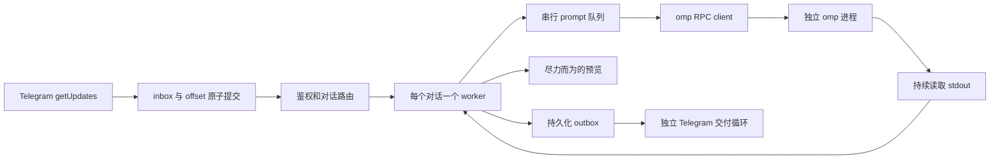

# 架构与开发说明

[English](architecture.md) | 中文 | [用户指南](../README.zh.md)

本文描述当前实现及其恢复语义.

## 范围与职责

桥接负责 Telegram polling, 鉴权, 对话路由, 子进程启动/关闭以及可靠消息交付. 模型执行, 工具, 配置, 凭据和原生会话历史由 omp 管理.

部署模型是一库一 Bot, 每个对话一个 worker: 普通私聊, 私聊 topic 或群组 topic. 不支持没有 topic 的群组消息. 不实现终端模拟, 第二份模型上下文, 多 Bot 分发器, 通用后端抽象或不确定任务的自动重放. 独立会话不等于文件系统或凭据隔离.

## 模块

| 位置 | 职责 |
| --- | --- |
| [`cmd/omp-telegram`](../cmd/omp-telegram/main.go) | CLI, 版本输出, 数据目录锁, 信号处理 |
| [`internal/config`](../internal/config/config.go) | TOML, 环境变量引用, 路径默认值, 启动参数校验 |
| [`internal/bridge`](../internal/bridge/bridge.go) | worker actor, 命令, prompt 队列, 预览, 最终回复和 host tool |
| [`internal/bridge/recovery.go`](../internal/bridge/recovery.go) | 启动恢复和关闭状态持久化 |
| [`internal/bridge/resume_picker.go`](../internal/bridge/resume_picker.go) | 原生 session 列表, 导出任务, 带鉴权和过期控制的选择菜单 |
| [`internal/omp`](../internal/omp/client.go) | RPC 分帧, 请求关联, 事件, 原生 session metadata, ACP 列表及原生导出委托 |
| [`internal/telegram`](../internal/telegram/client.go) | Bot API, 附件传输, 错误脱敏及交付确定性 |
| [`internal/media`](../internal/media/media.go) | 限定工作目录的文件处理, 图片准备和发送快照 |
| [`internal/store`](../internal/store/store.go) | SQLite schema, 绑定, 持久化输入/输出及完成事务 |
| [`config.go`](../config.go) | 内嵌唯一的默认配置来源 [`config.toml`](../config.toml) |

## 运行流程



启动顺序为: 加载配置, 锁定数据目录, 初始化数据库并整理遗留状态, `getMe`, 校验数据库 Bot 归属, 注册命令, 恢复实例, 再启动 polling 和交付. `--version` 在加载配置前返回. `--check` 检查本地配置并创建配置中的目录, 不打开数据库或验证 Telegram 认证.

收到的 update 先持久化, 再进行路由鉴权. 未授权输入标记为 ignored, 不能启动进程, 下载文件或执行命令. 用户和 chat 必须同时在白名单中, 普通私聊也必须同时允许 user ID 和相同的私聊 chat ID. 鉴权通过后, 接受非零 thread ID 或 private 类型 chat 的消息; 没有 topic 的群组消息只获得操作指引, 不推断目标话题.

### 并发模型

- 每个对话使用 actor 风格的 worker. 普通文字, 附件和 `/review` 都作为独立 prompt 进入 bridge 延后队列, 串行执行. bridge 只在当前任务结束后提交下一条 prompt.
- 命令和 callback 走 worker 控制路径, 不排在待执行 prompt 队列后面. 这不等于每个操作都完全非阻塞: 启动和部分控制 RPC 往返仍需等待.
- `/queue` 只读取当前 worker 内存中的 `queue`、`active` 和 `busy`. 它是当前对话范围的 viewer; Cancel 按钮定位 bridge pending inbox ID, 绝不中止 active task 或管理 OMP native queue. 队列只存在于 runtime: worker shutdown 会取消剩余 pending inbox, 不会恢复 queue entry.
- 附件准备和上传异步且有并发上限. 尚在准备的附件保留其队列位置.
- RPC stdout reader 不执行 Telegram HTTP 交付. 事件缓冲有界, 协议错误或持续积压会使 client 失败, 不允许内存无限增长.
- `worker.max_workers` 限制已连接的 OMP 进程, 不限制逻辑 session. 正数 `worker.idle_timeout` 可释放空闲 worker 的进程并归还 slot, 同时保留已验证的 binding 和 session claim.

Client 等待 `ready` 并协商协议 v2, 串行写入 stdin, 按 request ID 关联响应. `Call("prompt")` 成功只代表请求被接受, 不代表任务完成. 只有 `isTerminal` 不为 `false` 的 `agent_end` 事件或本地命令完成信号才能结束任务, 非终结事件不能开始下一条排队 prompt. 终结 assistant message 的 `stopReason=error` 或非空 `errorMessage` 使输入以 `uncertain` 提交; `stopReason=aborted` 以 `cancelled` 提交; 其他有确认文本的情况以 `done` 提交. `uncertain` 和 `cancelled` 的终态结果仍可交付 partial text, 但绝不转发 provider diagnostics. 分帧和重组都有明确边界, 不回退到 PTY/ANSI 解析.

### Prompt 和 interrupt 语义

bridge 使用公开 RPC v2, 不依赖协议扩展. 调用 `prompt` 前, 先将该输入设为 active terminal-result owner. 成功的 acknowledgement 不需要路由分类; `agentInvoked=false` 通过正常完成流程结束本地命令, 其他已接受的 prompt 则等待终结事件. prompt 请求失败或无法确认时, 该输入以 uncertain 结束, 同时关闭该 OMP client 并取消 bridge 队列, 不重试. 不能将该 client 当作 idle 后继续复用, 否则未确认的工作可能接管后续输入的结果归属. `/stop` 先清 bridge 延后 prompt, 再发送不带清队列选项的普通 `abort` 请求. 重启或执行结果不确定后, 包括 `/review` 在内的待执行任务都不会自动重放.

Progress Stop 只中止 active task. `/queue` Cancel 只移除选中的 bridge pending task, `/stop` 才会中止 active task 并清空全部 bridge pending task.

RPC v2 可能压缩大型终结 frame, 并省略已通过 `message_end` 发出的 message. Worker 缓存最后一条 assistant message 的 `stopReason` 和 `errorMessage`, 以及每一条 assistant `message_end` 的 finalized text; 终结 `agent_end` 自带的 assistant message 优先, 只有缺失 assistant message 时才使用缓存. 缓存在 `agent_start`, 终态完成和 shutdown 时清理. 缓存的诊断只用于分类, 绝不出现在 Telegram 输出中.

### 缺失终结信号与 watchdog

缺失终结信号走独立的保守恢复路径, 绝不当作成功. 活跃 busy 根任务必须至少 30 秒无活动, 且没有 compact/handoff、retry、运行中工具、host request 或原生 UI 等待. 后台 `get_state` 请求超时为 5 秒, 不阻塞 actor 处理控制命令. `isStreaming` 和 `isCompacting` 都必须明确为 `false`; 缺失/null/格式错误字段及请求错误会丢弃确认. 两次确认至少相隔 30 秒. 所有事件 (包括未知或格式错误事件) 和普通 RPC 活动都会使探测失效. 结果按 client 身份、generation、turn、active input 和活动 revision 隔离, 已排队事件优先于探测结果. 确认缺失完成后, 复用原有 uncertain 结果原子事务和进度清理, 再先关闭旧 client, 后派发队列; 保留逻辑 session claim 和排队输入, 按需 resume, 不重放旧任务. 终态、turn 变化、runtime 释放和 shutdown 都会取消待处理 typing 请求, 请求仍有 4 秒超时.

`awaitingContinuation` 记录明确的 `agent_end isTerminal=false`, 阻止 watchdog 探测及恢复. 原生异步工作可合法地连续几分钟不处于 streaming 状态. `agent_start`、任务结算、新根任务派发和 runtime teardown 清除此状态; 无关事件和状态查询不会清除. 在原生未提供 pending async work 信号前, 故意不自动恢复缺失的续接, 避免杀死合法后台工作.

Actor 生命周期日志为 `agent_start`、`agent_end`、`prompt_result`、自动 compact 边界及失败请求记录 client、active input、busy、turn 和 generation. Terminal 标记区分 absent/true/false. 仅记录元数据, 不记录原始事件、prompt、输出、provider 诊断或凭据.

RPC client 日志用同一 client 身份区分接收、事件入队、失败响应分发及拒绝. `event_queued` 只确认写入缓冲队列, 不代表 actor 已消费; 应与 actor 的 `phase=received` 对照. 请求 ID 仅以数字记录, 不记录任意 peer ID 字符串或响应正文.

### 结构化日志

daemon 在配置成功后创建一个 `slog` registry, 且只有六个组件 logger: `daemon`、`bridge`、`rpc`、`telegram`、`store` 和 `media`. text 与 JSON handler 共用一个同步 writer, 因而并发记录完整且可独立解析. `logging.level` 设置默认级别 (`debug`、`info`、`warn` 或 `error`), `logging.format` 选择 text 或 JSON 输出, `[logging.component_levels]` 可为指定组件覆盖级别. 组件名、级别、格式、事件名和 RPC phase 都是固定白名单, 不是用户自定义 label.

text 输出采用紧凑的 `YYYY-MM-DD HH:MM:SS LEVEL [component] message key=value` 单行格式, 例如 `2026-09-19 13:20:01 WARN [telegram] telegram polling failed event=poll_failed reason=timeout`. 组件头部来自 registry. 原始消息内容和其余所有结构化属性均保留, 头部不再包含 `time=`, `level=`, `msg=` 或 `component=` 标签. 字符串和控制字符按需转义, 确保每条记录只有一行. JSON 输出保持标准 `slog.JSONHandler` 格式不变, 包含 `component` 字段. 仅支持这两种格式; 未指定的组件继承 `logging.level`.

事件使用简短稳定的 `snake_case` 名称. `debug` 用于 RPC/probe 细节及 bridge handled 路径; `info` 记录成功的生命周期节点; `warn` 记录可恢复的 delivery、media 或 watchdog 故障; `error` 记录持久化失败、协议违反及缓冲区溢出. 普通用户取消不会产生 warning 或 error. 每个故障只在负责其策略的层记录, 调用层不重复记录同一错误.

RPC lifecycle 以 `event=rpc_lifecycle` 记录, `rpc_event` 只能取白名单值 (`agent_start`、`agent_end`、`prompt_result`、`auto_compaction_start`、`auto_compaction_end` 或 `response`), phase 只能是 `received`、`event_queued`、`response_queued`、`response_ignored`、`rejected` 或 `handled`. `terminal` 只能是 `absent`、`true`、`false` 或 `invalid`. 只有能安全解析为无符号整数的本地十进制 request ID 才会记录 `request_id`. Bridge 生命周期记录保持组件和稳定事件字段; handled bridge 路径保持 debug 级别.

日志元数据遵循审查过的白名单: 可按需记录 component/event 身份, 有界的 chat/thread ID 等数字状态, turn/generation, retry 次数, 错误分类和内部 session UUID 以便关联. 日志绝不包含 prompt、output、reasoning、token、header、URL、raw error 或 frame、tool 参数/结果、callback token、文件名、workspace/session 路径、配置或 `omp.args`. 异步 callback 捕获排队时的操作身份, 不从复用的 worker 读取动态身份. registry 创建前的配置和 CLI 错误保持普通文本, 不格式化为 JSON.

两种格式都输出到 stderr. 文件保存和轮转交给 supervisor/journald; 不增加异步日志队列、采样、网络上传或运行时级别重载. 共享 writer 只串行化此 registry 的记录, 不控制其他进程的输出. 日志写入错误不进入任务状态转换.

| 组件 | 主要事件 |
| --- | --- |
| `daemon` | `daemon_start`, `daemon_stop`, `daemon_fatal`, `lock_failed` |
| `bridge` | `worker_start`, `worker_stop`, `task_submit`, `task_complete`, `queue_rejected`, `session_new`, `session_resume`, `session_replace`, `session_close`, `runtime_connected`, `runtime_resume`, `runtime_release`, `runtime_exit`, `restore_claim`, `restore_runtime_failed`, `restore_runtime_skipped`, `watchdog_probe`, `watchdog_probe_reset`, `watchdog_async_wait`, `watchdog_recover` |
| `rpc` | `rpc_lifecycle`, `rpc_protocol_error`, `rpc_queue_overflow`, `rpc_process_exit` |
| `telegram` | `command_menu_registered`, `poll_failed`, `delivery_failed`, `delivery_uncertain`, `reply_fallback`, `progress_cleanup_failed`, `progress_cleanup_abandoned` |
| `store` | `cleanup_completed`, `cleanup_failed`, `snapshot_cleanup_failed`, `outbox_read_failed`, `outbox_write_failed`, `outbox_state_write_failed`, `inbox_state_write_failed`, `final_commit_failed`, `progress_message_write_failed`, `progress_cleanup_state_failed` |
| `media` | `prepare_failed`, `snapshot_failed`, `attachment_persist_failed`, `cleanup_failed` |

根任务按场景使用 `chat_id`, `thread_id`, `generation`, `turn`, `inbox_id` 和 `client_id` 关联. 私聊的 `thread_id=0` 是有效身份. 原生 `session_id` 仅在验证后完整记录; 文件路径不作为日志会话身份. `client_id` 在进程内递增, 不持久化. `task_complete` 在持久化事务成功后记录 `result=done|cancelled|uncertain`, 根任务开始时间已知时附带 `duration_ms`. 交付 metadata 使用 `outbox_id`, `kind`, `api_code`, `retry_after_s`, `uncertain` 和 `replay=false`; 不记录 Description 或响应正文. 跟踪从接收到 actor 处理的完整链路时, 设置 `logging.component_levels.rpc = "debug"` 和 `logging.component_levels.bridge = "debug"`.

Bot ID 仍用于内部会话身份和数据库校验, 但每个 daemon 只服务一个 bot, 因此日志中不重复记录. Chat 和 thread ID 不是凭据, 但可以关联具体对话; 应限制日志访问权限, 公开日志前将其替换为一致的占位符.

实时进度是内存中的尽力而为视图, 复用现有的一条消息 preview 通道. `telegram.progress_mode=off` 抑制 Telegram Send/Edit 和 typing, 仍持续处理 text delta 以支持最终结果 fallback. `summary` 显示 assistant 输出、以 tool call ID 标识的活动工具名和状态; `verbose` 增加有界的最近工具列表. retry、compaction 和并发工具均来自明确事件. 包括 host tool 在内, `tool_execution_end` 是唯一 completion source; host callback 只修正匹配的活跃工具名. 不渲染 reasoning、原始 frame、工具参数/结果、命令文本、stdout 或 stderr. 每个活跃根任务 progress 带有 Stop 按钮, 由 owner、worker generation、活跃 inbox ID 和 turn 共同约束. 合法点击消费并移除按钮, 只对该活跃根任务发送原生 `abort`; 不同于 `/stop`, 保留 bridge 延后 prompt, 在取消完成后按顺序调度; stale 按钮只移除, 不 abort. 程序任务结算、worker replacement 和 shutdown 均通过有界清理队列使按钮失效. 初次 Send 失败会抑制该 turn 的 progress 以避免重复消息; Edit 失败可继续重试. progress 尽可能回复根输入; Telegram 拒绝 reply 时退化为普通消息, 不改变任务状态.

Progress 创建在新任务开始后的三秒初始延迟之后, 于正常的 1.5 秒 worker tick 中检查. 已有消息更新、typing 和持久化最终回复保持独立行为. 每条 progress preview 都关联其根 inbox. 对于正常 `done` 任务, 只有全部关联 outbox 分段在 Telegram 确认送达并标记为 `done` 后, bridge 才删除该 progress. `cancelled` 和 `uncertain` 任务的 progress 保留. 这个关联只是本地清理辅助信息, 不是永久 retention pin: 当终态数据达到 retention cutoff 且没有关联的 `pending` 或 `sending` outbox 工作时, cleanup 只清除本地关联, 保留 Telegram 消息. 已确认的不可重试 Telegram 删除拒绝也会释放持久化关联. 传输失败、429、5xx 和不确定响应会保留关联以便后续重试. 启动时会重试上次运行留下的已完成关联.

## 身份与过期工作

| 身份 | 表示 |
| --- | --- |
| Bot | `getMe` 返回的数字 ID, 不是 token 或 username |
| 对话 | `(bot, chat, thread)`; 普通私聊使用 `thread=0` |
| 运行实例 | 对话加 `generation` 及当前 client |
| 已保存会话 | omp 原生 session 文件路径 |
| 输入 update | 当前 Bot 所属数据库内唯一的 Telegram update ID |

普通私聊使用现有的 `(chat, 0)` 目标及 worker/会话生命周期; topic 目标保留其 thread ID. 无需新增 worker 类型或数据库迁移. 已存储的 binding 不包含 Telegram chat 类型, 因此恢复时零 thread 目标只接受正数的私聊 chat ID, 并继续检查 chat 白名单; topic 目标沿用原有恢复行为.

`CheckBot` 拒绝其他 Bot 复用数据库. `daemon.lock` 防止两个桥接进程同时使用同一数据目录. 操作者仍需避免用不同数据目录或其他 polling 客户端重复运行同一个 Bot.

成功的新建/恢复实例会增加持久化 generation. 后台结果按对应的 generation, turn, 请求 token 或 client 身份校验. 会话 claim 防止同一 daemon 内两个 worker 同时打开同一个原生会话, 但不锁住工作目录供其他程序使用.

closed binding 删除与 startup intent 准备共享事务 fence: start 只能为精确匹配的持久化 binding generation, 或确实没有 binding 的对话, 预留启动; deletion 只有在不存在 startup intent 时才成功. worker 发现自己的 binding row 已被删除后, 会在创建新 binding 前使旧 picker confirmation 失效.

**关键是接受边界:** 旧运行时的迟到工作不能影响新实例, 但已经提交的 outbox 结果在 `/new` 或 `/close` 后仍可交付. generation 变化不能撤销已经接受的业务结果.

## SQLite

数据库是 `storage.data_dir` 下的 `omp-telegram.db`, 使用 WAL, busy timeout 和单连接. 保存桥接状态及 Telegram 消息内容, 不维护另一份 omp 模型上下文.

| 表 | 键 / 字段 | 用途 |
| --- | --- | --- |
| `meta` | `key`, 整数 `value` | 所属 Bot ID 和 polling offset |
| `bindings` | 主键 `(bot,chat,thread)`; `workspace,session,session_id,generation,last_used_at,running,interrupted` | 最后一次已验证的 session binding, 恢复资格, 最后使用时间 metadata 和活动任务中断标记 |
| `startup_intents` | 主键 `(bot,chat,thread)`; `kind,workspace,session,generation` | 尚未提交的 `/new` 或 `/resume` 持久化转换 |
| `history` | `bot,chat,thread,workspace,session,generation` | 旧 binding 快照, 不是会话浏览器 |
| `session_favorites` | 主键 `(bot,chat,thread,workspace,session_id)` | `/resume` picker 的 pinned 原生 session identity, 不保存 session 内容 |
| `inbox` | 主键 `id`; `raw,state,reply_to,progress_message_id,created_at,updated_at` | update 去重、处理状态和可选的实时进度身份 |
| `outbox` | 自增 `id`; `inbox_id,chat,thread,text,state,reply_to,kind,path,name,created_at,updated_at` | 与根输入关联的文字/附件顺序交付 |

### Database Message Retention

`storage.database_retention_days` 默认值是 90. `0` 关闭自动清理; 正数按 `updated_at` 即最后一次状态转换时间保留相应天数的终态 Telegram bridge 消息记录. Bridge 会在启动时执行一次, 并在之后每 24 小时执行一次这个 best-effort janitor. 失败只记录日志, 在下一个周期重试, 不会停止 Telegram 或 omp 处理.

只有明确列出的终态可以清理: inbox `done`, `cancelled`, `ignored`, `failed`, `uncertain`; outbox `done`, 旧的 `sent`, `failed`, `uncertain`, `cancelled`. inbox 的 `pending`/`submitted` 以及 outbox 的 `pending`/`sending` 保持持久化. 删除使用每批 1000 行的已提交事务; 服务绝不自动执行 `VACUUM`.

带有非零 `progress_message_id` 的终态 inbox 及其关联 outbox 在 Telegram progress 删除成功, 已确认的不可重试拒绝清除关联, 或 retention cutoff 到达且没有关联的 `pending` 或 `sending` outbox 工作前, 不会被 retention 清理. 最后一种情况只清除本地关联, 不调用 Telegram Delete.
保留策略绝不删除 binding, history, startup intent, session favorites, 工作目录, omp session 文件或其他 omp 数据. 终态 outbox 附件 snapshot 在对应数据库删除提交后才解除所有权, 仅当其位于 `storage.data_dir/attachments/outbox/` 时 best-effort 删除. 每次 janitor 运行还会移除这个私有 spool 中修改时间超过保留截止时间且没有引用的 `attachment-*` snapshot.

### Schema 版本

`PRAGMA user_version` 是数据库版本, 当前为 9. 空库在同一事务中创建所有表、索引和版本号. 重新打开时整理上次运行留下的状态. 已有无版本库及不支持的未来版本在 schema 或记录修改前被拒绝. 版本 1 至 8 会依次通过 `startup_intents`、binding 中断标记、消息时间戳、reply target、原生 session ID、inbox/outbox progress 关联、`bindings.last_used_at` 以及 conversation 级 `/resume` favorites 的事务迁移后才推进 `user_version`. v8 不猜测历史 `last_used_at`, 旧 binding 的值保持为 0. 应用版本和数据库版本独立变化.

### 输入与完成事务

```text
Telegram update
  -> 事务: 插入 inbox pending + 推进 offset
  -> 鉴权和路由
  -> 持久化 submitted
  -> 向 omp stdin 写入 prompt
  -> 收到终结事件
  -> 事务: 写入最终文本分段 + 标记 inbox 为 done, uncertain 或 cancelled
```

`Accept` 为每个 update 执行一个原子事务. offset 不会先于输入持久化推进, 重复 update 不覆盖原记录.

普通根任务在 OMP 接受 prompt 前, 持久化记录原始 Telegram message ID. 完成要求该输入处于 submitted, 并在同一事务中提交全部最终文本分段、其持久化 reply target 和终态 inbox 状态. 正常终结输出为 `done`; provider/model error 为 `uncertain`; 明确的 OMP abort 为 `cancelled`. 任一步失败整体回滚. `say()` 仍是通知接口, 不用于完成任务. 控制命令的完成状态单独处理. 工具附件可在任务执行期间入队, 不追溯纳入最终文本事务.

收到的消息如果 reply 了另一条 Telegram 消息, bridge 会在调用 `prompt` 前构造只用于输入的独立上下文: 非空 Telegram `quote.text` 优先, 否则只读取一层被回复文字、photo/document metadata 和 caption、caption-only 内容或 unsupported 标记. 完整引用块最多 3000 个 UTF-16 code units, 超限时追加 `...[truncated]`. sender 只标记为 `From: bot` 或 `From: user`. 当前消息位于 `[Current user message]` 下方且不会被截断. Bridge 不递归跟随 `ReplyToMessage`, 不下载或重新导入被回复附件, 也不改变现有输出 `reply_to` target. Queue preview 显示当前用户文字, 不显示这个 synthetic wrapper.

Reply context 只来自当前 Update 解码出的 `ReplyToMessage` 和 `Quote`; durable source 仍是 `inbox.raw`. 不查询 Telegram 历史, 不新增历史 API 请求, 也不增加 reply-context 数据库列.

完成事务失败时停止 worker, 不伪装成任务完成. 重启时 submitted 输入转为 `uncertain`, 旧的 pending 普通消息, 附件和 `/review` 取消, 不自动重放. 其他待处理控制命令仍正常鉴权; 依赖内存状态的旧 callback token 会随状态丢失而失效.

### 输出交付与 progress 清理

```text
pending -> sending -> done
                   -> failed
                   -> uncertain

restart: sending -> uncertain
```

Telegram client 在传输边界区分错误:

- 本地发送前失败, 或可信且完整的 API 拒绝, 属于明确失败.
- 传输中断, 响应不完整或其他无法确认的交付, 保持不确定状态.
- 不能只看 HTTP 状态码分类. 之前发生的不确定性不能被后来的本地失败抹掉.

不为这两种终态增加自动重发. 明确的 Telegram 限流保留有界重试. 数据库事务无法与 Telegram 网络副作用原子提交, 因此不承诺 exactly-once.

对于 progress 删除, 已确认且不可重试的 Telegram 4xx (429 除外) 只清除本地 progress 关联. 429, 5xx, 传输失败或不确定响应会保留该关联, 等待之后的清理尝试. 清理状态不会改变任务或 outbox 结果.

outbox replay 为每个最终文本分段保留持久化的 reply target. Telegram 因原始消息不可用而拒绝该 target 时, client 对同一文本仅再发送一次普通消息; 该 UX fallback 不改变 inbox/outbox ownership 或任务结算.

每条 progress preview 都关联其根 inbox, 每个最终 outbox 分段都携带该 inbox ID. 对于正常 `done` 任务, 只有全部关联 outbox 分段在 Telegram 确认送达并标记为 `done` 后才删除 progress. `cancelled` 和 `uncertain` 的 progress 保留. 启动时会重试上次运行留下的已完成关联. 已确认的不可重试 Telegram 删除拒绝会清除尽力而为的 progress 关联; 当终态数据达到 retention cutoff 且没有 pending 或 sending outbox 工作时, retention 会清除本地关联但不删除 Telegram 消息. 传输失败、429、5xx 和不确定响应会保留关联以便重试, 不改变任务交付状态.

### 附件生命周期

Telegram 输入附件只有在鉴权通过后才会下载, 并保留在所选 workspace 的 `.telegram/incoming/` 下. 它们属于 workspace 文件, 不会被 bridge 消息 retention 删除. 输出 `telegram_send` 只接受当前 workspace 内的普通文件. 入队前 bridge 会把文件复制到私有的 `storage.data_dir/attachments/outbox/` snapshot, 因此交付不依赖源文件之后是否变化. 确认送达后删除 snapshot; 失败或不确定交付会在 outbox 持有该文件, 直到终态 retention 清理. retention 只会在对应 outbox 行删除后删除 snapshot, janitor 也只会在这个私有 spool 内删除过期且无引用的 `attachment-*` 文件. 该清理不会删除 workspace 源文件.
确认送达后的 snapshot 删除是 best-effort; 暂时无法删除的 snapshot 由 retention 和 spool janitor 后续处理.

`/export` 只使用已提交 binding 的 workspace 和原生 session identity. 它不会调用 `ensureRuntime`, 修改 binding 状态, claim session, touch `last_used_at`, 或占用普通 runtime slot. 如果 selected ID 等于 committed binding 的 `session_id`, 即使 idle release 或 `/close` 之后也直接使用已保存的 `session` path; 其他 ID 通过 OMP 原生 `omp <omp.args...> render <session-id> -q -t` 命令, 使用 configured working directory 解析, 再严格校验返回的第一条 `session  <absolute-path>` diagnostic line 及持久化 session header. 如果 `omp.args` 或 `PI_CODING_AGENT_SESSION_DIR` 指定 custom session directory, inactive session export 会直接拒绝, 因为 native render 不会接收这个 launch-global store override. bridge 不发现或模拟 OMP session storage 规则. raw 导出以只读且禁止跟随 symlink 的方式打开 absolute source, 再通过 `Fstat` 检查打开的文件, 使用有界的 `MaxDocumentBytes` 读取复制到私有 attachment outbox spool, fsync 后设置 `0400`, 并保留经过安全处理的 OMP basename 作为 Telegram filename. HTML 导出也先以相同的 no-follow 规则, 只把选中的 main session JSONL snapshot 到 bridge-owned 私有 spool, 再把这个稳定 snapshot 交给 OMP 原生 exporter; 不复制 companion 或 subagent transcript. HTML 生成期间监控 output 增长, 超过 `MaxDocumentBytes` 就终止并清理. 只导出 main session JSONL, 不创建 zip 或 subagent bundle.

带非空 `media_group_id` 的 photo 和 document 消息由所属 worker 按 `(media_group_id,sender_id)` 聚合. 第一条成员消息立即占用一个 bridge queue slot, 同时作为 logical task 和 inbox owner; 后续成员在被消费后直接标记为 `done`, 不再进入队列. 首条消息后的 500 ms quiet period 会收集新成员, 从首条消息起最多等待 2 秒, 并使用 version fence 忽略旧 timer. 一个相册最多接受 10 个成员. 封存后按 Telegram message ID 排序, 使用带序号的文件名下载到同一个 incoming directory, 作为一次 prompt 提交并使用第一个非空 caption, 携带所有可用的 inline images. 按顺序找到的第一个带 reply context 的成员提供一次上下文, 最终 reply target 是相册第一条消息. preparation 采用 all-or-nothing: 任一成员失败都会删除 directory 和 owner queue entry, 将 owner 标记为 `failed`, 并只发送一次 album 专用提示. 没有 media group 的附件继续单消息路径. Album collection 只存在于 worker 内存中; 取消、拒绝、封存或 teardown 后会在短暂窗口内抑制迟到成员, daemon 重启时取消尚未完成的 owner, 不自动重放 album state.

## 会话生命周期

`/new` 解析工作目录, 替换已有运行实例时要求确认. `/new <名称或路径>`, `/resume` 及其他已有命令都可用于普通私聊和 topic. `/resume` 通过短生命周期的原生 `omp acp` 进程调用 `session/list`, 获取当前目录的会话列表. 桥接不扫描 session 文件, 不从 `history` 合成列表. 菜单使用随机 token, 校验所属用户, 对话, generation, 过期时间和取消状态. 显式 `/resume ID` 交给 omp 原生查找, 可以恢复该会话的原目录. Resume pin 只保存 `(bot,chat,thread,workspace,session_id)` identity metadata; pinned session 排在前面, stale pin 在 native listing 返回同一 identity 前保持隐藏. Pin 和 Unpin 是 picker 控件, 不修改原生 session 或 binding lifecycle. 显式删除 closed binding 时也会删除其 pinned metadata, 但不会触碰原生 session history.

`/export` 使用 generation 和 binding identity 双重 fence 的 picker, 默认导出原生 session JSONL; `/export html` 使用同一个 picker 进行原生 HTML 渲染. `/export <session ID>` 和 `/export html <session ID>` 不列出 session, 会先校验原生 identity 和 workspace, 再直接导出指定 session. 因为列举是只读操作, 当前 worker 忙碌时仍可打开 picker. 选择当前 session 前必须等待 active task、compaction/finalization 和 queued prompt 结束; 其他 inactive 且未被 claim 的 session 可以并行导出. 每个进行中的 export 都会 reservation 选中的 session identity, 因此其他 conversation 在操作结束前不能 claim 或 export 同一 session. 导出文件作为 document 排入当前 conversation; 成功 export 只代表 durable outbox item 已创建, Telegram delivery 状态单独确认.`

Session export 是 bridge control-plane operation, 不属于 OMP task queue. 原生 JSONL 数据流:

```text
/export
  |
  v
读取 committed binding
  |
  v
校验 workspace
  |
  v
omp.ListSessions(workspace)
  |
  v
Telegram session picker
  |
  v
omp <omp.args...> render <session-id> -q -t -> native session path
  |
  v
snapshot JSONL
  |
  v
durable attachment outbox
  |
  v
Telegram document
```

HTML 使用相同的 control-plane 路径, 在解析 session 后交给 OMP 原生 exporter:

```text
/export html
  |
  v
读取 committed binding -> 校验 workspace -> omp.ListSessions(workspace)
  |
  v
选择 session -> omp <omp.args...> render <session-id> -q -t -> bridge-owned main JSONL snapshot -> omp --export
  |
  v
private HTML spool file -> durable attachment outbox -> Telegram document
```

Export 不会:

- 提交 prompt;
- 修改 session;
- 改变 binding generation;
- 更新 `last_used_at`;
- 唤醒 idle runtime;
- 占用正常 runtime slot;
- 创建 `startup_intents` row;
- 修改 session claim.

Outbox 永远不指向原生 session 文件. Confirmed delivery 只删除 private snapshot; failed 或 uncertain delivery 遵循现有 attachment outbox 语义.

`/export` 返回的原生 JSONL 可以在另一台电脑上使用: 准备对应的源码目录, 下载文件, 然后在目标项目目录执行 `omp --resume /path/to/exported-session.jsonl`. 如果记录的旧工作目录不可用, OMP 可能要求将 session re-root 到当前目录. 该导出不是项目归档, 不包含源码文件, Git 状态, 未提交文件, OMP 配置, API credentials 或 shell environment; 这些内容需要单独同步. JSONL 和 HTML 导出可能包含敏感的 conversation 和 tool 数据, 包括 prompts, responses, tool calls 和 results, 本地路径, 命令输出, 源码片段以及意外捕获的 secrets. 只应将它们发送到可信的 Telegram 对话; 用户输入 `/export` 就是明确确认.

无参数 `/new` 优先沿用对话保存的工作目录. 没有历史目录时解析并使用 `storage.workspace_root` 本身, 不另建按对话划分的子目录. 数据库读取失败仍报错, 不回退默认目录. 选择同一目录的对话共享文件, 不共享原生 session 身份.

### Binding viewer

`/bindings` 只读取当前 Bot 和 Telegram chat 的已提交 binding 以及未完成的 `startup_intents`. Bridge 按 `(bot,chat,thread)` 合并为一条展示记录; 存在 pending intent 时优先显示 pending, 不使用旧 binding 的 `running` 值判断状态. 展示状态为 `Pending new`、`Pending resume`、`Open` 和 `Closed`. Pending 使用 intent 的 workspace 和 resume 目标; `Last used` 仍来自旧的 committed binding. 第一次 `/new` 没有旧 binding 时显示 `Session: pending` 和 `Last used: unknown`.

原生 session name 会按每个保存的 workspace, 通过短生命周期 `omp acp` `session/list` 查询尽力解析. name 只是 viewer 的临时 metadata, 不复制到 SQLite; 不可用或未命名的 session 显示 `unknown`, pending new session 显示 `pending`.

消息正文只保留 viewer header. 所有 binding 详情都渲染为 disabled inline-keyboard button: 每条记录占四行, 带编号的标题按钮与 `Del` 操作并列, 后面依次是 disabled 的状态/last-used、workspace 和合并后的 `Name`/短 session 行. 只有 `Del` 操作可以携带 callback data.

列表每页六条. Pending、open 和当前对话的删除按钮使用不带 callback data 的 Telegram disabled button. 只有其他对话的 closed binding 可以打开 danger 样式的删除确认. 每个列表和删除 callback 都校验授权用户、当前对话 generation、过期时间、来源消息 ID、action token、目标 binding generation 以及 Bridge 级内存 binding mutation epoch. `DeleteClosedBinding` 成功后会推进所有 worker 共享的 epoch, 即使被删除的 generation 随后复用, 旧 `/bindings` 菜单和删除确认仍会失效. 重新执行 `/bindings` 也会使旧 viewer token 失效; 旧 callback 不能翻页或清除新页面.

`/queue` 显示当前 worker 的 running 状态、pending 数量、附件 preparation 状态, 每页最多六个 pending task. Task preview 使用有界文本或 `Preparing attachment...`; callback data 使用随机菜单 token 加 `cancel:<inbox_id>`. 处理 callback 时重新扫描实时 queue. 如果任务期间已 dispatch, 返回 `Task is no longer queued.`, 绝不把操作转换成 active abort.

`last_used_at` 是 Unix time, 迁移旧数据时为 0. 显式 `/new` 或 `/resume` 成功, root/review/attachment prompt 被接受, 以及 name、model、thinking、fast mode、compact、handoff 和 abort 等原生 session-changing command 成功后 touch. startup restore、lazy restore 本身、`/status`、`/bindings`、`/help` 和 viewer 翻页不会 touch. touch 失败只记录 metadata persistence error, 不会改变已经接受的任务结果. startup restore 会把旧值复制到新 generation, 不会刷新时间.

`DeleteClosedBinding` 和 `PrepareStart` 都针对同一组 binding 与 intent row 使用 generation-fenced transaction. 删除只有在目标已关闭且没有 startup intent 时成功; closed binding 的启动必须先确认预期 row 仍存在, 并在同一事务中插入 intent. 因此 intent 先提交会使删除失败, 删除先提交会使 stale start 失败. 成功删除还会同时删除 bridge history snapshot, 并推进不持久化的 Bridge 级 binding mutation epoch, 使其他 worker 持有的菜单立即成为 stale. 它绝不删除 workspace、原生 session 文件或 omp 原生 history. 如果删除目标意外是当前 worker, worker 会清理内存中的 binding identity; UI 正常情况下会禁用该操作.

合法的最终选择或取消会先消费 confirmation token, 再尽力通过 `editMessageReplyMarkup` 移除 inline keyboard, 不修改消息正文. 清理失败不阻止实际操作. 翻页直接更新原菜单. 已知的过期菜单也会清理; 未授权用户和未知旧 token 不会触发清理, 避免旧分页 callback 擦掉新一页按钮. 菜单 message ID 仅保存在内存中, 不跨重启持久化.

定时过期处理在 worker 内使 token 失效, 随后非阻塞提交键盘清理, 不等待 Telegram. 每个 worker 只有一个清理消费者, 最多缓存 32 个 message ID; 队列满时放弃尽力而为的按钮移除, 但 token 仍然失效. 每个请求超时五秒, worker 取消时停止消费者, 因此 UI 清理阻塞不会拖住控制命令或终结事件. 用户主动选择仍保持先清按钮再执行操作的原顺序.

程序主动失效也统一使用该有界清理队列: 取消 resume 列表、原生 UI 取消、关闭或替换实例以及任务终结都会删除适用的 token, 并把已知菜单 message ID 加入清理队列. 任务终结会保留当前 generation 的独立 `/queue` viewer token, 因而与 dispatch 竞争的 callback 可以重新扫描实时 queue 并返回 `Task is no longer queued.`, 不会中止 active task. model、thinking、fast、compact、new 和原生 UI 选择属于当前运行实例的 runtime-bound confirmation, 会阻止正常空闲释放; 它们原有的过期机制仍会删除 token, 并在需要时取消当前 generation 的原生 UI. 独立的 `/resume` 菜单不依赖当前运行实例, 可以在 runtime 释放后继续有效. 明确的 runtime teardown 仍会使旧 runtime 菜单失效, `/close` 和 worker teardown 则清理全部 confirmation. 清理仍是尽力而为, worker context 已取消或队列溢出时不保证移除按钮.

`/model` 在 worker 工作目录通过只读 `omp config get ... --json` 子进程读取 `cycleOrder` 和 `modelRoles`. 按参数顺序把 `--config` 文件追加到查询子进程继承的 `PI_CONFIG_FILES`, 由 OMP 自己合并覆盖配置. 支持两种参数写法, 工作目录相对路径和 `~/` 展开. 包含环境列表分隔符的路径通过继承的只读文件描述符传递, 避免被拆成不同文件. 不修改配置文件或父进程环境. 不通过切换模型枚举角色, 不重复实现 selector 解析. 选择角色时发送原生本地命令 `/model @role`, 并用 `get_state` 验证成功后的模型标识; 不转发原始命令输出. 切换要求原生与 bridge 都空闲且 bridge 队列为空. 尚不支持的 `--profile`, `--smol`, `--slow`, `--plan` 覆盖项仍会禁用角色菜单, 但可手动指定模型. 原生角色命令结果不确定时使 client 失效.

`/thinking` 复用模型选择的 owner/generation/过期与空闲检查. 只有合法按钮被消费后才发送 `set_thinking_level`, 随后读取 `get_state.thinkingLevel`, 报告原生调整后的实际等级而不是回显请求值. 通过 OMP 现有 RPC 修改会话状态, 不编辑 OMP 配置文件, 不启动 agent turn.

`/fast` 打开绑定 owner 的开关菜单; `/fast on` 和 `/fast off` 仅在空闲且队列为空时调用原生 `set_fast_mode`. 回复分别使用原生返回的 `enabled` 和 `active`, 不把请求设置等同于实际生效状态. 模型不支持或请求失败时不提示成功. `/fast status` 只读取原生状态, 任务运行中也可使用. Provider 支持与服务等级行为仍由 OMP 负责.

`/status` 仅在已连接时解码 `get_state` 的安全白名单字段. 当前用户 home 下的目录缩写为 `~`, 会话标题同时保留短原生 ID. Thinking 表示实际生效等级, 不代表是否配置 auto. Fast 显示实际启用状态, 与设置不同时单独注明设置值. Context 按 OMP 返回的 `contextUsage.percent` 百分数直接显示, 仅在未返回该值时用 token 用量/窗口推算; 速度使用原生 `tokensPerSecond`. 缺失指标显示 `n/a`, 与零值区分. `Queued` 仅统计 bridge 延后 prompt. 已释放运行期只显示保留的目录/session、`OMP: released`、不可用的 model/context 和队列状态, 不声称实时原生指标. 不渲染原始模型配置, header, system prompt 或原生队列数量.

`/doctor` 是异步的 bridge control-plane 检查. 它不调用 `ensureRuntime`, 不启动或替换 OMP 进程, 不进入 prompt queue, 也不修改 binding. 它检查配置, Telegram `getMe`, SQLite `quick_check`, data directory 的写入/删除能力, `omp --version`, 已提交的 workspace 和 session 文件, runtime 状态, 不确定的 inbox/outbox 数量以及磁盘剩余空间. 报告只使用固定的安全摘要, 不包含 token, header, prompt, 原始 RPC state 或完整本地路径. 如果 conversation 在检查期间变化, binding 和 runtime snapshot fence 会丢弃结果; 检查进行时的第二次请求会被拒绝.
 native history file 尚未持久化的 connected 或 starting binding 报告为 `WARN`; 缺少文件的 released running binding 报告为 `FAIL`, closed binding 缺少文件则报告为 `WARN`.

`/name <名称>` 对运行中的实例调用原生 `set_session_name`. 它走控制命令路径, 不排在 prompt 后面, 不打断当前任务. 不改变 session 身份或工作目录, 不重命名 Telegram topic. 名称持久化由 OMP 管理, 包括尚未写入历史的新会话处理; bridge 不在 SQLite 另存标题副本. `/status` 从原生状态读取名称.

`/handoff [补充要求]` 直接调用原生 `handoff`, 可携带 `customInstructions`; 摘要生成和上下文维护仍由 OMP 负责. 要求实例空闲且 bridge 队列为空, 复用现有异步维护结果通道, 按 generation 隔离旧结果. bridge 不创建替代 session, 不自行生成交接文档, 不重放失败或结果不确定的操作. 等待结果时仍可处理本地 `/help` 和 `/close`. 其他 RPC 命令遵循 OMP 自身串行规则, 不承诺 `/stop` 能立即中断 handoff.

### 启动恢复与崩溃语义

未提交的启动意图表示转换尚未完成, 不表示可以再次启动一个 omp 进程. 恢复会保留已保存 binding 供显式处理, 再次尝试新转换前需要执行 `/close`, 然后执行 `/new` 或 `/resume`.

每次用户请求启动前, 先提交包含固定操作, 目标和下一代数的 `startup_intents` 记录. 同一事务会撤销旧运行绑定的自动恢复资格. 只有在原生身份校验和 host tool 注册后, 第二个事务才发布绑定并删除意图. 这是 bridge 级 two-phase commit: 先持久化意图, 再发布运行绑定; 不保证进程启动 exactly once. `/close` 会先删除待完成意图, 再关闭当前绑定.

`running` 表示恢复资格, 不是实时 PID 状态:

| 事件 | 持久化行为 |
| --- | --- |
| 成功启动/恢复 | 发布原生身份, 删除意图并设置 `running=1` |
| daemon 正常退出 | 保留已提交的恢复资格; 活动任务标记为已中断 |
| `/stop` | 保留实例和恢复资格, 清空等待 prompt |
| `/close` | 删除待完成意图, 保存 `running=0`, 再关闭实例 |
| worker 回收运行期故障实例 | 清除恢复资格, 活动任务转为不确定 |
| 启动自动恢复时缺失原生 session 文件或 workspace | 保存 `running=0`, 记录 info 级跳过日志并提示使用 `/new`; 绝不创建替代 session |
| 其他启动自动恢复失败 | 保留已保存身份和恢复资格, 供手动恢复或下次服务重启使用 |

### 空闲运行期释放

`worker.idle_timeout` 默认值为 `30m`; 设置为 `0` 或 `disabled` 可关闭. 设置为其他正时长后, worker 只有在已连接进程完整空闲达到该时长, 且没有活动任务、队列项(包括附件准备)、compact 或 handoff operation、结束预览、host request、会话列表请求、启动意图或 runtime-bound confirmation 时才释放进程. model、thinking、fast、compact、new 和原生 UI 选择的 runtime-bound confirmation 会阻止空闲释放, 直到被消费或过期. 独立的 `/resume` 菜单不阻止释放, runtime 释放后仍可继续操作. 满足条件后, worker 关闭 client 并归还全局进程 slot. 不修改 binding、generation、已验证 session 文件身份、session claim、工作目录或原生历史.
idle release 之前, 当前 binding 的 session path 必须是绝对路径, 且已存在并指向 regular file. 新建 native session 可能已经返回 ID 并提交 binding, 但 OMP 尚未写入 history file; 这种状态保持 connected, 避免 bridge 销毁唯一可恢复的副本. 这是内存中的 release guard, 不增加数据库 durability flag.

下一条普通 prompt、附件、`/review` 或需要 OMP 状态的原生控制命令会在入队或 RPC 调用前, 通过正常原生身份和工作目录校验懒恢复已保存的 session. 懒恢复失败不会提交或重放根任务. `/status`、`/help`、`/stop` 和 `/close` 不会唤醒已释放运行期; `/stop` 只清 bridge 延后 prompt, `/close` 直接清除恢复资格. 显式 `/resume ID` 替换逻辑 binding 并启动指定原生 session. actor 会先移除 client 并标记运行期 released, 再关闭它, 所以迟到的关闭事件不会进入 failure handling; 仍连接时 OMP 真正退出继续走既有 uncertain/failure 路径. 原生事件、confirmation 展示和成功的原生调用会刷新空闲计时.

成功 RPC 会刷新空闲计时并使 watchdog 证据失效. 失败 RPC 只使 watchdog 证据及正在进行的探测失效, 不刷新空闲计时.

重启后, 已提交且 `running=1` 的 binding 会恢复准确的 session 文件和目录. 在恢复任何 OMP 进程前, daemon 根据每个符合条件 binding 已持久化的原生 session ID 重建逻辑 session claim; 被 `worker.max_workers` 阻塞的 binding 会持续持有该 claim, 直到显式 `/close`, 因而其他对话不能恢复同一 session. 被标记为中断的 binding 会在 `omp is ready` 消息中追加 warning, 并在新 generation 中清除标记; 空闲会话恢复保持静默. 未提交的 new/resume intent 不会再次启动 omp: 之前的启动可能已创建身份尚未提交的进程状态. 桥接会创建未激活 worker 并报告不确定性, 必须显式执行 `/close`, 再执行 `/new` 或 `/resume`. 这会保留用户请求的转换, 又不会重放不确定操作. 如果启动前发现已保存的 session 文件或 workspace 不可用, bridge 会保存 `running=0`, 记录 `restore_runtime_skipped`, 并提示使用 `/new`; 绝不创建替代 session. 其他启动失败仍保留已保存身份和恢复资格, 供手动恢复或下次服务重启使用. OMP 新 session 可能先返回身份, 再持久化 history file.

持久化的逻辑 session claim 就是 restore claim: 它在进程启动前依据保存的原生 session 身份重建, 并在 worker 容量延迟重连期间保持.

## 进程与文件安全

- 使用 argv 直接启动, 不经过 shell. 显式 `omp.args` 不允许覆盖桥接管理的 RPC 模式, cwd 或会话生命周期选项.
- 正常关闭先关闭 stdin 并继续读取输出, 必要时升级到进程组终止. 每个子进程只有一个 `Wait` 所有者.
- Linux RPC/ACP 启动使用父死亡 SIGTERM. Linux 将此信号关联到创建子进程的 OS 线程, 因此线程锁定到 `Wait` 完成, 每个存活原生子进程占一个锁定线程.
- 父死亡信号不是整个进程树 containment. 忽略信号, 后代残留, 脱离进程组或清除父死亡设置的程序, 仍需要部署层边界. 项目不强制 systemd/supervisor 配置.
- 输入附件限定在选定工作目录, 保存于 `.telegram/incoming/`. 输出文件先复制到 `storage.data_dir/attachments/outbox/` 私有快照后入队, 交付确认后删除快照, 失败则保留.
- Host tool 受当前对话/request 限制, 不能指定其他 Telegram 目标. 不将原始 RPC 状态, provider header, 凭据或 system prompt 写入日志或状态消息.

## 配置与路径契约

桥接默认路径以解析符号链接后的真实可执行文件目录为基准, 不是调用者 cwd. 显式相对 `--config` 路径相对于调用目录; 相对 `storage.data_dir` 和 `storage.workspace_root` 即使配置文件放在别处, 仍相对于二进制目录.

根目录 `config.toml` 只内嵌一份. 仅当隐式默认文件不存在时才使用内嵌配置, 显式缺失文件及不可读/无效文件均报错.

桥接配置使用分组 TOML table: `[telegram]`, `[omp]`, `[storage]`, `[worker]`, `[logging]` 和可选 `[logging.component_levels]`. 根级 flat 字段, 原 `[log_component_levels]` table, 放错 table 的字段以及 flat/grouped 混合布局都会拒绝. 这是有意的 breaking cutover: 升级前必须手动迁移现有私有配置; 程序不会自动重写.

环境变量在 TOML 解析后对每个字符串值只展开一次, 包括 `logging.level`、`logging.format` 以及 `[logging.component_levels]` 中的值. 组件名会先按六个支持的名称校验, 再展开覆盖值. `OMP_TELEGRAM_ARGS`、`OMP_TELEGRAM_PROGRESS_MODE` 和 `OMP_TELEGRAM_WORKSPACE_ROOT` 的可选引用可以未设置. 内嵌配置中的 `telegram.progress_mode` 读取 `OMP_TELEGRAM_PROGRESS_MODE`; 为空、未设置或非法时回退到 `summary`. 不读取专用日志环境变量. `logging.level` 默认 `info`, `logging.format` 默认 `text`, 组件覆盖只能使用六个固定组件名. `omp.args` 只进行支持引号的分词, 不执行 shell. 除显式配置或用户请求的 RPC 设置外, 不改变 omp 自身默认值.

## 开发与发布

```sh
just build
just check
just install
just deploy
```

`just test` 只运行单元测试, 不启动或重启服务. `just check` 执行单元测试, race 和 vet. `just install` 只复制二进制. `just deploy` 安装二进制后重启已有的 supervisor 服务.

保留能防止可观察回归的测试: 原子回滚, 重启身份保持, 鉴权, 取消, 交付不确定性和进程所有权. 真实 omp smoke 使用隔离的工作目录及数据库. 注入的 Telegram 输入或模拟 callback 不能当作手机端完整验收.

已有证据包括事务失败注入, 索引查询计划, 真实 omp 重启恢复, 以及注入输入配合真实 Telegram 文件传输. 父进程 SIGKILL 实验观察到配合清理的原生 omp/工具树退出, 独立夹具同时证明不配合的后代可以存活. 真实用户客户端输入/点击, 完整线上故障矩阵和长会话成功压缩仍待验收.

应用版本由 [`cmd/omp-telegram/main.go`](../cmd/omp-telegram/main.go) 中的 `Version` 定义. `--version`/`-v` 在构建元数据可用时显示 Git revision/dirty 标记, 可通过 `-ldflags "-X main.Version=..."` 覆盖基础版本.

[发布工作流](../.github/workflows/release.yaml) 在 `main` push, PR 及手动触发时运行. 所有非 `main` 分支变更必须通过 PR 进入 workflow. Linux amd64/arm64 分别原生构建和测试, amd64 额外执行 race. 本仓库的每个 workflow 都会发布: `main` 上的新源码版本创建正式 release, 不覆盖已有正式 tag; 其他内部 workflow 均更新 `nightly` GitHub prerelease. 内部 PR 发布真实 head commit. 外部 PR 只构建, 不发布. workflow 只能更新 `nightly` tag 或创建新的正式版本 tag, 不会覆盖已发布的正式版本 tag.

发布包包含二进制和 LICENSE, 并提供 `SHA256SUMS`. 只有发布 job 为 `GITHUB_TOKEN` 申请写权限. 发布新应用版本时, 将 `Version` 改为 `vMAJOR.MINOR.PATCH` 并合并/push 到 `main`, 不会自动改变数据库 schema 版本.
