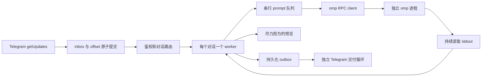

# 架构与开发说明

[English](architecture.md) | 中文 | [用户指南](../README.zh.md)

本文描述当前实现及其恢复语义.

安装, 配置, 命令用法及用户可感知的限制放在[用户指南](../README.zh.md). 协议, 状态机, 持久化及恢复细节统一放在本文, 不在 README 中重复维护.

## 范围与职责

桥接负责 Telegram polling, 鉴权, 对话路由, 子进程启动/关闭以及可靠消息交付. 模型执行, 工具, 配置, 凭据和原生会话历史由 omp 管理.

部署模型是一库一 Bot, 每个对话一个 worker: 普通私聊, 私聊 topic 或群组 topic. 不支持没有 topic 的群组消息. 不实现终端模拟, 第二份模型上下文, 多 Bot 分发器, 通用后端抽象或不确定任务的自动重放. 独立会话不等于文件系统或凭据隔离.

## 模块

| 位置 | 职责 |
| --- | --- |
| [`cmd/omp-telegram`](../cmd/omp-telegram/main.go) | CLI, 版本输出, 数据目录锁, 信号处理 |
| [`internal/config`](../internal/config/config.go) | TOML, 环境变量引用, 路径默认值, 启动参数校验 |
| [`internal/bridge`](../internal/bridge/bridge.go) | worker actor, 命令, prompt 队列, 预览, 最终回复和 host tool |
| [`internal/bridge/recovery.go`](../internal/bridge/recovery.go) | 启动恢复和关闭状态持久化 |
| [`internal/bridge/resume_picker.go`](../internal/bridge/resume_picker.go) | 原生 session 列表, 导出任务, 带鉴权和过期控制的选择菜单 |
| [`internal/bridge/session_delete.go`](../internal/bridge/session_delete.go) | 删除确认, session reservation 和原生删除编排 |
| [`internal/omp`](../internal/omp/client.go) | RPC 分帧, 请求关联, 事件, 原生 session metadata, ACP 列表及原生导出委托 |
| [`internal/omp/delete.go`](../internal/omp/delete.go) | 原生 RPC session 删除与文件消失校验 |
| [`internal/telegram`](../internal/telegram/client.go) | Bot API, 附件传输, 错误脱敏及交付确定性 |
| [`internal/media`](../internal/media/media.go) | 文件访问限定, 输入附件存储, 图片准备和输出快照 |
| [`internal/store`](../internal/store/store.go) | SQLite schema, 绑定, 持久化输入/输出及完成事务 |
| [`config.go`](../config.go) | 内嵌唯一的默认配置来源 [`config.toml`](../config.toml) |

## 运行流程


```mermaid
flowchart LR
    TG[Telegram getUpdates] --> IN[inbox 与 offset 原子提交]
    IN --> AUTH[鉴权和对话路由]
    AUTH --> W[每个对话一个 worker]
    W --> Q[串行 prompt 队列]
    Q --> RPC[omp RPC client]
    RPC --> OMP[独立 omp 进程]
    OMP --> READER[持续读取 stdout]
    READER --> W
    W --> PREVIEW[尽力而为的预览]
    W --> OUT[持久化 outbox]
    OUT --> DELIVERY[独立 Telegram 交付循环]
```

启动顺序为: 加载配置, 锁定数据目录, 初始化数据库并整理遗留状态, `getMe`, 校验数据库 Bot 归属, 注册命令, 恢复实例, 再启动 polling 和交付. `--version` 在加载配置前返回. `--check` 检查本地配置并创建配置中的目录, 不打开数据库或验证 Telegram 认证.

收到的 update 在持久化前鉴权. 授权输入在 inbox 中保留用于路由的 typed update; 未授权输入只保留 update ID, ignored 状态和接收时间, 同时原子地推进 offset. 未授权输入不能启动进程, 下载文件或执行命令. 用户和 chat 必须同时在白名单中, 普通私聊也必须同时允许 user ID 和相同的私聊 chat ID. 鉴权通过后, 接受非零 thread ID 或 private 类型 chat 的消息; 没有 topic 的群组消息只获得操作指引, 不推断目标话题. 群组 topic 中的获准用户共享同一 OMP session; 能查看该 topic 的群成员即使不能操作 bot, 也能看到 bot 回复及 `/export` 附件.

### 并发模型

- 每个对话使用 actor 风格的 worker. 空闲时普通文字开启独立 root prompt; root 运行中收到的普通文字成为已跟踪的 OMP steer, 不创建新 root. `/followup <message>`, 附件, `/review` 和其他已识别的 OMP 原生命令作为独立提交进入 bridge 延后队列. 活跃 root 拥有最终回复; 不同对话可以并行.
- Bridge 控制命令和 callback 走 worker 控制路径, 不排在待执行 prompt 队列后面. 这不等于每个操作都完全非阻塞: 启动和部分控制 RPC 往返仍需等待.
- 命令识别优先使用已注册的 bridge 命令及隐藏的 `/start` 别名, 然后检查当前 OMP 命令 catalog. 仅当 `@bot` 前是单段 Telegram 命令名 (1-32 位 ASCII 字母、数字或下划线), 且目标是同类字符组成的 5-32 位用户名形状时才识别定向. `/opt/user@host/file` 等路径仍是普通 prompt. 发给其他 bot 的命令在重启前已 pending 时也会标为 ignored; 启动时取消 pending 的斜杠 prompt, 不自动重放.
- `/queue` 只读取当前 worker 内存中的 `queue`、`active` 和 `busy`. 它是当前对话范围的 viewer; Cancel 按钮定位 bridge pending inbox ID, 绝不中止 active task 或管理 OMP native queue. 队列只存在于 runtime: worker shutdown 会取消剩余 pending inbox, 不会恢复 queue entry.
- 附件准备和上传异步且有并发上限. 尚在准备的附件保留其队列位置.
- RPC stdout reader 不执行 Telegram HTTP 交付. 帧重组预留容量和排队的异步事件字节数共用 64 MiB credit 预算, worker 收到事件后归还 credit. 协议错误或积压超限会使 client 失败, 不允许内存无限增长. worker 对 terminal 前累计的 assistant 文本单独设置 4 MiB 上限. terminal 前任一预算溢出都会关闭 runtime, 将任务结果标记为 uncertain, 且不自动重放. terminal event 已确认后只有展示超限时会截断: 最多发送 32 条、合计 1 MiB 的 Telegram 回复文本并明确提示, 任务仍为 done.
  64 MiB logical frame 协议上限和 64 MiB 缓冲资源策略彼此独立: 即使 frame 符合协议, 在 physical chunk 或排队事件同时占用预算时仍可能因资源上限被拒绝. 已完成的 assistant message 在 4 MiB 逻辑输出预算中替换其在途 streamed 文本; 保留的 stream buffer 另受 4 MiB 上限约束.
- `worker.max_workers` 限制已连接的 OMP 进程, 不限制逻辑 session. 正数 `worker.idle_timeout` 可释放空闲 worker 的进程并归还 slot, 同时保留已验证的 binding 和 session claim.

Client 等待 `ready` 并协商协议 v2, 串行写入 stdin, 按 request ID 关联响应. `Call("prompt")` 成功只代表请求被接受, 不代表任务完成. 只有 `isTerminal` 不为 `false` 的 `agent_end` 事件或本地命令完成信号才能结束任务, 非终结事件不能开始下一条排队 prompt. 终结 assistant message 的 `stopReason=error` 或非空 `errorMessage` 使输入以 `uncertain` 提交; `stopReason=aborted` 以 `cancelled` 提交; 其他有确认文本的情况以 `done` 提交. `uncertain` 和 `cancelled` 的终态结果仍可交付 partial text. uncertain 失败回复可包含有长度上限的 `errorMessage` 摘要, 但会先脱敏凭据、request ID、URL 和绝对路径; 不转发不安全详情或 provider classification. 分帧和重组都有明确边界, 不回退到 PTY/ANSI 解析.

受管理的 autoresearch 是上述普通 root 完成规则的显式例外: 看似 terminal 的一轮不会结算研究 owner. 详见[受管理的 autoresearch](#受管理的-autoresearch).

### 原生命令识别与提交

Phase 1 使用每个 client 独立的不可变命令 catalog snapshot, 区分 `CatalogUnknown`, `CatalogReady` (包括空 catalog) 和 `CatalogUnsupported`. 公布的 alias 也参与查找. discovery 异步运行, 同一时刻最多一个 query 在途, lazy restore session 后会刷新可用性. 明确不支持 discovery 不等于 transport 失败: 未被 bridge 明确接管的斜杠输入因无法验证命令来源而取消; 非斜杠文字和 bridge 控制命令保持原有路由. transport 失败仍属于错误, 畸形 catalog 属于协议错误, 绝不作为 unsupported 或 ready-empty 回退. 当前分支 metadata 确认研究模式关闭后, unknown discovery 不阻塞普通 root; 开启的研究模式等待 discovery 后才能取得研究所有权. 不记录或持久化 catalog 名称, 描述和原始 frame; 不引入 schema 或队列持久化变更.

Catalog 在一张私有 map 中保留紧凑的 unknown/builtin/extension/other 来源分类, 并为 canonical autoresearch extension 增加专用分类. 通用可执行 whitelist 为 `builtin`, `skill`, `custom`, `mcp_prompt` 和 `file`; 只有 `builtin` 启用 builtin 调用语法. 唯一 extension 例外是 canonical 名称 `autoresearch` 且来源为 `extension`. 它的 alias 仍按普通 extension 拒绝; 其他 extension 即使提供名为 `autoresearch` 的 alias 也不能获得权限. 缺失, null, 非字符串, 空字符串和未识别的 source 值归为 unknown: 名称及 alias 仍可识别, 但不可执行. Source 异常本身不拒绝整个 catalog, 也不关闭 runtime. 其他 alias 继承所属命令的来源分类; 其余元数据丢弃.

名称和 alias 作为不透明字符串原样保留, 包括 Unicode format, 空白及控制字符, 不做规范化. 仍拒绝空名称, 前导 `/` 及错误的 name/alias 字段类型. Catalog 合法性与调用匹配分开: 即使当前按字面空格分隔的 parser 无法匹配 `code review` 完整名称, 该文件命令也不能使 runtime 关闭. 路由仍由既有 bridge/native 优先级和分隔符决定; 保留 entry 不代表完整名称可以调用.

stdout reader 在唤醒后续 response waiter 前先应用 `available_commands_update` snapshot. worker event 只作为通知, 读取 client 的权威 snapshot; 已排队的旧 event 不能重新应用过时 catalog. discovery query 在发送前记录 reader 的 update revision 和 session scope. reader 在唤醒其 response waiter 前决定是否应用 query snapshot, 只有 revision 和 scope 都未变化时才应用. 因此较新的 reader update 优先于较旧 query 的结果. session 切换会使 catalog 失效并 fence 在途 query, 但不改变 client ID; 过时的 bridge continuation 也必须按当前 runtime/session scope 丢弃.

已识别且支持的原生文字从 `/cmd@thisbot` 规范化为 `/cmd`, 保留参数, 通过现有 bridge 队列提交, 不添加 reply-context 包装, 也不使用 `streamingBehavior: "steer"`. Catalog 为 ready 时, 未识别的斜杠输入 (包括绝对路径) 保留原文和普通 prompt/steer 路由. 原生 queue entry 保留原生分类, 派发时再次验证可用性. 当前 catalog 不再公布排队命令时 (包括切换到 discovery 不受支持的状态后), 取消该 entry, 绝不降级成模型文字. 刷新失败不能作为健康的 unsupported 回退.

Unsupported 的 fail-closed 检查由直接斜杠路由, pending 斜杠分类, 原始斜杠开头 queued prompt 派发 (包括 followup 和已准备附件), 以及运行中任务的 steer 路径共用. 拒绝会取消 inbox, 移除排队输入及其准备好的附件资源, 发出通用的能力限制提示, 不关闭 runtime 或改变 binding. 显式 bridge `/review` 的 queue entry 记录 bridge 接管来源; 原始 `/followup /review ...` 或附件文字不能仅靠命令名称取得该豁免. Unknown discovery 仍是独立的等待状态, 绝不作为 Unsupported 拒绝或 ready-empty 回退.

Bridge 路由, 生命周期拒绝和重启分类使用 slash invocation parser. 按最早出现的 OMP 兼容空白或 `:` 分隔, 包括 JavaScript BOM 空白, 不包括 NEL. Advertised-native 识别先匹配第一个字面空格前的完整名字, 保留 `plugin:command` 和 `foo:bar` 等 extension/custom/file 名字, 并规范化有效 bot 后缀. 只有已公布的 builtin 名字和 alias 启用 colon/其他空白调用语法. 对已公布但不可执行的来源, 也识别这些分隔形式, 仅用于拒绝执行; 完整的字面空格名字仍优先于被拒绝的前缀. 未公布的名字及可执行 extension/custom/file 的非字面空格调用保持普通输入, 保留 reply context 和 prompt/steer 路由. 派发时用相同的完整名字优先识别方式重新验证, 并要求匹配保存的 native name. 名字移除, source 变更导致调用语法失效, 或新增更长的匹配名字时, 即使原来的名字仍公布也会取消排队提交. 只在命令 token 内解析 bot targeting. Bridge 参数处理移除一个分隔符并去除两侧空白; 原生命令规范化保留原始分隔符和参数字节. 未知命令绝不规范化. 因此 colon 语法不能绕过 bridge 命令优先级, confirmation, idle 检查或 session-operation 归属. `/compact` 的不受支持参数在本地拒绝.

原生 queue entry 还保留原生 session ID. session 改变时即使新 session 公布同名命令也会取消该 entry; 新 client 恢复同一 session 则不会. 同一 session 内的 catalog revision 改变本身不会取消仍公布的命令. 旧 session discovery 请求的拒绝不能关闭较新的 session. Acknowledgment 缺少 `agentInvoked` 时继续保留 native 归属: 普通文字保持排队, 直到 `agentInvoked:true` 或 `agent_start` 证明 agent 正在执行. 这两个信号将 active input 切换为普通 root task 行为, 后续文字可以 steer, 最终回复仍归原始输入所有.

`RefreshCommandCatalog` 返回它在 client mutex 下实际创建或 join 的 query epoch. Worker 用这个返回值区分旧 session 的结果和当前 session 的失败; 启动 discovery 前读取的 worker snapshot 不能充当 query scope token.

Discovery waiter 的 deadline, 取消和请求拒绝都不证明 runtime 失败, 不论 query epoch 是否改变. Reader 已公布的可用 catalog 仍是权威 snapshot, 可以解析等待输入. Discovery 仍为 unknown 时, 斜杠输入保持 pending, worker 暂停该 client/epoch 的 discovery, 不反复 join 未返回的 query. Scope 改变可以刷新 discovery; reader 公布更新后恢复分类. 面向用户的失败提示说明可用 `/queue` 和等待斜杠项的 Cancel; 移除该项让后续任务继续, 不重新排列 FIFO. 真实 transport, protocol, process 及其他 discovery 失败仍按 runtime failure 处理. Discovery 等待中断不会回退为不受支持的 catalog, 也不能因此退役无关的健康 root.

Pending 分类逐条重新读取当前 catalog, 包括研究 mode 查询返回后: stdout reader 可能已在查询期间公布更新. Catalog 为 unknown 时, 剩余输入保持 pending. 分类结束后重新读取队首, 即使拒绝前一条命令使附件变成队首, 仍不能派发尚在 preparing 的附件. 原队首的异步研究 mode 准入完成后, 最终队首校验再次读取当前 catalog 的 source, name 和 session, 再移除或提交输入. 最终校验不分类 pending 输入, 也不发起新的阻塞查询. 它同时覆盖原始斜杠开头的 queued prompt; 命令在相同 name 和 session 下仍可执行且可用时, 不会仅因 catalog revision 改变而取消.

改变生命周期的 builtin `/move`, `/wt`, `/worktree` 和 `/session delete` 在输入路由时被保留为不支持的命令, 排队 prompt 派发前再次检查. 覆盖 OMP 的空白/colon 调用语法, bot 后缀及 worktree alias. Session 拒绝匹配不区分大小写且没有剩余参数的 `delete` verb; `/session info` 和 `/session pin` 保持正常原生路由. 拒绝会取消 inbox 并通知用户, 不提交 prompt, 不移动或删除 session 文件, 不创建 worktree, 不修改保存的 binding. discovery 为 unknown 或 unsupported 时也执行该策略, 因为回退成原始模型文字仍会让 OMP 派发 builtin. Session 删除仍由 `/resume` picker 的确认和 in-use 检查控制. 不实现每条命令后的 session reconciliation 或 binding migration.

除 canonical autoresearch 外, 已公布的 extension 和 unknown-source 命令及 alias 在 ready 输入路由, pending discovery 分类和排队派发时拒绝. Extension handler 可以调用 `newSession`, `branch`, `navigateTree`, `switchSession` 和 `reload` 等原生 session 生命周期 API; 通用 extension 生命周期变化不会与保存的 binding 和 session claim 对齐, 未知来源不能继承执行权限. 拒绝会取消 inbox, 按来源类型发出不回显 catalog 名称, 参数或原始 source 的通用提示, 绝不回退成普通 prompt 或 steer, 不关闭当前 runtime. 派发也检查 followup 或附件产生的原始斜杠开头 queued prompt, 以及从可执行来源变为 extension 或 unknown 的变化. Discovery 为 unknown 时斜杠开头的 prompt 保持等待; 研究准入也会在其他 root 派发前检查 catalog. Bridge 控制命令优先级和 foreign-bot 忽略规则不变. 此拒绝不会在 OMP 中禁用 extension, 也不会增加 session identity migration.

派发前重新验证可用性消除了 bridge 排队期间 catalog 过时的窗口, 但不是上游原子的检查并执行操作: OMP 仍可能在最后一次 snapshot 检查后、接受 prompt 前改变可用性. 同样, 同一 client 上没有 session 标记的旧 session `available_commands_update` 无法被可靠识别为过时; query fence 无法补上缺失的 session 身份. 这些属于 RPC 协议限制, bridge generation 不能提供相应保证.

原生本地命令成功响应包含 `agentInvoked:false`, 或与请求关联的 `prompt_result` 包含 `agentInvoked:false` 且 `status:"completed"` 时, 即使没有 assistant 文字, 也将 bridge 提交标记为 `done`. Acknowledgment 缺少 `agentInvoked` 时保留 native 归属, 让延后的本地完成结果正确结算. 这只代表提交完成, 不证明后台操作已结束. Phase 1 保持未关联请求的原生 `command_output` 处理不变, 不将其交付到 Telegram; 本地命令可能产生输出但没有可见回复. 不添加 rich ask UI. `/plan` 和 `/plan-review` 仍需上游 RPC 实现; catalog 识别不会实现这些命令.

保存的研究模式不会改变其他原生命令的 ACK-only 完成规则, 例如 `/session info`. 只有 canonical 研究命令绕过该捷径, 要求关联的本地完成结果.

对于本地 `prompt_result`, `status:"error"` 沿用 root 任务的失败语义 (`uncertain`), `status:"aborted"` 记为 `cancelled`, 缺失或未知 status 记为 `uncertain`. 这些结果将通用通知与 inbox 终态原子持久化, 不暴露原始 RPC error. 不会因此关闭 runtime 或重放命令; 后续 bridge 任务可以正常继续.

### 受管理的 autoresearch

[`internal/bridge/autoresearch.go`](../internal/bridge/autoresearch.go) 只拥有研究操作 metadata. 实验, Git 操作, artifacts 和自主续跑由原生 extension 管理. 启动不增加 confirmation 或 approval override. 直接发送的目标和空参数 toggle 使用原生 handler; off 和 clear 依赖关联的本地完成结果, 不使用 acceptance response 或 notification 判断完成. 确认的本地启动拒绝会完成命令, 不留下虚假的研究 root.

派发前 (包括 lazy restore), `Client.AutoresearchMode` 从 `get_state` 获取原生 session ID/file, 只读取该 JSONL history 的 ancestry/control metadata, 再以有效前缀最后一个 entry 的 ID 为 `since` 调用 `get_entries`. RPC 提供权威的剩余 entry 和当前 `leafId`; 文件追加顺序不用于选择当前分支. 查询后再次核对 session ID/file. 不再传输整个原生 transcript: 即使当前模型 context 已压缩, 历史仍可能超过 64 MiB RPC 重组上限. 新 session 尚无持久化文件时使用初始 entries 查询. 不持久化 metadata cache, model/tool payload 副本或第二份历史.

[`internal/bridge/research_admission.go`](../internal/bridge/research_admission.go) 在现有异步 RPC lane 中查询派发所需的 mode. 证据绑定 client, generation, turn, 队首 inbox, catalog epoch/revision 和原生 session. 已取消或被替换的队首不能使用旧结果; catalog revision 变化时重新获取 mode 证据, 不重放命令. 取消队列, 退役 runtime 和显式 off 都会丢弃查询或已就绪结果. 一份证据只用于一次提交, 不复用于下一条 root. 原生 metadata 尚未返回时仍可处理 Stop 和 close.

OMP 可以恢复损坏的 JSONL 记录, 而不立即重写历史. 遇到 JSON 语法错误时, 磁盘 reader 停在前一个完整 entry, 通过 RPC 获取权威的剩余 entry. 不跳到磁盘后续记录选择 cursor, 不据此假定模式为 off, 也不自行修复文件. 语法有效但 control metadata 无效的 JSON 仍然失败关闭.

旧 session header 的 `version < 2`, 包括没有 version 的历史, 不能提供磁盘 entry ID 或 ancestry: OMP 会在内存中迁移, 不一定重写文件. Reader 改用初始原生 `get_entries` snapshot, 不使用磁盘 cursor, 随后执行同样的 identity, control 和 ancestry 校验. 现代历史仍要求有效 entry ID. Bridge 不自行写入迁移后的历史.

Reader 从 `leafId` 沿 parent ID 查找最近的 `autoresearch-control` entry (`on`, `off` 或 `clear`), 忽略其他分支相反模式的 entry. Metadata 缺失, mode 无效, 祖先断裂, 环, 历史不可读或 session header 缺失/身份不匹配, cursor 过期, session 变化和查询失败都不能解释为模式已关闭: 取消尝试中的输入, 暂停等待工作. 这只是保存的 control flag, 不是第二份实验状态, 也不保证依赖 Git 分支的工具激活状态. Pending slash 输入必须先由 actor 完成分类, 即使 reader 已经公布 ready catalog, 也不能越过该步骤进入研究准入.

已知上游限制: 这只是 control intent, 不是权威 effective state. OMP 18.8.2 可以恢复保存的 `on` entry, 同时因当前 Git 分支而关闭研究. 其 [`get_state` 实现](https://github.com/can1357/oh-my-pi/blob/v18.8.2/packages/coding-agent/src/modes/rpc/rpc-mode.ts) 不提供 effective autoresearch mode. Bridge 不应复制 OMP 的 branch/storage 重建规则, 也不从 notification/tool 推断模式. 因此 recorded-on/effective-off 仍可能创建无法自然结算的 managed root; 该 P2 需要上游提供关联当前 session 和 extension 生命周期的权威查询. 缺失字段不能解释为 off. Workspace lease 不解决这个协议限制.

Discovery 分类在原队列位置转换研究目标和开启模式的 toggle, 保留原有 FIFO 顺序. 即时 off/关闭模式的 toggle 及 clear 在执行控制检查前移除自身 pending entry; clear 仍要求不存在其他排队工作. 接管研究 root 或其持久化租约时, 还会取消排队的空参数 toggle 控制, 包括尚待 catalog 分类的条目, 不移除普通工作或非空研究目标.

分类期间如果控制操作替换 runtime, 立即结束本轮分类. 剩余 entry 等待新 client 的 catalog, 不通过已退役的 client 取消或分类.

仅建立研究 owner 不会开放 steer. Native command 尚待确认进入 agent 执行或完成本地处理时, 到达的普通文字继续排队. 切换为普通 prompt 状态后, 文字才可 steer 同一 root, 包括研究轮次间隙.

Native-command root 尚未结算且没有研究 control 正在加载时, 新接受的研究目标或 toggle 保留在队列中, 不启动另一个 routing-mode 查询. 这样当前 root 独占关联的本地完成控制; root 结算后, 派发时再为排队输入读取新的 mode 证据. 如果研究 root 转入 agent 执行, 延后的空参数 toggle 会重新进入即时控制路径, 重新校验 catalog/session 并查询 mode, 不能继续等待自主研究 root 结束. 对研究 root 或租约 owner 执行 off 时, 在退役前取消未完成的 toggle 查询和所有排队的空参数 toggle 控制, 即使尚未观察到 agent 执行. 这些 toggle 标记为 `cancelled`, 不能在 off 完成后重新解释为开启命令; 普通 prompt, 附件和非空排队目标保持原有顺序.

开启模式后, 下一条普通提交成为研究 root. 自主 `agent_start`/`agent_end`, 看似 terminal 的 `prompt_result` 和短暂 settled/idle 状态都不会改变其原始 inbox, request owner, turn 和 progress association. Bridge 不重放目标, 不生成续跑 prompt. 每轮将有界回复原子追加到 outbox, 保留 owner 为 `submitted`, 然后清空该轮文本 buffer. 没有新 start 的重复 end 不会再次追加结果. 普通文字 steer 同一 root; 原生命令, 附件和 followup 继续等待. 通用完成, idle release 和 watchdog 路径不能据此认定显式研究已经完成. `/status` 区分受管理的研究, 没有 root 的已保存开启模式, 以及未确认的 disable.

自然关闭使用独立完成路径. `session_settled` 只使旧证据失效, 并通过现有 RPC lane 异步查询. Round 已关闭且所有 steer 结算后, 保存模式必须为 off, `get_state` 还必须明确返回 `isStreaming=false`, `isCompacting=false`, `isSettled=true`, `hasPendingAsyncWork=false` 和 `queuedMessageCount=0`. 此时才将 root 转为 `done`, 不复制已提交的 round 回复; 在派发队列前释放已确认 off 的 lease. 查询失败或状态不完整时退役 root 为 uncertain 并暂停队列; mode-on 或 pending work 保留 owner. 结果按 client, generation, root/request, turn, catalog epoch/revision/session, settlement revision 和 steer admission 隔离, 优先消费已缓冲事件. 查询期间仍可处理 Stop 和 close.

已连接实例的 `/status` 在异步 RPC lane 中读取研究 metadata 和 runtime state, 不在 worker actor 中同步等待. 因此缓慢的 `get_entries` 不会阻塞活动研究的 Stop 或 `/close` 处理. Mode cache 更新必须匹配原始 generation, turn, client, catalog epoch 和 session identity; 过时结果不能让替换后的 runtime 恢复已开启模式.

[`internal/bridge/research_control.go`](../internal/bridge/research_control.go) 将路由, mode 查询, off 身份校验, 最终 idle 检查, prompt acceptance, 关联的本地完成以及控制后的 mode 查询作为 actor 拥有的阶段推进. RPC 使用现有可取消的 operation lane 返回不可变结果, 不修改 worker 状态, 不消费 `Client.Events`. `worker.event` 统一分发控制结果, catalog/session 更新, host tool, notification 和其他事件. 结果必须匹配原 client, generation, turn, catalog epoch/revision 和原生 session. 本地研究命令需要 acceptance 和关联的 `status:"completed"`, `agentInvoked:false`, `sessionSettled:true` 结果, 才查询控制后的 mode. Stop/close 可以取消这些等待并退役原 runtime; 中断 off/clear 时保留 lease 和暂停状态, 不隐式重放控制命令. 进程启动沿用现有生命周期.

研究 notification 仅用于显示, 有长度上限, 使用既有 terminal-detail filter 脱敏, 经 durable outbox 交付; 每轮或本地 control 最多八条. 它们不能证明 mode 或完成. Error/abort 事件, 进程退出和资源超限会退役 runtime, 保守结算中断的 owner, 绝不重放研究.

显式 `/autoresearch off` 在退役前检查研究 root 和持久化 lease 归属. 没有研究 lease 或 root 且存在当前 scope 的 recorded-off 证据时, 直接完成控制, 不提交原生 off 或 abort, 保留普通任务, runtime, binding 和延后队列. 证据过时时异步执行只读 mode 查询. 只读查询失败会将控制标记为 uncertain 并暂停后续排队工作, 但不打断普通任务或丢弃其最终回复. 空参数 toggle 仍需查询 mode; 没有研究归属时, 等待 discovery 的 control 只移除自己的队列条目.

Catalog scope 失效遵循同一规则: 只读 off 或 route mode 查询失败后, 若保留原 runtime, 不吞掉 reader 更新 catalog 前已排队的普通任务事件. Actor 仍正常处理这些事件的输出与完成. Route 失败会取消尚未提交的研究命令并暂停排队工作; 过时的 mode 结果不能清除队列暂停.

普通 root 没有研究归属时, 重试失败的只读 off 查询仍保持只读. 查询返回前再次到达的 off, 或在 route 查询尚未提交研究命令时到达的 off, 仅取消并替换只读查询, 不退役普通 runtime, 即使 root 已在查询期间完成. 被取消的 off 控制保持 uncertain; 尚未提交的待路由命令标记为 cancelled. 过时结果不能影响替换后的控制. 确认 recorded-off mode 后清除 disable-pending 队列暂停, 不改变 root 的 runtime, 身份或等待工作. 查询连续失败时同时保留普通任务和暂停状态.

对于活动研究或持有研究 lease 的 owner, Stop/off 先使活动研究的进程组失效并立即终止, 再持久化将 root 和未决 steer 标记为 `uncertain`. 恢复的 runtime 必须 idle, settled 且没有 pending work, 才能提交原生 `/autoresearch off`; acceptance, 关联的本地完成结果 (`agentInvoked:false`, `sessionSettled:true`) 及随后确认模式关闭的查询共同允许释放 lease 和派发保留工作. 失败会关闭 runtime 并保留 disable-pending 暂停. Progress Stop/off 保留普通排队工作; `/stop` 清空队列. 旧 client/generation/turn 的结果不能修改恢复后的 worker. 终止不能撤销工具副作用, 也不保证 session 仍可恢复.

空闲且仍连接的 owner 可以在原生 session 文件首次落盘前确认本地 off. 只有冷启动 resume 才要求保存文件存在. 已连接路径仍须验证原生 session ID, 精确文件路径或已有文件身份, workspace, session claim, 关联的本地完成以及随后确认模式关闭的证据, 才释放 lease.

Stop 中断尚未完成的准入查询且 canonical autoresearch 可用时, 先清空队列并退役被阻塞的 runtime, 再恢复原 session 并确认本地 off. 不在旧的未返回 response 后面追加另一次 mode 查询. 原生 session 尚未落盘, 或无法确认恢复/disable 时, 保留 disable-pending 暂停及原有 lease, 报告失败, 不虚构替换 session, 不重放已取消的输入.

进程退出因未返回的 RPC 而延后处理时, 处理该结果后先清除旧 client 的 exit fence, 再退役研究 runtime. 活动 RPC lane 仍须等待其结果, 但 exit fence 不得阻止替换后 runtime 的后续调用.

如果停机在 deferred input 提交前取消 Git 准入探测, 错误处理会保留 pending inbox, 交由统一的停机/重启流程取消, 不将其误标为 done. 覆盖排队 text/review/followup, native/raw slash 输入, 单个附件和新 album. 真实 OMP 18.8.2 smoke 验证了 followup, native slash, photo 和 album 四条边界: 全部被取消, 没有 provider 调用, 使用隔离 profile 和模拟 Telegram.

Worker context 已取消时, 同时 ready 的 client-exit 通知不再按意外退出关闭 session. 正常 worker teardown 保留已保存的 running binding, 将活动 root 标为 uncertain 和 interrupted, 并取消排队工作. 真实 OMP 18.8.2 smoke 同时观察到取消与原生进程实际退出, 随后确认 session 身份/history 保留, 活动任务 uncertain, followup 被取消且未重放, 使用本地 provider 和模拟 Telegram.

Clear 要求实例空闲, 没有排队工作或未决 steer, 并经 owner, chat, topic, message, generation 和 catalog epoch 隔离的 confirmation. 保留原始 native clear 参数. Followup/附件的原始调用不能绕过控制. 原生 clear 可能 reset/clean worktree, 即使使用 `--keep-tree` 也会删除研究 artifacts; bridge 不实现自己的文件系统清理. Shutdown/restart 沿用既有恢复语义, 将在途工作标为 uncertain 并取消等待工作, 不自动恢复循环. 下一条显式 prompt 重新检查原生保存的模式.

最后一次 idle `get_state` 返回后, off 和已确认 clear 在发送 control prompt 前重新校验原 client, 原生 session, catalog epoch 及可执行的 canonical autoresearch 来源. 查询期间 session 改变或来源权限撤销都会阻止提交; 失败保留原 lease, 沿用未确认控制的暂停策略. 这仍是 snapshot 校验, 不是上游原子的检查并执行事务.

Workspace fencing 持久化, 与原生 session claim 分开. `workspace_users` 记录普通逻辑用户; `workspace_leases` 为一个 `(bot,chat,thread,native session ID)` 独占物理 root. 开启研究或执行已确认的 clear 前, 事务检查并拒绝已使用同一 root 的其他 topic. `/new`, 已知 CWD 的 resume, lazy runtime 启动及实际 startup metadata 均在提交任何用户工作前检查准入. 未知 ID 的 resume 可以读取原生 session metadata, 但实际 CWD 和 identity 通过检查前不能提交工作. Startup intent 与普通准入一同提交; binding 成功提交时原子替换旧普通登记. Research claim 和删除 reservation 也相互排斥.

每个准入边界都在 `sessionMu` 下重新解析物理身份, 同时覆盖全部 durable running binding, workspace 已知的 pending intent, 以及没有匹配持久来源的普通登记. 使用持久 owner 的 workspace 路径替换过期的普通 root; 普通任务可以创建或移除 Git 仓库, 因此只按 worker 路径缓存不足以保证正确性. 一个 store 事务替换普通登记, 并将已有 lease 扩展到当前 canonical root, 保留全部历史 lease root. Lease 刷新还会跟随准确 owner 在 closed binding 中的 workspace, 防止新建嵌套仓库绕过占用. 只要该对话仍持有任意研究 lease, 就不能忘记其 owner binding, 从而保留原 workspace 来源. 拓扑变化导致多个 lease owner 合并时保留全部准确 owner, 不使全局刷新失败; 该 root 的普通准入检查全部 lease 并 fail closed. 来源路径不可用时保留保守登记和历史 lease, 不阻塞无关 root. 持久化失败会回滚两个表. 确认 off/clear 后, 按准确的 `(bot,chat,thread,native session ID)` 释放全部 lease alias, 不接受 session prefix, 也不依赖再次 Git 探测. 解析结果是当前快照, 不是文件系统锁.

Git 使用显式只读 argv 解析物理 worktree root, 不接受进程全局 `GIT_*` 覆盖. 仅此探测固定 `LC_ALL=C` 和 `LANGUAGE=C`, 确保可以识别非仓库诊断, 不改变 OMP 的环境策略. Symlink 和子目录共享 root; linked worktree 独立; 非 Git 目录使用 canonical directory. Root 解析失败时 fail closed. 重启先为全部 running binding 和 workspace 已知的 pending intent 登记普通占用, 再启动 worker, 不受 runtime slot 限制. Idle release, worker eviction 和重启保留普通占用与排他 lease. 显式 close 或跳过不可用 binding 的恢复只移除普通占用. 排他 lease 没有 TTL, 跨 close, 不确定终止和未确认 disable 保留; 只有同一 native owner 在确认 off 或 clear 后才能释放. 不同 session 不能替代该 owner, lease 存在时拒绝删除其原生历史. 历史被外部删除后, 需恢复真实 owner 历史才能按正常流程解除, bridge 不会悄悄丢弃 lease. 这是 bridge 内部准入控制, 不隔离外部进程或工具的任意文件路径访问.

恢复保存的 session claim 只建立 identity, 不授予 workspace 准入. 冲突不会中止无关 worker 启动; 所有普通执行入口仍检查准入, 包括 steer 活动 root 的新文字. 不可用的普通 binding 沿用跳过恢复并关闭的路径. 不可用的准确 lease owner 则保留 binding 和 lease, 由用户修复原目录/session 文件后重试关闭.

仅准确持久 lease owner 的显式 `/autoresearch off` 或 Stop 可以绕过普通 workspace 准入, 恢复 disable-only runtime. 必须确认原生 session ID, session 文件及 workspace, 再确认 idle/settled 和关联的本地 off 完成结果, 才能释放该 owner 的 lease. 已连接 owner 的 command catalog 为 unknown 时, 复用既有异步发现队列; off 分类时只移除自身 pending entry. Disable-only 路径不能提交普通 prompt, enable, toggle 或 clear. 一个 owner 确认 off 绝不释放合并 root 上另一个 owner 的 lease.

真实 OMP 18.8.2 smoke 使用隔离的 profile/environment 和本地确定性 OpenAI-compatible endpoint: 原生 `init_experiment` 触发两轮自主续跑; Progress Stop 在新进程确认原生 off 后, 保留的 followup 才完成. 覆盖真实 RPC 和 extension hook, 不涉及真实 Telegram 或生产 model provider. 该 smoke 未执行破坏性的 Git/reset 操作.

另一个使用已有原生历史的恢复 smoke 覆盖了待处理 status 结果前的进程退出, off 确认后的本地和普通 RPC 完成, 以及 deferred off 替换 runtime 后继续执行排队研究目标和保留的 followup. 使用真实 OMP, 模拟 Telegram 和本地确定性模型 endpoint.

自然停止 smoke 使用真实 OMP 18.8.2, 在隔离的非 Git 目录中执行 `init_experiment(max_iterations=1)`, 无破坏性的 `run_experiment` harness 和 `log_experiment(status="keep")`. 原生 off 后, 原始 root 恰好完成一次, 排队 followup 继续执行. 第二个 topic 在 lease 持有期间被拒绝, 自然 off 后可进入. 使用本地确定性 provider 和模拟 Telegram, 未执行 Git reset/commit 或真实 Telegram 交付.

第二个真实 OMP smoke 使用一次性 Git 仓库. 两个普通 topic 已绑定该位置时, enable 和已确认 clear 在原生修改前被拒绝: 分支保持 `main`, untracked 标记文件仍存在, 没有发出模型请求. 关闭另一 topic 并提交 smoke 自有的无害 baseline 后, 原生 OMP 进入 `autoresearch/*`; 同一有限实验正常完成并释放 lease. 只修改一次性 Git 数据, 未调用原生 reset/clean.

动态身份 smoke 在法语 locale 下, 为非 Git 的父目录和子目录启动两个真实 OMP 18.8.2 runtime, 再将父目录初始化为一次性 worktree. 两侧研究目标和已确认 clear 均被拒绝, 没有模型调用或原生 Git 修改. 关闭另一 topic 后, 本地 enable 和已确认 off 成功, 没有残留 lease. 另一个恢复 smoke 先保存原生历史, 再为活动研究旧 runtime 的 `get_entries` 设置故障: 显式 off 跳过该查询, 将原 root 退役为 uncertain, 恢复并确认原生 off 后, 保留的 followup 恰好执行一次. 两者均使用隔离 profile, 本地确定性 provider 和模拟 Telegram, 未执行原生 reset/clean 或真实 Telegram 交付.

真实 OMP 18.8.6 smoke 在隔离的 agent 目录/workspace 中恢复了 78,750,537 字节的合成原生历史. 增量模式读取在五秒查询期限内确认 off, Go client 确认 canonical `autoresearch` 是可执行 extension, 原生 `/autoresearch off` 经关联的本地结果确认完成, 随后的 `/session info` 也本地完成. 未提交 provider prompt, 未修改 production 历史, 未执行 Git 操作或真实 Telegram 交付. 永久回归覆盖大历史的分支选择, 文件 snapshot 后的追加, 历史身份不匹配, 以及查询期间的 session 变化.

真实 OMP 18.8.6 残尾恢复 smoke 分别恢复了保存模式为 off 和 on 的合成历史, 文件末尾均有不完整的 message 记录. 两次模式查询均成功, 且未修改损坏文件; 随后原生 off 经关联的本地结果确认完成, 再成功执行本地 `/session info`. 未提交 provider prompt 或执行真实 Telegram 操作. 回归还要求磁盘 control 记录只写入一部分时保留 RPC 补回的 on metadata, 并在 control metadata 无效, cursor 被拒绝或祖先断裂时保持失败关闭.

真实 OMP 恢复 smoke 覆盖 v1 和无 version 历史的两种保存模式: 查询不修改原文件, 原生 off 经关联结果完成, 随后 `/session info` 本地完成. Workspace smoke 通过一次性父目录 `git init` 合并两个持久 lease owner: 无关本地工作成功, 两个 owner 的普通准入均被拒绝, 各自确认 off 时保留另一个 owner 的 lease, 直至后者独立关闭. 最终 smoke 同时覆盖 catalog 已失效的已连接 owner 和冷 owner. 均使用隔离 profile 和模拟 Telegram, 未提交 provider prompt 或执行原生 reset/clean.

### Telegram 命令菜单

Default 菜单保留 bridge 命令. 独立的 chat-scoped 菜单将这些命令与该 chat 各 worker 公布且可执行的名称及 alias 合并. `builtin`, `skill`, `custom`, `mcp_prompt` 和 `file` 来源符合条件, 另加精确的 canonical `autoresearch` extension. 排除其他 extension 及 extension alias, unknown-source 命令, 隐藏的 `/start` 和被拒绝的生命周期命令. Bridge 命令保留原有描述和优先级. 原生条目使用固定的通用描述, 不使用上游 catalog 描述.

Telegram 没有 topic-specific 命令 scope. 同一 chat 的 topic 因此共享并集, 不同 chat 相互独立. 菜单条目不等于执行权限: 输入路由和派发仍校验当前 session. 原生名称必须匹配 `[a-z0-9_]{1,32}`, 不规范化名称或凭空创建 alias. 名称去重并排序后放在 bridge 条目之后, 合并列表最多 100 项. 未进入菜单的可执行命令仍可手动调用.

Catalog 结果和 reader update 通知在内存中发布权威 snapshot. Session 失效时清除旧贡献; runtime 启动时注册当前 worker, 包括 `/close` 后重新打开 session. 逻辑 worker 关闭, 替换, 失败或退出时移除自身贡献, 不删除其他 topic 的条目. 单纯 idle process release 保留已发现的贡献, 直到下一次 session/catalog 更新. 指针所有权和 removal fence 拒绝已退出 worker 的迟到更新或移除.

单个后台 publisher 合并 dirty chat, 在 worker actor 和 RPC reader 之外执行有超时的 `setMyCommands`, 为每个 chat scope 更新默认语言和 `zh`. 启动时同步允许的 chat scope; discovery 尚未完成时使用 bridge-only 列表, 同时保留提前到达的 catalog. 按 chat/language 缓存成功列表; 失败不缓存, 后续贡献更新可以重试. 较旧的在途发布完成后会继续发布最新的排队并集. 菜单失败不使任务失败, 也不阻塞 worker 控制处理.

发布结果不确定时, 使该 chat/language 上次成功的 cache entry 失效: Telegram 可能已经应用新列表, 但响应丢失. 即使目标回到先前确认成功的列表, 也必须重新发布. 确定拒绝则保留成功 cache; 不增加 publisher 重试或退避策略.

Bridge 不持久化菜单状态. 发布的命令名称对 Telegram chat 成员可见, 包括没有 bot 操作权限的成员. 日志只包含有界的 chat/language/error metadata (`telegram_chat_commands_failed`), 不记录原生名称, 描述, 参数或原始 RPC 数据.

### Prompt 和 interrupt 语义

bridge 使用公开 RPC v2. 根任务在发送前持久化 inbox; 接受和 `agentInvoked=false` 保持原有终态处理. 根任务提交失败或无法确认时关闭 client, 取消 bridge 队列, 不重放. 对于运行中的文字, worker 先验证 frame 大小, 预留 RPC request ID, 将 steer inbox 持久化为 `submitted`, 按当前 root/client/generation/turn 登记请求, 然后发送带 `streamingBehavior: "steer"` 的 `prompt`. 按 request ID 关联 `prompt_result` 和 settlement 证据要求 OMP >= 18.3.2. steer 不拥有最终回复, 不创建独立 progress, 也不进入 bridge 队列. `/followup` 则创建排入 bridge 队列的独立 root; 附件及 `/review` 保持排队. 排队根任务与未决 steer 总数受 `worker.queue_capacity` 限制.

OMP 18.3.2 是目前实测支持文字 steer 的最低版本, 能按 request ID 返回 RPC v2 `prompt_result` 终态 (`completed`, `aborted`, `error`) 和 settlement 证据. 这项功能的版本要求高于 bridge 原有的 RPC v2 要求.

仅当观察到 terminal `agent_end`, 所有 steer 请求的终态 (`completed`, `aborted`, `error`; 本地命令可由 `agentInvoked=false` 结算), 且本轮 session 已 settled 后, 才能完成 root. `sessionSettled=false` 会清除之前的 true 证据; 没有 request ID 的 `session_settled` 只触发 `get_state.isSettled` 探针, 不能自行释放 fence. 消费已排队事件后, 按 client, generation, root, turn 和 revision 校验探针结果. 新 `agent_start` 清除暂存的旧 terminal, 本地命令回复则保留它. 连续确认 idle 却缺少结果时, 退役旧 runtime, 将未决 steer 和 root 记为 `uncertain`, 不重放. worker shutdown 和意外退出同样结算未决 submitted steer.

结算证据按接收顺序处理: 任意已关联 steer 的 `sessionSettled=false` 都使先前 true 失效, 即使该请求 admission 更早. 只有最新 admission 的 true 结果能建立 settled 证据; 否则需要通过 `get_state` 确认当前 quiescence.

`handoff` 或 `compact` 请求出错时会关闭该 client, 只有 omp 明确拒绝时才继续复用; timeout、取消或结果无法确认都会让后续请求 lazy resume. `abort` 被明确拒绝时会保留 client; 结果无法确认时会关闭 client, 将 active task 以 `uncertain` 结算且不重放, 然后在新 runtime 上继续排队任务. `set_model`, `set_thinking_level` 和 `set_fast_mode` 仅在 RPC 明确拒绝时保留 client; 错误结果不确定或无法确认时, 会在排队 prompt 执行前关闭它. 原生 cycle-role 选择继续遵循 `SetModelRole` 的 fail-closed 行为. worker 在 RPC 进行中观察到 client 退出时, 会等待该 RPC 的结果再应用退出策略; 因此 model-role 失败只释放 runtime, 并保留供 lazy resume 使用的逻辑 binding. `host_tool_result` 写入失败时, bridge 将 active task 以 `uncertain` 结算并关闭该 client.

没有 steer fence 时, Progress Stop 对活动任务发送普通 `abort` 并保留 bridge 队列; `/stop` 还会清空 bridge 队列. 有 steer fence 时, 普通 `abort` 无法保证清除 OMP 原生 steer 队列. 两种 Stop 都先使旧进程失效并立即终止进程组 (不等待关闭 stdin 后排空请求), 再将 root 和未决 steer 记为 `uncertain`; Progress Stop 保留 bridge follow-up, `/stop` 清空它们. 只有持久化结算后, 保留的 follow-up 才能在重新恢复的 runtime 执行. 强制终止无法撤销工具副作用, 也可能使 OMP session 无法恢复. `/queue` 只取消选中的 bridge pending task, 不管理原生 steer.

Workspace 准入限制新增工作, 不限制中断已有 runtime. 普通 abort 直接使用当前已连接的 client, 不执行 workspace 准入或 lazy restore, 因而阻止新增工作的 Git 拓扑或路径变化不会阻止 Stop. 它保留其他 topic 的 research lease; Progress Stop 保留的 bridge 任务仍须通过正常准入才能派发. 这不改变独立的 exact-owner 研究 disable 恢复路径.

steered root 退役时清除旧 runtime 的 compaction/session-operation 状态, 不等待已终止进程的结束事件. 附件准备属于保留的逻辑 session 队列: 即使 client 已释放, generation 和 pending inbox ID 匹配的结果仍可生效. 已取消任务及旧 generation 的结果继续丢弃, 并清理对应临时文件.

OMP RPC 当前无法在中止活动 run 的同时原子清除已 accepted 的 native steer/follow-up prompt, 并为每个被清除的请求返回关联的 terminal result. Bridge 不依赖该能力保证正确性: 上述 fail-closed 退役机制就是当前安全路径. 未来的原子 abort-and-clear RPC 必须阻止排队请求继续执行, 中止活动 run, 为被清除的 prompt 返回按 request ID 关联的 `prompt_result(status="aborted")`, 并确认队列为空且 session settled. 这项可选优化可用正常 cancellation 替代 runtime 退役, 保持进程可复用, 避免 lazy resume 开销及强制终止后的恢复风险; 单独清空队列并不足够.

RPC v2 可能压缩大型终结 frame, 并省略已通过 `message_end` 发出的 message. Worker 缓存最后一条 assistant message 的 `stopReason` 和 `errorMessage`, 以及每一条 assistant `message_end` 的 finalized text; 终结 `agent_end` 自带的 assistant message 优先, 只有缺失 assistant message 时才使用缓存. 缓存在 `agent_start`, 终态完成和 shutdown 时清理. 缓存错误 metadata 用于分类结果; uncertain 回复只可能包含经过长度限制和脱敏的 `errorMessage` 摘要, 不会原样转发 metadata.

`agent_start` 只有在 bridge 输入占用 active lane 时才能修改任务 busy 状态. 任务结算后的迟到或非请求 start 不能重新触发 typing 或阻塞排队 prompt. `/status` 报告 OMP 原生 streaming 状态, bridge 队列派发则使用自己的 active-task 状态.

### 缺失终结信号与 watchdog

缺失终结信号走独立的保守恢复路径, 绝不当作成功. 活跃 busy 根任务必须至少 30 秒无活动, 且没有 compact/handoff、retry、运行中工具、host request 或原生 UI 等待. 后台 `get_state` 请求超时为 5 秒, 不阻塞 actor 处理控制命令. `isStreaming` 和 `isCompacting` 都必须明确为 `false`; 缺失/null/格式错误字段及请求错误会丢弃确认. 两次确认至少相隔 30 秒. 所有事件 (包括未知或格式错误事件) 和普通 RPC 活动都会使探测失效. 结果按 client 身份、generation、turn、active input 和活动 revision 隔离, 已排队事件优先于探测结果. 确认缺失完成后, 复用原有 uncertain 结果原子事务和进度清理, 再先关闭旧 client, 后派发队列; 保留逻辑 session claim 和排队输入, 按需 resume, 不重放旧任务. 终态、turn 变化、runtime 释放和 shutdown 都会取消待处理 typing 请求, 请求仍有 4 秒超时.

`awaitingContinuation` 记录明确的 `agent_end isTerminal=false`, 阻止普通 root 的 watchdog 探测. 原生异步工作可合法地连续几分钟不处于 streaming 状态. `agent_start`, 任务结算, 新根任务派发和 runtime teardown 清除此状态; 无关事件和状态查询不会清除. 普通 root 保留这种保守抑制, 不把缺失续接直接视为失败.

steer fence 是普通 `awaitingContinuation` watchdog 抑制的例外. 正在 streaming, compact, 执行工具, 等待原生 UI 或 retry 时不按 idle 恢复. 明确 idle 且 `hasPendingAsyncWork=true` 或 `queuedMessageCount` 大于零时, 从首次确认起给予 5 分钟宽限期, 同类 idle-pending probe 不会重置期限. 活动, 不再符合探测条件, 非 idle 结果或 pending 消失都会清除连续 pending 计时. 到期后再次确认当前仍 idle-pending, 就立即终止旧进程, 将 root 和未决 steer 标为 `uncertain`, 保留 bridge follow-up 且不重放. 这为原生队列卡死提供有限恢复, 但也可能中断完全静默且持续 pending 达 5 分钟的合法异步工作.

Actor 生命周期日志为 `agent_start`、`agent_end`、`prompt_result`、自动 compact 边界及失败请求记录 client、active input、busy、turn 和 generation. Terminal 标记区分 absent/true/false. 仅记录元数据, 不记录原始事件、prompt、输出、provider 诊断或凭据.

RPC client 日志用同一 client 身份区分接收、事件入队、失败响应分发及拒绝. `event_queued` 只确认写入缓冲队列, 不代表 actor 已消费; 应与 actor 的 `phase=received` 对照. 请求 ID 仅以数字记录, 不记录任意 peer ID 字符串或响应正文.

### 结构化日志

daemon 在配置成功后创建一个 `slog` registry, 且只有六个组件 logger: `daemon`、`bridge`、`rpc`、`telegram`、`store` 和 `media`. text 与 JSON handler 共用一个同步 writer, 因而并发记录完整且可独立解析. `logging.level` 设置默认级别 (`debug`、`info`、`warn` 或 `error`), `logging.format` 选择 text 或 JSON 输出, `[logging.component_levels]` 可为指定组件覆盖级别. 组件名、级别、格式、事件名和 RPC phase 都是固定白名单, 不是用户自定义 label.

text 输出采用紧凑的 `YYYY-MM-DD HH:MM:SS LEVEL [component] message key=value` 单行格式, 例如 `2026-09-19 13:20:01 WARN [telegram] telegram polling failed event=poll_failed reason=timeout`. 组件头部来自 registry. 原始消息内容和其余所有结构化属性均保留, 头部不再包含 `time=`, `level=`, `msg=` 或 `component=` 标签. 字符串和控制字符按需转义, 确保每条记录只有一行. JSON 输出保持标准 `slog.JSONHandler` 格式不变, 包含 `component` 字段. 仅支持这两种格式; 未指定的组件继承 `logging.level`.

事件使用简短稳定的 `snake_case` 名称. `debug` 用于 RPC/probe 细节及 bridge handled 路径; `info` 记录成功的生命周期节点; `warn` 记录可恢复的 delivery、media 或 watchdog 故障; `error` 记录持久化失败、协议违反及缓冲区溢出. 普通用户取消不会产生 warning 或 error. 每个故障只在负责其策略的层记录, 调用层不重复记录同一错误.

RPC lifecycle 以 `event=rpc_lifecycle` 记录, `rpc_event` 只能取白名单值 (`agent_start`、`agent_end`、`prompt_result`、`auto_compaction_start`、`auto_compaction_end` 或 `response`), phase 只能是 `received`、`event_queued`、`response_queued`、`response_ignored`、`rejected` 或 `handled`. `terminal` 只能是 `absent`、`true`、`false` 或 `invalid`. 只有能安全解析为无符号整数的本地十进制 request ID 才会记录 `request_id`. Bridge 生命周期记录保持组件和稳定事件字段; handled bridge 路径保持 debug 级别.

日志元数据遵循审查过的白名单: 可按需记录 component/event 身份, 有界的 chat/thread ID 等数字状态, turn/generation, retry 次数, 错误分类和内部 session UUID 以便关联. 启动时 `daemon_start` 仅包含实际生效的 progress 模式、worker/queue 上限、空闲超时、数据库保留天数及日志级别/格式; 这条 info 事件受 daemon 组件级别控制. 日志绝不包含 prompt、output、reasoning、token、header、URL、raw error 或 frame、tool 参数/结果、callback token、文件名、workspace/session 路径、授权名单、未审查的配置值或 `omp.args`. 异步 callback 捕获排队时的操作身份, 不从复用的 worker 读取动态身份. registry 创建前的配置和 CLI 错误保持普通文本, 不格式化为 JSON.

两种格式都输出到 stderr. 文件保存和轮转交给 supervisor/journald; 不增加异步日志队列、采样、网络上传或运行时级别重载. 共享 writer 只串行化此 registry 的记录, 不控制其他进程的输出. 日志写入错误不进入任务状态转换.

| 组件 | 主要事件 |
| --- | --- |
| `daemon` | `daemon_start`, `daemon_stop`, `daemon_fatal`, `lock_failed` |
| `bridge` | `worker_start`, `worker_stop`, `task_submit`, `task_complete`, `queue_rejected`, `session_new`, `session_resume`, `session_replace`, `session_close`, `runtime_connected`, `runtime_resume`, `runtime_release`, `runtime_exit`, `restore_claim`, `restore_runtime_failed`, `restore_runtime_skipped`, `topic_rename_failed`, `watchdog_probe`, `watchdog_probe_reset`, `watchdog_async_wait`, `watchdog_recover` |
| `rpc` | `rpc_lifecycle`, `rpc_protocol_error`, `rpc_queue_overflow`, `rpc_process_exit` |
| `telegram` | `command_menu_registered`, `poll_failed`, `delivery_rate_limited`, `delivery_retry_scheduled`, `delivery_retry_exhausted`, `delivery_failed`, `delivery_uncertain`, `reply_fallback`, `progress_cleanup_failed`, `progress_cleanup_abandoned` |
| `store` | `cleanup_completed`, `cleanup_failed`, `snapshot_cleanup_failed`, `outbox_read_failed`, `outbox_write_failed`, `outbox_state_write_failed`, `inbox_state_write_failed`, `final_commit_failed`, `progress_message_write_failed`, `progress_cleanup_state_failed` |
| `media` | `prepare_failed`, `snapshot_failed`, `attachment_persist_failed`, `cleanup_failed` |

根任务按场景使用 `chat_id`, `thread_id`, `generation`, `turn`, `inbox_id` 和 `client_id` 关联. 私聊的 `thread_id=0` 是有效身份. 原生 `session_id` 仅在验证后完整记录; 文件路径不作为日志会话身份. `client_id` 在进程内递增, 不持久化. `task_complete` 在持久化事务成功后记录 `result=done|cancelled|uncertain`, 根任务开始时间已知时附带 `duration_ms`. 交付 metadata 使用 `outbox_id`, `kind`, `api_code`, `retry_after_s`, `uncertain` 和 `replay`; 不记录 Description 或响应正文. 跟踪从接收到 actor 处理的完整链路时, 设置 `logging.component_levels.rpc = "debug"` 和 `logging.component_levels.bridge = "debug"`.

Bot ID 仍用于内部会话身份和数据库校验, 但每个 daemon 只服务一个 bot, 因此日志中不重复记录. Chat 和 thread ID 不是凭据, 但可以关联具体对话; 应限制日志访问权限, 公开日志前将其替换为一致的占位符.

实时进度是内存中的尽力而为视图, 复用现有的一条消息 preview 通道. `telegram.progress_mode=off` 抑制 Telegram Send/Edit 和 typing, 仍持续处理 text delta 以支持最终结果 fallback. `summary` 的可编辑状态视图显示 assistant 输出、以 tool call ID 标识的活动工具名和状态; `verbose` 在同一条消息中额外显示有界的原始工具参数、部分更新、最终结果和最近的工具完成记录, 不发送第二条 Activity 消息. retry、compaction 和并发工具均来自明确事件. 包括 host tool 在内, `tool_execution_end` 是唯一 completion source; host callback 修正匹配的活跃工具名, 也可能补充参数. 不渲染 reasoning 和整条 RPC frame; 只有 `verbose` 渲染工具负载, bridge 不将其写入日志. 每个活跃根任务 progress 带有 Stop 按钮, 由 owner、worker generation、活跃 inbox ID 和 turn 共同约束. 合法点击消费并移除按钮, 只对该活跃根任务发送原生 `abort`; 不同于 `/stop`, 保留 bridge 延后 prompt, 在取消完成后按顺序调度; stale 按钮只移除, 不 abort. 程序任务结算、worker replacement 和 shutdown 均通过有界清理队列使按钮失效. 初次 Send 失败会抑制该 turn 的 progress 以避免重复消息; Edit 失败可继续重试. progress 尽可能回复根输入; Telegram 拒绝 reply 时退化为普通消息, 不改变任务状态.

assistant text delta 更新可编辑 preview 的 `Output`; 已完成的 assistant 文本仍可用于持久化最终回复. 仅 `verbose` 在活动工具中保留每个字段最多 100 个 UTF-16 单位的原始 JSON 参数以及最新的部分更新或最终结果. 最近 5 次已完成工具调用保留这些有界字段、结果状态 (`completed` 或 `failed`) 和四舍五入后的耗时, 更早的调用只统计数量. 工具详情总预算为 1600 个单位; 活动工具独立显示, 仍可识别正在运行的工具. 只有匹配的 `tool_execution_end` 才记录完成状态; 部分更新仅改变活动工具的预览. 工具历史复用已有单条 preview 及其 Stop 按钮, 不发送第二条 Activity 消息. preview 和持久化最终回复继续独立投递、清理. 工具负载不脱敏, 可能向进度消息的读者泄露凭据或私人文件.

JSON decoder 仍会扫描完整工具事件, 但每个负载字段只复制有界前缀, 不再复制整个字段. 100 单位上限包含省略号 `…`; 如果某个 rune 恰好占满上限且后面还有数据, 为保留截断标记会省略该 rune.

开发版 schema 12 曾持久化旧 Activity 消息 ID. 迁移至 schema 13 时, 这些 ID 随表一起删除; Telegram 中仍存在的旧 Activity 消息之后无法自动清理. 旧版发送已被接受但无法取得消息 ID 时同样无法自动清理.

Progress 创建在新任务开始后的三秒初始延迟之后, 于正常的 1.5 秒 worker tick 中检查. 已有消息更新、typing 和持久化最终回复保持独立行为. 每条 progress preview 都关联其根 inbox. 对于任意终态 inbox (`done`, `cancelled`, `ignored`, `failed` 或 `uncertain`), 所有关联 outbox 分段进入终态交付状态 (`done`, `failed`, `uncertain`, `cancelled` 或旧版 `sent`) 后, bridge 就会尝试删除该 progress; `pending` 和 `sending` 分段会推迟清理. 因此终态回复交付失败不会继续保留 progress 关联. 这个关联只是本地清理辅助信息, 不是永久 retention pin: 当终态数据达到 retention cutoff 且没有关联的 `pending` 或 `sending` outbox 工作时, cleanup 只清除本地关联, 保留 Telegram 消息. 已确认的不可重试 Telegram 删除拒绝也会释放持久化关联. 传输失败、429、5xx 和不确定响应会保留关联以便后续重试. 启动时会重试上次运行留下的已完成关联.

## 身份与过期工作

| 身份 | 表示 |
| --- | --- |
| Bot | `getMe` 返回的数字 ID, 不是 token 或 username |
| 对话 | `(bot, chat, thread)`; 普通私聊使用 `thread=0` |
| 运行实例 | 对话加 `generation` 及当前 client |
| 已保存会话 | omp 原生 session 文件路径 |
| 输入 update | 当前 Bot 所属数据库内唯一的 Telegram update ID |

普通私聊使用现有的 `(chat, 0)` 目标及 worker/会话生命周期; topic 目标保留其 thread ID. 无需新增 worker 类型或数据库迁移. 已存储的 binding 不包含 Telegram chat 类型, 因此恢复时零 thread 目标只接受正数的私聊 chat ID, 并继续检查 chat 白名单; topic 目标沿用原有恢复行为.

`CheckBot` 拒绝其他 Bot 复用数据库. `daemon.lock` 防止两个桥接进程同时使用同一数据目录. 操作者仍需避免用不同数据目录或其他 polling 客户端重复运行同一个 Bot.

成功的新建/恢复实例会增加持久化 generation. 后台结果按对应的 generation, turn, 请求 token 或 client 身份校验. 会话 claim 防止同一 daemon 内两个 worker 同时打开同一个原生会话, 但不锁住工作目录供其他程序使用.

closed binding 删除与 startup intent 准备使用事务 fence: start 只能为精确匹配的持久化 binding generation, 或确实没有 binding 的对话, 预留启动; deletion 只有在不存在 startup intent, 且该对话没有研究 lease 时才成功. bridge 级菜单 mutation epoch 会在 binding 或原生 session 删除后使 picker 和列表 callback 失效; worker 发现 binding row 缺失并重新创建 binding 前, 也会丢弃旧 confirmation.

**关键是接受边界:** 旧运行时的迟到工作不能影响新实例, 但已经提交的 outbox 结果在 `/new` 或 `/close` 后仍可交付. generation 变化不能撤销已经接受的业务结果.

## SQLite

数据库是 `storage.data_dir` 下的 `omp-telegram.db`, 使用 WAL, busy timeout 和单连接. 保存桥接状态及 Telegram 消息内容, 不维护另一份 omp 模型上下文.

| 表 | 键 / 字段 | 用途 |
| --- | --- | --- |
| `meta` | `key`, 整数 `value` | 所属 Bot ID 和 polling offset |
| `bindings` | 主键 `(bot,chat,thread)`; `workspace,session,session_id,generation,last_used_at,running,interrupted` | 最后一次已验证的 session binding, 恢复资格, 最后使用时间 metadata 和活动任务中断标记 |
| `startup_intents` | 主键 `(bot,chat,thread)`; `kind,workspace,session,generation,created_at` | 尚未提交的 `/new` 或 `/resume` 持久化转换及其保留期起点 |
| `workspace_users` | 主键 `(root,bot,chat,thread,session)` | 普通逻辑占用持久化, 包括未连接 runtime 的 session |
| `workspace_leases` | 主键 `(root,bot,chat,thread,session)` | 研究占用; root 合并后保留全部准确 owner, 直到各自确认原生 off/clear |
| `history` | `bot,chat,thread,workspace,session,generation` | 替换 binding 时创建的旧快照; 删除 closed binding 时清理该对话的快照. 不是会话浏览器. |
| `session_favorites` | 主键 `(bot,chat,thread,workspace,session_id)` | `/resume` picker 的 pinned 原生 session identity, 不保存 session 内容 |
| `inbox` | 主键 `id`; `raw,state,reply_to,progress_message_id,created_at,updated_at` | update 去重、处理状态和可选的实时进度身份 |
| `outbox` | 自增 `id`; `inbox_id,chat,thread,text,state,reply_to,kind,path,name,next_attempt_at,attempt_count,server_retry_count,created_at,updated_at` | 与根输入关联的 Telegram 有序投递; 明确限流重试不设上限, 独立的服务端拒绝计数限制可重试的 5xx 失败 |

### 数据库保留策略

`storage.database_retention_days` 默认值是 90. `0` 关闭自动清理; 正数按 `updated_at` 即最后一次状态转换时间保留相应天数的终态 Telegram bridge 消息记录. Bridge 在启动时及之后每 24 小时执行一次尽力而为的消息与附件 janitor. 这部分清理失败只记录日志, 在下一个周期重试, 不会停止 Telegram 或 omp 处理.

只有明确列出的终态可以清理: inbox `done`, `cancelled`, `ignored`, `failed`, `uncertain`; outbox `done`, 旧的 `sent`, `failed`, `uncertain`, `cancelled`. inbox 的 `pending`/`submitted` 以及 outbox 的 `pending`/`sending` 保持持久化. 删除使用每批 1000 行的已提交事务; 服务绝不自动执行 `VACUUM`.

带有非零 `progress_message_id` 的终态 inbox 及其关联 outbox 在 Telegram progress 删除成功, 已确认的不可重试拒绝清除关联, 或 retention cutoff 到达且没有关联的 `pending` 或 `sending` outbox 工作前, 不会被 retention 清理. 最后一种情况只清除本地关联, 不调用 Telegram Delete.
进度消息删除的临时失败会保留关联, daemon 正常运行期间每分钟及启动时重试. Telegram 明确永久拒绝时清除关联并停止重试.
保留策略绝不删除 binding, history, session favorites, workspace users 或 lease, 工作目录, omp session 文件或其他 omp 数据. 终态 outbox 行在被删除前仍拥有其附件 snapshot. bridge 在任意终态 outbox 状态持久化后 best-effort 删除 snapshot; retention 仅在对应 outbox 行已删除且路径位于 `storage.data_dir/attachments/outbox/` 时删除残留 snapshot. 每次 janitor 运行还会移除这个私有 spool 中修改时间超过保留截止时间且没有引用的 `attachment-*` snapshot.

未提交的 `startup_intents` 使用各自的 `created_at` 和同一 retention cutoff. 启动时先删除超期意图, 再恢复 worker 或接收 update; 清理失败会中止启动, 避免错误表示意图状态. 运行期间, 持有待启动意图的 worker 每天检查一次, 仅在其运行期已停止时, 按 `(bot,chat,thread,generation)` 和截止时间作为删除 fence 清除意图. 删除后会使旧的 binding 菜单失效. 正在执行的 OMP 启动不会被周期 janitor 删除. 此操作只移除 bridge 的未决意图, 不删除旧 binding, 工作目录或可能已创建的 OMP session; 原生启动结果仍然未知. 保留期设置为 `0` 时, 意图在显式关闭或成功提交前一直保留.
取消或清理过期 intent 时, 与 intent 在同一事务中移除其失效的普通 workspace 登记, 保留仍 running 的 binding 对应原生 session 登记及全部排他研究 lease. 过时 generation 或尚未过期的 intent 不会释放占用.

Telegram 输入附件保存在 `storage.data_dir/attachments/inbox/incoming-*` 私有目录中, 不属于 SQLite. 如果所选 workspace 包含该路径, 附件也位于该 workspace 内. preparation 失败及提交前取消的任务会删除目录. daemon 运行期间, 已提交且排队中或活动任务的路径不会被清理; 任务结算时重置目录修改时间. 启动时及每日运行的 janitor 只处理修改时间早于配置保留截止时间且不在用的目录: 已准备完成的附件还要求 owner 有效, 且 `session/list` 确认 session 不存在或最后更新时间早于同一截止时间; owner 或 session 状态无法确认时保留. 带有 bridge `.preparing` 标记但没有有效 owner 的中断准备目录, 超期后会被删除; 无标记且没有有效 owner metadata 的目录保持不动. `database_retention_days = 0` 会关闭这项清理. 旧 workspace `.telegram/incoming/` 目录不会迁移或删除. 保留的 OMP session history 可能仍引用已被 retention 删除的文件路径.

### Schema 版本

`PRAGMA user_version` 是数据库版本, 当前为 16. 空库在同一事务中创建所有表, 索引和版本号, 不创建 Activity 表. 重新打开时整理上次运行留下的状态. 已有无版本库及不支持的未来版本在 schema 或记录修改前被拒绝. 版本 1 至 10 会依次通过 `startup_intents`, binding 中断标记, 消息时间戳, reply target, 原生 session ID, inbox/outbox progress 关联, `bindings.last_used_at`, conversation 级 `/resume` favorites, 持久化 outbox 重试元数据和独立的服务端拒绝重试计数进行事务迁移, 然后推进 `user_version`. v8 不猜测历史 `last_used_at`, 旧 binding 的值保持为 0. v10 到 v11 将 `server_retry_count` 初始化为 0, 因为旧 `attempt_count` 混合记录了 rate limit 和服务端拒绝, 无法还原. 应用版本和数据库版本独立变化.

历史迁移链中的版本 11 到 12 会创建 `activity_messages`, 版本 12 到 13 会在同一启动事务中删除该表, 不论其中是否有记录. 版本 13 到 14 为 `startup_intents` 增加 `created_at`, 并将既有 pending 条目标记为升级时间: 原始年龄未知, 不会立即过期. Workspace 表在版本 15 引入; 更早 schema 现在直接创建当前结构. 版本 15 到 16 在同一事务内将 lease 的 root-only 主键替换为 `(root,bot,chat,thread,session)`, 保留全部既有 owner 和历史 root. Daemon 启动在准入 worker 前, 根据 running binding 和 workspace 已知的 pending intent 重建普通占用. 既有记录和原生 session 数据保持不变. 版本高于 16 的数据库仍不受支持; 旧二进制不能打开 v16 数据库.

### 输入与完成事务

```text
Telegram update
  -> 事务: 插入 inbox pending + 推进 offset
  -> 鉴权和路由
  -> 持久化 submitted
  -> 向 omp stdin 写入 prompt
  -> 收到终结事件
  -> 事务: 写入最终文本分段 + 标记 inbox 为 done, uncertain 或 cancelled
```

`Accept` 为每个 update 执行一个原子事务. offset 不会先于输入持久化推进, 重复 update 不覆盖原记录.

普通根任务在 OMP 接受 prompt 前, 持久化记录原始 Telegram message ID. 完成要求该输入处于 submitted, 并在同一事务中提交全部最终文本分段、其持久化 reply target 和终态 inbox 状态. 正常终结输出为 `done`; provider/model error 为 `uncertain`; 明确的 OMP abort 为 `cancelled`. 任一步失败整体回滚. `say()` 仍是通知接口, 不用于完成任务. 控制命令的完成状态单独处理. 工具附件可在任务执行期间入队, 不追溯纳入最终文本事务.

steer 输入在发送第一个 RPC byte 之前从 `pending` 转为 `submitted`; `FinishSubmitted` 只允许单行 `submitted` 转入 `done`, `cancelled`, `failed` 或 `uncertain`. steer 不生成最终回复 outbox. 崩溃恢复将未结算 submitted steer 转为 `uncertain`, 绝不重放; OMP session history 仍由 OMP 管理.

收到的消息如果 reply 了另一条 Telegram 消息, bridge 会在调用 `prompt` 前构造只用于输入的独立上下文: 非空 Telegram `quote.text` 优先, 否则只读取一层被回复文字、photo/document metadata 和 caption、caption-only 内容或 unsupported 标记. 完整引用块最多 3000 个 UTF-16 code units, 超限时追加 `...[truncated]`. sender 只标记为 `From: bot` 或 `From: user`. 当前消息位于 `[Current user message]` 下方且不会被截断. Bridge 不递归跟随 `ReplyToMessage`, 不下载或重新导入被回复附件, 也不改变现有输出 `reply_to` target. Queue preview 显示当前用户文字, 不显示这个 synthetic wrapper.

Reply context 只来自当前 Update 解码出的 `ReplyToMessage` 和 `Quote`; durable source 仍是 `inbox.raw`. 不查询 Telegram 历史, 不新增历史 API 请求, 也不增加 reply-context 数据库列.

完成事务失败时停止 worker, 不伪装成任务完成. 重启时 submitted 输入转为 `uncertain`, 旧的 pending 普通消息, 附件和 `/review` 取消, 不自动重放. 其他待处理控制命令仍正常鉴权; 依赖内存状态的旧 callback token 会随状态丢失而失效.

### 输出交付与 progress 清理

```text
pending -> sending -> done
                   -> pending (429 不限次数 / 第 12 次服务端拒绝之前的明确 5xx)
                   -> failed (第 12 次明确的 5xx 拒绝, 或其他失败)
                   -> uncertain

restart: sending -> uncertain
```

Telegram client 在传输边界区分错误:

- 本地发送前失败, 或可信且完整的 API 拒绝, 属于明确失败.
- 传输中断, 响应不完整或其他无法确认的交付, 保持不确定状态.
- 不能只看 HTTP 状态码分类. 之前发生的不确定性不能被后来的本地失败抹掉.

完整且明确的 500, 502, 503 和 504 拒绝使用指数退避, 从一秒开始, 最长五分钟. 持久化的 `server_retry_count` 只记录这些明确拒绝; 第 12 次拒绝会将输出标记为 `failed`, 不再安排重试, 使同一对话中的后续输出可以继续. `attempt_count` 只记录总认领次数, 不消耗该服务端拒绝预算. 明确的 429 拒绝会按 Telegram 的 `retry_after` 截止时间回到持久 pending 队列; 缺少该值时等待一秒, 429 重试不设次数上限. 不确定结果和其他失败不会自动重试. 数据库事务无法与 Telegram 网络副作用原子提交, 因此不承诺 exactly-once 交付.

对于 progress 删除, 已确认且不可重试的 Telegram 4xx (429 除外) 只清除本地 progress 关联. 429, 5xx, 传输失败或不确定响应会保留该关联, 等待之后的清理尝试. 清理状态不会改变任务或 outbox 结果.

outbox replay 为每个最终文本分段保留持久化的 reply target. Telegram 因原始消息不可用而拒绝该 target 时, client 对同一文本仅再发送一次普通消息; 该 UX fallback 不改变 inbox/outbox ownership 或任务结算.

每条 progress preview 都关联其根 inbox, 每个最终 outbox 分段都携带该 inbox ID. 对于任意终态 inbox (`done`, `cancelled`, `ignored`, `failed` 或 `uncertain`), 所有关联 outbox 分段进入终态交付状态 (`done`, `failed`, `uncertain`, `cancelled` 或旧版 `sent`) 后就会开始 progress 清理; `pending` 和 `sending` 分段会推迟清理, 但终态交付失败不会阻止清理. 启动时会重试上次运行留下的终态关联. 已确认的不可重试 Telegram 删除拒绝会清除尽力而为的 progress 关联; 当终态数据达到 retention cutoff 且没有 pending 或 sending outbox 工作时, retention 会清除本地关联但不删除 Telegram 消息. 传输失败、429、5xx 和不确定响应会保留关联以便重试, 不改变任务交付状态.

### 附件生命周期

Telegram 输入附件只有在鉴权通过后才会下载到 `storage.data_dir/attachments/inbox/incoming-*` 私有目录, 不属于 SQLite. 如果配置的数据目录与所选 workspace 路径重叠, 附件也可能位于该 workspace 内. worker 运行期间, 排队中和活动任务的路径不会被清理; 正常任务结算时会重置目录修改时间. 崩溃中断任务留下的旧文件可能在启动时参与清理. 旧 workspace `.telegram/incoming/` 目录不会迁移或删除. OMP session history 可能保留已被 retention 删除的文件路径. 输出 `telegram_send` 只接受当前 workspace 内的普通文件. 入队前 bridge 会把文件复制到私有的 `storage.data_dir/attachments/outbox/` snapshot, 因此交付不依赖源文件之后是否变化. outbox state 持久化为任意终态 (`done`, `failed`, `uncertain`, `cancelled` 或旧版 `sent`) 后, bridge 无论交付成功或失败都会 best-effort 删除 snapshot; workspace 源文件保持不变. 如果立即删除失败, retention 和 spool janitor 可以后续清除剩余 snapshot.

Outbox 终态在 snapshot 删除之前提交. 仅观察到 `done` 不代表清理已经完成; 验证还必须观察到文件删除, 或与 delivery loop 结束同步. 这个顺序保证终态持久化失败时仍保留 snapshot, 且不改变 workspace 源文件.

`/export` 只使用已提交 binding 的 workspace 和原生 session identity. 它不会调用 `ensureRuntime`, 修改 binding 状态, claim session, touch `last_used_at`, 或占用普通 runtime slot. 如果 selected ID 等于 committed binding 的 `session_id`, 即使 idle release 或 `/close` 之后也直接使用已保存的 `session` path; 其他 ID 通过 OMP 原生 `omp <omp.args...> render <session-id> -q -t` 命令, 使用 configured working directory 解析, 再严格校验返回的第一条 `session  <absolute-path>` diagnostic line 及持久化 session header. 如果 `omp.args` 或 `PI_CODING_AGENT_SESSION_DIR` 指定 custom session directory, inactive session export 会直接拒绝, 因为 native render 不会接收这个 launch-global store override. bridge 不发现或模拟 OMP session storage 规则. raw 导出以只读且禁止跟随 symlink 的方式打开 absolute source, 再通过 `Fstat` 检查打开的文件, 使用有界的 `MaxDocumentBytes` 读取复制到私有 attachment outbox spool, fsync 后设置 `0400`, 并保留经过安全处理的 OMP basename 作为 Telegram filename. HTML 导出也先以相同的 no-follow 规则, 只把选中的 main session JSONL snapshot 到 bridge-owned 私有 spool, 再把这个稳定 snapshot 交给 OMP 原生 exporter; 不复制 companion 或 subagent transcript. HTML 生成期间监控 output 增长, 超过 `MaxDocumentBytes` 就终止并清理. 只导出 main session JSONL, 不创建 zip 或 subagent bundle.

带非空 `media_group_id` 的 photo 和 document 消息由所属 worker 按 `(media_group_id,sender_id)` 聚合. 第一条成员消息立即占用一个 bridge queue slot, 同时作为 logical task 和 inbox owner; 后续成员在被消费后直接标记为 `done`, 不再进入队列. 首条消息后的 500 ms quiet period 会收集新成员, 从首条消息起最多等待 2 秒, 并使用 version fence 忽略旧 timer. 一个相册最多接受 10 个成员. 封存后按 Telegram message ID 排序, 使用带序号的文件名下载到同一个 incoming directory. Worker 作为一次 prompt 提交第一个非空 caption, 并仅携带能够放进协商后物理 RPC frame 的前几张 inline images; 每份原文件仍可通过列出的 data-directory 路径访问. 如果纯文本已超出帧限额, pending task 会标记为 `failed`, 而不会关闭 session. 已提交任务若遇到写入前帧超限, 则以 `cancelled` 结束, 不关闭 session; 执行结果不确定的错误继续沿用原有关闭流程. 按顺序找到的第一个带 reply context 的成员提供一次上下文, 最终 reply target 是相册第一条消息. preparation 采用 all-or-nothing: 任一成员失败都会删除 directory 和 owner queue entry, 将 owner 标记为 `failed`, 并只发送一次 album 专用提示. 没有 media group 的附件继续单消息路径. Album collection 只存在于 worker 内存中; 取消、拒绝、封存或 teardown 后会在短暂窗口内抑制迟到成员, daemon 重启时取消尚未完成的 owner, 不自动重放 album state.

## 会话生命周期

`/new` 解析工作目录, 替换已有运行实例时要求确认. `/new <名称或路径>`, `/resume` 及其他已有命令都可用于普通私聊和 topic. `/resume` 通过短生命周期的原生 `omp acp` 进程调用 `session/list`, 获取当前目录的会话列表. 桥接不扫描 session 文件, 不从 `history` 合成列表. 菜单使用随机 token, 校验所属用户, 对话, generation, 过期时间和取消状态. 显式 `/resume ID` 交给 omp 原生查找, 可以恢复该会话的原目录. Resume pin 只保存 `(bot,chat,thread,workspace,session_id)` identity metadata; pinned session 排在前面, stale pin 在 native listing 返回同一 identity 前保持隐藏. Pin 和 Unpin 是 picker 控件, 不修改原生 session 或 binding lifecycle. 显式删除 closed binding 时也会删除其 pinned metadata, 但不会触碰原生 session history.

`/resume` 的 Delete 与 `/bindings` 删除不同. 首次点击校验 picker workspace 和完整原生 ID, 然后生成绑定用户和消息的红色二次确认. 最终确认再次校验 binding generation、mutation epoch、workspace、运行中 session claim、已持久化的 running binding 和待提交 resume intent. 按 session ID 持有 delete reservation, 排斥同时 resume、export 和其他 delete; resume 启动会在同一把锁下检查 reservation 并写入 startup intent. 完成、失败及 worker 关闭时都会释放 reservation. 删除超时为 30 秒, 不占用常驻 worker runtime slot.

通过 picker 发起的 resume 会把菜单 epoch 传入启动流程. bridge 在 `sessionMu` 下比较 epoch、检查删除 reservation, 并在释放锁前写入 `PrepareStart`. 如果删除先完成, 即使 callback 已通过早期 UI 校验也不能恢复被删 session; 如果启动意图先提交, 删除会被拒绝. 显式 `/resume ID` 不使用 picker epoch.

已知原生 session ID 的 running binding 按 identity 匹配并阻止删除. 缺少 ID 的旧 running binding 仅阻止删除其 workspace 中的 session, 不影响其他 workspace.

已安装的 OMP 18.3.2 会把 `omp -p --resume ID "/session delete"` 当作模型输入, 而非本地 slash command. bridge 因此启动隔离的短生命周期原生 RPC 进程, 校验完整 session ID、canonical workspace 和实际存在的普通 session 文件, 再通过现有 `prompt` 命令执行 `/session delete`. 成功需要本地命令确认、匹配该文件的原生删除输出, 以及终止临时进程组后文件确已消失. 这个本地命令不发送 `prompt_result`. 在确认后正常关闭进程可能重新写出已删除文件, 因此确认后立即终止临时进程; bridge 不直接删除 OMP session 文件, 也不自行推导 artifact 路径. Artifact 清理由 OMP 负责. 原生删除或持久化失败无法回滚, 也不能安全地自动重试.

在尝试写入变更性的 RPC prompt 前, 删除流程先为临时进程启用强停边界. 遇到拒绝响应、输出缺失或变化、协议错误、取消或超时, 都会在 stdin 正常关闭前终止进程组; 原生命令的执行状态仍可能不确定, bridge 只报告失败, 不自动重放. 识别到原生 `Failed to delete session: ...` 输出时立即失败, 不暴露其中的诊断文本. 如果历史中已有 assistant 消息, 正常关闭可能在原 JSONL 与 artifacts 已删除后重新写入 session-exit 记录.

确认删除后, store 按 native ID 忽略大小写地清除这个 bot 所有对话和 workspace 的 pin metadata, 不修改 binding 或 workspace 文件. 即使此时有普通 prompt 进入队列, 仍重新请求 session 列表; 如果 binding generation/epoch 改变则不显示过期的新菜单. Pin 清理失败会与已成功的原生删除分别报告.

确认原生删除后, 即使 Pin 清理失败也会推进 bridge 全局菜单 mutation epoch. 其他对话持有的旧 `/resume`、`/export` 菜单和正在返回的 session 列表会因 epoch 不匹配而失效. Pin 更新与 Pin 清理及 epoch 推进串行化, 防止已通过旧校验的 callback 在清理后重新写入已删除 session 的 Pin. 如果没有其他 binding 变更, 执行删除的对话可以用新 epoch 刷新自己的 picker.

如果原生删除返回错误, 但临时进程强停后已验证的 session 文件不存在, bridge 仍报告失败并保留 Pin, 同时在释放 delete reservation 前推进菜单 epoch. 旧 picker 不能再启动已消失的 session. 文件仍存在的失败不推进 epoch; 两种情况都不会自动重放删除.

如果删除在列表通过校验后、Telegram 发送过程中推进 epoch, 旧菜单仍可能出现在聊天中. 它的 callback 会被 epoch 校验拒绝; `sessionMu` 不会跨 Telegram 网络 I/O 持有.

在没有 binding 的 forum topic 中首次执行 `/new` 时, bridge 会在 worker 命令路径之外, 尽力把 Telegram topic 标题异步更新为解析后 workspace 的最后一级目录名. 重命名失败不会撤销已经成功启动的 session. 后续替换 session 不会重命名 topic; `/name` 只修改 OMP 原生 session title.

`/export` 使用 generation 和 binding identity 双重 fence 的 picker, 默认导出原生 session JSONL; `/export html` 使用同一个 picker 进行原生 HTML 渲染. `/export <session ID>` 和 `/export html <session ID>` 不列出 session, 会先校验原生 identity 和 workspace, 再直接导出指定 session. 因为列举是只读操作, 当前 worker 忙碌时仍可打开 picker. 选择当前 session 前必须等待 active task、compaction/finalization 和 queued prompt 结束; 其他 inactive 且未被 claim 的 session 可以并行导出. 每个进行中的 export 都会 reservation 选中的 session identity, 因此其他 conversation 在操作结束前不能 claim 或 export 同一 session. 导出文件作为 document 排入当前 conversation; 成功 export 只代表 durable outbox item 已创建, Telegram delivery 状态单独确认.`

Session export 是 bridge control-plane operation, 不属于 OMP task queue. 原生 JSONL 数据流:

```text
/export
  |
  v
读取 committed binding
  |
  v
校验 workspace
  |
  v
omp.ListSessions(workspace)
  |
  v
Telegram session picker
  |
  v
omp <omp.args...> render <session-id> -q -t -> native session path
  |
  v
snapshot JSONL
  |
  v
durable attachment outbox
  |
  v
Telegram document
```

HTML 使用相同的 control-plane 路径, 在解析 session 后交给 OMP 原生 exporter:

```text
/export html
  |
  v
读取 committed binding -> 校验 workspace -> omp.ListSessions(workspace)
  |
  v
选择 session -> omp <omp.args...> render <session-id> -q -t -> bridge-owned main JSONL snapshot -> omp --export
  |
  v
private HTML spool file -> durable attachment outbox -> Telegram document
```

Export 不会:

- 提交 prompt;
- 修改 session;
- 改变 binding generation;
- 更新 `last_used_at`;
- 唤醒 idle runtime;
- 占用正常 runtime slot;
- 创建 `startup_intents` row;
- 修改 session claim.

Outbox 永远不指向原生 session 文件. outbox state 持久化为终态后, 无论交付成功或失败, bridge 都只 best-effort 删除 private snapshot; source session file 保持不变.

`/export` 返回的原生 JSONL 可以在另一台电脑上使用: 准备对应的源码目录, 下载文件, 然后在目标项目目录执行 `omp --resume /path/to/exported-session.jsonl`. 如果记录的旧工作目录不可用, OMP 可能要求将 session re-root 到当前目录. 该导出不是项目归档, 不包含源码文件, Git 状态, 未提交文件, OMP 配置, API credentials 或 shell environment; 这些内容需要单独同步. JSONL 和 HTML 导出可能包含敏感的 conversation 和 tool 数据, 包括 prompts, responses, tool calls 和 results, 本地路径, 命令输出, 源码片段以及意外捕获的 secrets. 只应将它们发送到可信的 Telegram 对话; 用户输入 `/export` 就是明确确认.

无参数 `/new` 优先沿用对话保存的工作目录. 没有历史目录时解析并使用 `storage.workspace_root` 本身, 不另建按对话划分的子目录. 数据库读取失败仍报错, 不回退默认目录. 选择同一目录的对话共享文件, 不共享原生 session 身份.

### Binding viewer

`/bindings` 只读取当前 Bot 和 Telegram chat 的已提交 binding 以及未完成的 `startup_intents`. Bridge 按 `(bot,chat,thread)` 合并为一条展示记录; 存在 pending intent 时优先显示 pending, 不使用旧 binding 的 `running` 值判断状态. 展示状态为 `Pending new`、`Pending resume`、`Open` 和 `Closed`. Pending 使用 intent workspace 和 resume session 目标, 最近使用时间仍来自旧的 committed binding; 第一次 `/new` 以 workspace 目录名为备用标题, 不显示未知时间.

原生 session name 会按每个保存的 workspace, 通过短生命周期 `omp acp` `session/list` 查询尽力解析. name 只是 viewer 的临时 metadata, 不复制进 SQLite; 不可用或未命名时使用 workspace 目录名作为标题. 长名称在拼接 topic ID 前截短, 确保 ID 仍可见.

消息正文只保留 viewer header. 每个 binding 占两行全宽 inline keyboard: 第一行是编号 session 标题及 `#thread` (或 `Main chat`), 第二行是 disabled 的状态、已知时的简短最近使用时间与 workspace. 整天数省略零小时 (例如 `4d` 而非 `4d 0h`); 未知时间直接省略. 标题和详情均清理并限制长度; 这里不显示完整 session ID. 可删除条目的整行标题是普通 callback 按钮, 不再有单独的 Del 控件. 当前对话及 pending 条目的标题禁用. 只有后续 Delete/Cancel 确认页的 Delete 按钮使用 danger 样式.

打开 `/bindings` 时, worker 对合并后的快照排序: 当前对话在前, pending start 其次, 其余按 `last_used_at` 降序. 零值和未来时间视为未知, 排在最后; 同组时间相同则按 thread ID 升序. 异步返回的原生 session name 只更新标题, 不重新排序. 列表每页六条. Pending 和当前对话的标题不带 callback data. 点击其他对话中可删除条目的标题会打开 Delete/Cancel 确认, 无论 binding 为 Open 还是 Closed. 每个列表和删除 callback 都校验授权用户、当前对话 generation、过期时间、来源消息 ID、action token、目标 binding generation 以及 Bridge 级内存 binding mutation epoch. `DeleteClosedBinding` 成功后会推进所有 worker 共享的 epoch, 即使被删除的 generation 随后复用, 旧 `/bindings` 菜单和删除确认仍会失效. 重新执行 `/bindings` 也会使旧 viewer token 失效; 旧 callback 不能翻页或清除新页面.

`/bindings old` 对所有条目按已知的 `last_used_at` 从旧到新排序, 包括当前对话和有旧 binding 的 pending start. 没有已知时间的条目 (包括首次启动的 pending start) 排在后面; 未来时间也视为未知. 时间相同时按 thread ID 升序. 标题标明最久未使用优先模式. 翻页、异步 session name 回填以及成功删除 Closed 或空闲 Open 条目后的新列表均保留该顺序.

页脚只有一行 inline keyboard, 可用的翻页按钮排在 Close 前面: 首页为 Next/Close, 中间页为 Previous/Next/Close, 末页为 Previous/Close, 单页列表仅显示 Close.

成功确认删除 Closed 或空闲 Open binding 后, 发起操作的 worker 会重新读取并发送带新 token 的 `/bindings` 列表, 保留来源页和选定排序. 如果来源页已消失, 则显示新的末页; 没有剩余 binding 时提示空列表. 删除失败时保留原有错误回复, 不显示过期列表.

`/queue` 显示当前 worker 的 running 状态、pending 数量、附件 preparation 状态, 每页最多六个 pending task. Task preview 使用有界文本或 `Preparing attachment...`; callback data 使用随机菜单 token 加 `cancel:<inbox_id>`. 处理 callback 时重新扫描实时 queue. 如果任务期间已 dispatch, 返回 `Task is no longer queued.`, 绝不把操作转换成 active abort. 空队列只显示标题、running 状态和 pending 数量, 不带页码、keyboard 或 token; 取消最后一个任务时, 编辑后的状态附带空 inline keyboard 来移除旧按钮.

`/queue` 和 `/bindings` viewer 的 Close 与有业务副作用的选择不同: 只有 `editMessageReplyMarkup` 成功后才消费 token 并返回 `Closed`. 如果 Telegram 拒绝编辑或请求超时, token 保持有效, 可在过期前再次点击 Close; pending task 和 binding 均不受影响.

`last_used_at` 是 Unix time, 迁移旧数据时为 0. 显式 `/new` 或 `/resume` 成功, root/review/attachment prompt 被接受, 以及 name、model、thinking、fast mode、compact、handoff 和 abort 等原生 session-changing command 成功后 touch. 启动恢复 binding、按需恢复 runtime 本身、`/status`、`/bindings`、`/help` 和 viewer 翻页不会 touch. Worker 用同一个时间戳更新数据库和内存 binding, 避免跨秒时出现 1 秒的偏差. touch 失败只记录 metadata persistence error, 不会改变已经接受的任务结果. 启动恢复保留已有 binding generation 和时间戳.

`DeleteClosedBinding` 和 `PrepareStart` 都针对同一组 binding 与 intent row 使用 generation-fenced transaction. 删除只有在目标已关闭, 没有 startup intent, 且没有研究 lease 时成功; closed binding 的启动必须先确认预期 row 仍存在, 并在同一事务中插入 intent. 因此 intent 先提交会使删除失败, 删除先提交会使 stale start 失败. 删除事务按 `(bot,chat,thread)` 检查 lease, 不仅匹配当前 session ID. 仍持有 lease 时返回 `ErrWorkspaceOccupied` 并回滚删除, 保留 binding 的原 workspace, history snapshot 和 session favorite. 成功删除会同时移除 bridge history snapshot 和 session favorite, 并推进不持久化的 Bridge 级 binding mutation epoch, 使其他 worker 持有的菜单立即成为 stale. 它绝不删除 workspace, 原生 session 文件或 omp 原生 history. 如果删除目标意外是当前 worker, worker 会清理内存中的 binding identity; UI 正常情况下会禁用该操作.

对于 Open binding, 确认后的请求会经 Bridge 路由到目标 worker 再删除. Worker 拒绝旧 generation, startup intent, 活动任务, 未处理输入, 排队工作和进行中的 session 操作. 关闭 runtime 前先检查保留的研究 lease, 持有占用时拒绝忘记, 不改变 open 状态或进程. 否则空闲时先阻止新输入, 关闭 OMP 进程并持久化 closed binding, 然后调用 `DeleteClosedBinding`; 删除失败时保留 closed binding. Open 和 Closed 删除路径均解释 lease 拒绝原因, 提示用户在原对话中恢复所属 session 并确认 `/autoresearch off`. Forget 操作只回复发起操作的对话, 不产生目标 topic 消息; 已排队的 outbox 投递保持不变.

合法的最终选择或取消会先消费 confirmation token, 再尽力通过 `editMessageReplyMarkup` 移除 inline keyboard, 不修改消息正文. 清理失败不阻止实际操作. 翻页直接更新原菜单. OMP 原生 `select` 对话框 (包括 `/review` 的 commit 选择) 每页显示 8 项, 回复 OMP 时仍使用原始选项值; 翻页轮换 token, 不回答原生对话框, 超过 20 项的列表也不再取消. 已知的过期菜单也会清理; 未授权用户和未知旧 token 不会触发清理, 避免旧分页 callback 擦掉新一页按钮. 菜单 message ID 仅保存在内存中, 不跨重启.

定时过期处理在 worker 内使 token 失效, 随后非阻塞提交键盘清理, 不等待 Telegram. 每个 worker 只有一个清理消费者, 最多缓存 32 个 message ID; 队列满时放弃尽力而为的按钮移除, 但 token 仍然失效. 每个请求超时五秒, worker 取消时停止消费者, 因此 UI 清理阻塞不会拖住控制命令或终结事件. 用户主动选择仍保持先清按钮再执行操作的原顺序.

程序主动失效也统一使用该有界清理队列: 取消 resume 列表、原生 UI 取消、关闭或替换实例以及任务终结都会删除适用的 token, 并把已知菜单 message ID 加入清理队列. 任务终结会保留当前 generation 的独立 `/queue` viewer token, 因而与 dispatch 竞争的 callback 可以重新扫描实时 queue 并返回 `Task is no longer queued.`, 不会中止 active task. model、thinking、fast、compact、new 和原生 UI 选择属于当前运行实例的 runtime-bound confirmation, 会阻止正常空闲释放; 它们原有的过期机制仍会删除 token, 并在需要时取消当前 generation 的原生 UI. 独立的 `/resume` 菜单不依赖当前运行实例, 可以在 runtime 释放后继续有效. 明确的 runtime teardown 仍会使旧 runtime 菜单失效, `/close` 和 worker teardown 则清理全部 confirmation. 清理仍是尽力而为, worker context 已取消或队列溢出时不保证移除按钮.

`/model` 在 worker 工作目录通过只读 `omp config get ... --json` 子进程读取 `cycleOrder` 和 `modelRoles`. 按参数顺序把 `--config` 文件追加到查询子进程被允许继承的父进程 `PI_CONFIG_FILES`, 由 OMP 自己合并覆盖配置; allowlist 模式下未列入 `allow` 的父进程变量视为不存在, 显式 `omp.args` overlay 仍会生效. 支持两种参数写法, 工作目录相对路径和 `~/` 展开. 包含环境列表分隔符的路径通过继承的只读文件描述符传递, 避免被拆成不同文件. 不修改配置文件或父进程环境. 不通过切换模型枚举角色, 不重复实现 selector 解析. 选择角色时发送原生本地命令 `/model @role`, 并用 `get_state` 验证成功后的模型标识; 不转发原始命令输出. 切换要求原生与 bridge 都空闲且 bridge 队列为空. 尚不支持的 `--profile`, `--smol`, `--slow`, `--plan` 覆盖项仍会禁用角色菜单, 但可手动指定模型. 原生角色命令结果不确定时使 client 失效.

`/thinking` 复用模型选择的 owner/generation/过期与空闲检查. 只有合法按钮被消费后才发送 `set_thinking_level`, 随后读取 `get_state.thinkingLevel`, 报告原生调整后的实际等级而不是回显请求值. 通过 OMP 现有 RPC 修改会话状态, 不编辑 OMP 配置文件, 不启动 agent turn.

`/fast` 打开绑定 owner 的开关菜单; `/fast on` 和 `/fast off` 仅在空闲且队列为空时调用原生 `set_fast_mode`. 回复分别使用原生返回的 `enabled` 和 `active`, 不把请求设置等同于实际生效状态. 模型不支持或请求失败时不提示成功. `/fast status` 只读取原生状态, 任务运行中也可使用. Provider 支持与服务等级行为仍由 OMP 负责.

`/status` 仅在已连接时解码 `get_state` 的安全白名单字段. 当前用户 home 下的目录缩写为 `~`, 会话标题同时保留短原生 ID. Thinking 表示实际生效等级, 不代表是否配置 auto. Fast 显示实际启用状态, 与设置不同时单独注明设置值. Context 按 OMP 返回的 `contextUsage.percent` 百分数直接显示, 仅在未返回该值时用 token 用量/窗口推算; 速度使用原生 `tokensPerSecond`. 缺失指标显示 `n/a`, 与零值区分. `Queued` 仅统计 bridge 延后 prompt. 已释放运行期只显示保留的目录/session、`OMP: released`、不可用的 model/context 和队列状态, 不声称实时原生指标. 不渲染原始模型配置, header, system prompt 或原生队列数量.

`/doctor` 是异步的 bridge control-plane 检查. 它不调用 `ensureRuntime`, 不启动或替换 OMP 进程, 不进入 prompt queue, 也不修改 binding. 它检查配置, Telegram `getMe`, SQLite `quick_check`, data directory 的写入/删除能力, `omp --version`, 已提交的 workspace 和 session 文件, runtime 状态, 不确定的 inbox/outbox 数量以及磁盘剩余空间. 报告只使用固定的安全摘要, 不包含 token, header, prompt, 原始 RPC state 或完整本地路径. 如果 conversation 在检查期间变化, binding 和 runtime snapshot fence 会丢弃结果; 检查进行时的第二次请求会被拒绝.
 native history file 尚未持久化的 connected 或 starting binding 报告为 `WARN`; 缺少文件的 released running binding 报告为 `FAIL`, closed binding 缺少文件则报告为 `WARN`.

`/name <名称>` 对运行中的实例调用原生 `set_session_name`. 它走控制命令路径, 不排在 prompt 后面, 不打断当前任务. 不改变 session 身份或工作目录, 不重命名 Telegram topic. 名称持久化由 OMP 管理, 包括尚未写入历史的新会话处理; bridge 不在 SQLite 另存标题副本. `/status` 从原生状态读取名称.

`/handoff [补充要求]` 直接调用原生 `handoff`, 可携带 `customInstructions`; 摘要生成和上下文维护仍由 OMP 负责. 要求实例空闲且 bridge 队列为空, 复用现有异步维护结果通道, 按 generation 隔离旧结果. bridge 不创建替代 session, 不自行生成交接文档, 不重放失败或结果不确定的操作. 等待结果时仍可处理本地 `/help` 和 `/close`. 其他 RPC 命令遵循 OMP 自身串行规则, 不承诺 `/stop` 能立即中断 handoff.

### 启动恢复与崩溃语义

未提交的启动意图表示转换尚未完成, 不表示可以再次启动一个 omp 进程. 恢复会保留未超期的意图与已保存 binding 供显式处理, 再次尝试新转换前需要执行 `/close`, 然后执行 `/new` 或 `/resume`. 保留期可能删除旧意图, 但不能证明原生启动失败; 再次启动前应检查 OMP history.

每次用户请求启动前, 先提交包含固定操作, 目标和下一代数的 `startup_intents` 记录. 同一事务会撤销旧运行绑定的按需恢复资格. 只有在原生身份校验和 host tool 注册后, 第二个事务才发布绑定并删除意图. 这是 bridge 级 two-phase commit: 先持久化意图, 再发布运行绑定; 不保证进程启动 exactly once. `/close` 会先删除待完成意图, 再关闭当前绑定.

`running` 表示恢复资格, 不是实时 PID 状态:

| 事件 | 持久化行为 |
| --- | --- |
| 成功启动/恢复 | 发布原生身份, 删除意图并设置 `running=1` |
| daemon 正常退出 | 保留已提交的恢复资格; 活动任务标记为已中断 |
| `/stop` | 保留实例和恢复资格, 清空等待 prompt |
| `/close` | 删除待完成意图, 保存 `running=0`, 再关闭实例 |
| worker 回收运行期故障实例 | 清除恢复资格, 活动任务转为不确定 |
| 启动恢复 binding 时缺失原生 session 文件或 workspace | 保存 `running=0`, 记录 info 级跳过日志并提示使用 `/new`; 绝不创建替代 session |
| 按需恢复运行期失败 | 保留已保存身份和恢复资格; 不提交或重放 prompt |

### 空闲运行期释放

`worker.idle_timeout` 默认值为 `30m`; 设置为 `0` 或 `disabled` 可关闭. 设置为其他正时长后, worker 只有在已连接进程完整空闲达到该时长, 且没有活动任务、队列项(包括附件准备)、compact 或 handoff operation、结束预览、host request、会话列表请求、启动意图或 runtime-bound confirmation 时才释放进程. model、thinking、fast、compact、new 和原生 UI 选择的 runtime-bound confirmation 会阻止空闲释放, 直到被消费或过期. 独立的 `/resume` 菜单不阻止释放, runtime 释放后仍可继续操作. 满足条件后, worker 关闭 client 并归还全局进程 slot. 不修改 binding、generation、已验证 session 文件身份、session claim、工作目录或原生历史.
idle release 之前, 当前 binding 的 session path 必须是绝对路径, 且已存在并指向 regular file. 新建 native session 可能已经返回 ID 并提交 binding, 但 OMP 尚未写入 history file; 这种状态保持 connected, 避免 bridge 销毁唯一可恢复的副本. 这是内存中的 release guard, 不增加数据库 durability flag.

下一条普通 prompt、附件、`/review` 或需要 OMP 状态的原生控制命令会在入队或 RPC 调用前, 通过正常原生身份和工作目录校验懒恢复已保存的 session. 懒恢复失败不会提交或重放根任务. `/status`、`/help`、`/stop` 和 `/close` 不会唤醒已释放运行期; `/stop` 只清 bridge 延后 prompt, `/close` 直接清除恢复资格. 显式 `/resume ID` 替换逻辑 binding 并启动指定原生 session. actor 会先移除 client 并标记运行期 released, 再关闭它, 所以迟到的关闭事件不会进入 failure handling; 仍连接时 OMP 真正退出继续走既有 uncertain/failure 路径. 原生事件、confirmation 展示和成功的原生调用会刷新空闲计时.

成功 RPC 会刷新空闲计时并使 watchdog 证据失效. 失败 RPC 只使 watchdog 证据及正在进行的探测失效, 不刷新空闲计时.

重启后, daemon 在开始轮询前根据每个符合条件且 `running=1` 的 binding 已持久化的原生 session ID 重建逻辑 session claim. 它验证已保存的 session 文件和工作目录, 但不启动 OMP 进程, 也不占用 `worker.max_workers` 名额. 下一条 prompt 或原生控制命令才启动 OMP 并校验原 session 身份; 首条请求可能稍慢. `/status` 显示已保存的 session 为 released, 不启动进程. 被标记为中断的 binding 只收到独立的中断警告, 并在不改变 generation 的情况下清除标记; 显式 `/new` 和 `/resume` 仍发送 ready 消息. 未提交的 new/resume intent 不会再次启动 omp: 之前的启动可能已创建身份尚未提交的进程状态. 桥接会创建未激活 worker 并报告不确定性, 必须显式执行 `/close`, 再执行 `/new` 或 `/resume`. 这会保留用户请求的转换, 又不会重放不确定操作. 如果启动时发现已保存的 session 文件或 workspace 不可用, bridge 会保存 `running=0`, 记录 `restore_runtime_skipped`, 并提示使用 `/new`; 绝不创建替代 session. 按需重连失败仍保留已保存身份, 不提交或重放请求. OMP 新 session 可能先返回身份, 再持久化 history file.

持久化的逻辑 session claim 就是 restore claim: 它在启动任何进程前依据保存的原生 session 身份重建, 并在运行期 released 或 worker 容量延迟重连期间保持.

## 进程与文件安全

- 使用 argv 直接启动, 不经过 shell. 显式 `omp.args` 不允许覆盖桥接管理的 RPC 模式, cwd 或会话生命周期选项.
- OMP RPC、ACP、模型查询、render、HTML export 和 doctor 探测使用 `[omp.environment]`. 策略本身不识别凭据: 默认 `mode = "denylist"` 会传递当前及未来新增的父进程变量, 仅排除显式列入 `deny` 的名称. 随附的 `config.toml` 显式排除 `OMP_TELEGRAM_BOT_TOKEN`; 加载器不会自动增加排除项. `telegram.token` 引用的自定义变量不会按值识别, 除非另行加入 `deny`, 否则仍会传给 OMP. bridge 侧 TOML `${VAR}` 展开独立于 OMP 子进程策略. 显式 `mode = "allowlist"` 通过必填的 `allow` 只传递列出且已存在的父进程变量; `allow = []` 不传递任何变量. 两种模式即使另一种名单为空也拒绝混用. Allowlist 模式只有显式列入时才传递 token 变量. OMP 及其启动的工具可能继承传入的凭据; 仅对可信 OMP 代码和专用测试 bot 启用, 不要用同一 token 同时运行另一个 `getUpdates` polling consumer. 显式 `omp.args` 配置 overlay 仍然生效, 但不会因此允许其他无关的父进程变量. 这不是沙箱: 省略 `HOME` 不会阻止访问文件系统、同用户进程或其他 token 副本.
- 正常关闭先关闭 stdin 并继续读取输出, 必要时升级到进程组终止. 每个子进程只有一个 `Wait` 所有者.
- Linux RPC/ACP 启动使用父死亡 SIGTERM. Linux 将此信号关联到创建子进程的 OS 线程, 因此线程锁定到 `Wait` 完成, 每个存活原生子进程占一个锁定线程.
- 父死亡信号不是整个进程树 containment. 忽略信号, 后代残留, 脱离进程组或清除父死亡设置的程序, 仍需要部署层边界. 项目不强制 systemd/supervisor 配置.
- 输入附件保存在 `storage.data_dir/attachments/inbox/` 下的私有目录; 如果路径重叠, 该目录也可能位于所选 workspace 内. 开始下载前写入 `.preparing` 标记, 将原生 session ID 和 workspace 写入 `.owner.json` 后移除标记. 清理先要求附件目录超过 retention cutoff 且不在用; 有效 owner 的目录还须通过 `session/list` 确认 session 不存在, 或其 `UpdatedAt` 早于同一 cutoff. 每轮清理按 workspace 各查询一次 session list. 当前 session claim、待处理的 resume intent、export/delete operation、workspace 不可访问、session list 失败或 `UpdatedAt` 无效时都会保留已记录 owner 的目录. owner metadata 缺失或损坏时通常保留, 仅带有 bridge 准备标记的中断下载目录可不查询 session 而删除. 无标记且没有有效 owner metadata 的目录以及旧 workspace `.telegram/incoming/` 文件保持不动. 输出文件在入队前复制到 `storage.data_dir/attachments/outbox/` 下的私有快照; outbox state 持久化为任意终态后, bridge 会 best-effort 删除快照, 包括交付失败, workspace 源文件保持不变.
  对有效 owner 的目录, 每次删除前在 `sessionMu` 下重新检查当前 session/export/delete claim 与待执行的 resume intent, 并持锁删除目录. `/resume` 在同一把锁下持久化启动意图: 若 resume 先提交, 目录会保留; 若删除先完成, resume 随后才能开始. 带标记但没有 owner 的中断准备目录没有可认领的 session identity, 超期且不在用时直接删除. `session/list` 不持锁运行. 整轮 incoming 清理包含所有 workspace, 总超时为 30 秒; 未扫描完的目录留待下一轮 janitor.
  `.owner.json` 和 `.preparing` 文件名保留给 metadata; 同名的单个 document 会加 `attachment-` 前缀保存. 写入 owner metadata 前会按读取端的 16 KiB 上限检查编码后的长度, 包括末尾换行.
- Host tool 受当前对话/request 限制, 不能指定其他 Telegram 目标. 不记录整条 RPC frame、provider header 或 system prompt, 也不把它们作为状态字段. `verbose` 显式允许有界且不脱敏的工具参数/结果负载: bridge 不记录或持久化它们, 但其中可能包含对 topic 读者可见的凭据及其他私人内容.

以下是两种互斥配置, 不能在同一个 TOML 文件中重复定义该 table:

```toml
[omp.environment]
mode = "denylist"
deny = ["OMP_TELEGRAM_BOT_TOKEN", "SOME_API_KEY"]
```

```toml
[omp.environment]
mode = "allowlist"
allow = ["PATH", "HOME", "YOUR_PROVIDER_API_KEY"]
```

## 配置与路径契约

桥接默认路径以解析符号链接后的真实可执行文件目录为基准, 不是调用者 cwd. 显式相对 `--config` 路径相对于调用目录; 相对 `storage.data_dir` 和 `storage.workspace_root` 即使配置文件放在别处, 仍相对于二进制目录.

根目录 `config.toml` 只内嵌一份. 仅当隐式默认文件不存在时才使用内嵌配置, 显式缺失文件及不可读/无效文件均报错.

桥接配置使用分组 TOML table: `[telegram]`, `[omp]`, `[storage]`, `[worker]`, `[logging]` 以及可选 `[omp.environment]` 和 `[logging.component_levels]`. 根级 flat 字段, 原 `[log_component_levels]` table, 放错 table 的字段以及 flat/grouped 混合布局都会拒绝. 这是有意的 breaking cutover: 升级前必须手动迁移现有私有配置; 程序不会自动重写.

环境变量在 TOML 解析后对配置字符串只展开一次, `[omp.environment]` 的模式和变量名除外, 它们均为字面值. 组件名会先按六个支持的名称校验, 再展开覆盖值. `OMP_TELEGRAM_ARGS`、`OMP_TELEGRAM_PROGRESS_MODE` 和 `OMP_TELEGRAM_WORKSPACE_ROOT` 的可选引用可以未设置. 内嵌配置中的 `telegram.progress_mode` 读取 `OMP_TELEGRAM_PROGRESS_MODE`; 为空、未设置或非法时回退到 `summary`. 不读取专用日志环境变量. `logging.level` 默认 `info`, `logging.format` 默认 `text`, 组件覆盖只能使用六个固定组件名. `omp.args` 只进行支持引号的分词, 不执行 shell. 除显式配置或用户请求的 RPC 设置外, 不改变 OMP 自身模型与审批设置. `[omp.environment]` 默认使用无额外排除项的 denylist 模式; allowlist 模式必须显式提供可为空的有效 POSIX 变量名 `allow` 名单, 即使为空也拒绝 `deny`. denylist 模式则拒绝 `allow` (即使为空), 可选提供可为空的有效 POSIX 变量名 `deny` 名单.

## 开发与发布

最低 Go 版本为 [go.mod](../go.mod) 指定的 1.26.9, 包含漏洞扫描要求的标准库安全修复. CI 的两个架构都从该文件选择 Go 工具链; 标准库安全公告要求更新补丁版本时, 应升级最低版本, 不绕过 `govulncheck`.

大历史回归保留超过 64 MiB RPC 重组上限的完整夹具, 使用一分钟的测试截止时间容纳 race instrumentation 开销. 这不会延长 bridge 的五秒模式查询期限.

```sh
just build
just check
just install
just deploy
```

`just test` 只运行单元测试, 不启动或重启服务. `just check` 执行单元测试, race 和 vet. `just install` 只复制二进制. `just deploy` 安装二进制后重启已有的 supervisor 服务.

保留能防止可观察回归的测试: 原子回滚, 重启身份保持, 鉴权, 取消, 交付不确定性和进程所有权. 真实 omp smoke 使用隔离的工作目录及数据库. 注入的 Telegram 输入或模拟 callback 不能当作手机端完整验收.

已有证据包括事务失败注入, 索引查询计划, 真实 omp 重启恢复, 以及注入输入配合真实 Telegram 文件传输. 父进程 SIGKILL 实验观察到配合清理的原生 omp/工具树退出, 独立夹具同时证明不配合的后代可以存活. 真实用户客户端输入/点击, 完整线上故障矩阵和长会话成功压缩仍待验收.

Phase 1 原生命令 smoke 使用真实 OMP RPC 进程和模拟 Telegram 输入/交付: 公布的 `/usage` 和 `/rename`, bot 后缀规范化且不包装引用回复, 无输出本地提交完成, 原生 rename 状态变化以及同 session lazy restore 均通过. 普通 agent turn 创建了 idle release 所需的可恢复历史; 空 session 中仅执行本地命令不会创建 session 文件. 本次修改未验证真实 Telegram 客户端交互.

生命周期命令拒绝 smoke 也已在真实 OMP 上通过: `/move`, 定向 `/wt@bot` 和 colon 写法 `/worktree:branch` 均被取消并提示; 原生 session identity/CWD 和 bridge 持久化 binding 保持不变, 支持的 `/usage@bot` 仍正常完成. 确定性子进程回归覆盖 session 切换后创建 query, 以及新 session 调用者 join 旧 pending query, 包括拒绝响应的 scope 和 single-flight 行为.

应用版本由 [`cmd/omp-telegram/main.go`](../cmd/omp-telegram/main.go) 中的 `Version` 定义. `--version`/`-v` 在构建元数据可用时显示 Git revision/dirty 标记, 可通过 `-ldflags "-X main.Version=..."` 覆盖基础版本. daemon 将同一显示版本传给 `/help` 和 `/start`; 不从运行目录推断分支名. 发布构建已用正式版本和 `dev-latest` 区分渠道.

[发布工作流](../.github/workflows/release.yaml) 在 `main` push, PR 及手动触发时运行. 所有非 `main` 分支变更必须通过 PR 进入 workflow. Linux amd64/arm64 分别原生构建和测试, amd64 额外执行 race. 本仓库的每个 workflow 都会发布: `main` 上的新源码版本创建正式 release, 不覆盖已有正式 tag; 其他内部 workflow 均更新 `dev-latest` GitHub prerelease. 内部 PR 发布真实 head commit. 外部 PR 只构建, 不发布. workflow 只能更新 `dev-latest` prerelease tag 和新源码版本 tag, 不会修改无关 tag.

发布包包含二进制和 LICENSE, 并提供 `SHA256SUMS`. 只有发布 job 为 `GITHUB_TOKEN` 申请写权限. 发布新应用版本时, 将 `Version` 改为 `vMAJOR.MINOR.PATCH` 并合并/push 到 `main`, 不会自动改变数据库 schema 版本.
